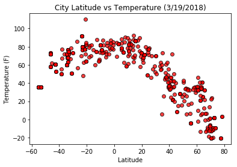
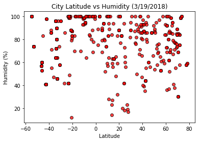
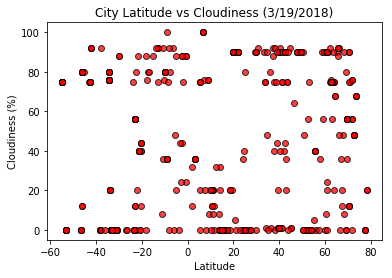
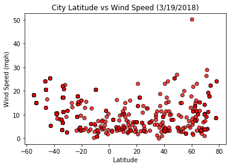

```python
import numpy as np
import pandas as pd
import matplotlib.pyplot as plt
import requests
from citipy import citipy
import random
api_key = '2765bd24bf383b91a6fd01c375a583db'
```


```python
#Generate City list

#Create random list of longitude and latitude
lat_random = []
long_random = []
for rand in range(499):
    lat_random.append(round(random.uniform(-90.0, 91.0),2))
    long_random.append(round(random.uniform(-180.0,181.0),2))
```


```python
#Convert the lat and long to city names and append to city_list
city_list = []
for row in range(499):
    city = (citipy.nearest_city(lat_random[row],long_random[row]))
    city_list.append(city.city_name)
```


```python
#Create a small listi to test
city_small_list = city_list[:5]
city_small_list
```


    ['belushya guba', 'narsaq', 'sumbawa', 'longyearbyen', 'naze']


```python

# Save config information
url = "http://api.openweathermap.org/data/2.5/weather?"
units = "imperial"

# Build query URL in for loops then output Temp, Humidity, Cloudiness, and Wind Speed
city_small_list_agg = []
for index, city in enumerate(city_small_list):
    parameters = f"appid={api_key}&units={units}&q={city}"
    response_json = requests.get(url, params=parameters).json()
    city_small_list_agg.append(response_json)
print(city_small_list_agg)

#Find the index for temp
#city_small_list_agg[1]['main']['temp']

#Find the index for Humidity
#city_small_list_agg[1]['main']['humidity']

#Find the index for Cloudiness
#city_small_list_agg[1]['clouds']['all']

#Find the index for Wind Spped
#city_small_list_agg[1]['wind']['speed']
```

    [{'cod': '404', 'message': 'city not found'}, {'coord': {'lon': -46.05, 'lat': 60.91}, 'weather': [{'id': 801, 'main': 'Clouds', 'description': 'few clouds', 'icon': '02n'}], 'base': 'stations', 'main': {'temp': 46.4, 'pressure': 998, 'humidity': 36, 'temp_min': 46.4, 'temp_max': 46.4}, 'wind': {'speed': 21.92, 'deg': 60, 'gust': 17}, 'clouds': {'all': 20}, 'dt': 1521442200, 'sys': {'type': 1, 'id': 4791, 'message': 0.0038, 'country': 'GL', 'sunrise': 1521450471, 'sunset': 1521494233}, 'id': 3421719, 'name': 'Narsaq', 'cod': 200}, {'cod': '404', 'message': 'city not found'}, {'coord': {'lon': 15.63, 'lat': 78.22}, 'weather': [{'id': 801, 'main': 'Clouds', 'description': 'few clouds', 'icon': '02d'}], 'base': 'stations', 'main': {'temp': 3.2, 'pressure': 1020, 'humidity': 59, 'temp_min': 3.2, 'temp_max': 3.2}, 'visibility': 10000, 'wind': {'speed': 24.16, 'deg': 130}, 'clouds': {'all': 20}, 'dt': 1521442200, 'sys': {'type': 1, 'id': 5326, 'message': 0.0045, 'country': 'NO', 'sunrise': 1521435464, 'sunset': 1521479787}, 'id': 2729907, 'name': 'Longyearbyen', 'cod': 200}, {'coord': {'lon': 7.07, 'lat': 5.43}, 'weather': [{'id': 803, 'main': 'Clouds', 'description': 'broken clouds', 'icon': '04d'}], 'base': 'stations', 'main': {'temp': 78.8, 'pressure': 1010, 'humidity': 88, 'temp_min': 78.8, 'temp_max': 78.8}, 'visibility': 8000, 'wind': {'speed': 4.05, 'deg': 198.001}, 'clouds': {'all': 75}, 'dt': 1521442800, 'sys': {'type': 1, 'id': 6299, 'message': 0.004, 'country': 'NG', 'sunrise': 1521437777, 'sunset': 1521481353}, 'id': 2337542, 'name': 'Naze', 'cod': 200}]
    


```python
# Build table for Temp, Humidity, Cloudiness, and Wind Speed
cities_test_df = pd.DataFrame()
cities_test_df ['lat'] = ''
cities_test_df ['long'] = ''
cities_test_df ['temp'] = ''
cities_test_df ['humidity'] = ''
cities_test_df ['cloudiness'] = ''
cities_test_df ['wind speed'] = ''

for index, row in enumerate(city_small_list_agg):
    try:
        cities_test_df .loc[index,'lat'] = city_small_list_agg[index]['coord']['lat']   
        cities_test_df .loc[index,'long'] = city_small_list_agg[index]['coord']['lon']   
        cities_test_df .loc[index,'temp'] = city_small_list_agg[index]['main']['temp']
        cities_test_df .loc[index,'humidity'] = city_small_list_agg[index]['main']['humidity']  
        cities_test_df .loc[index,'cloudiness'] = city_small_list_agg[index]['clouds']['all']   
        cities_test_df .loc[index,'wind speed'] = city_small_list_agg[index]['wind']['speed']   
    except:
        continue
            
cities_test_df

```


<div>
<style>
    .dataframe thead tr:only-child th {
        text-align: right;
    }

    .dataframe thead th {
        text-align: left;
    }

    .dataframe tbody tr th {
        vertical-align: top;
    }
</style>
<table border="1" class="dataframe">
  <thead>
    <tr style="text-align: right;">
      <th></th>
      <th>lat</th>
      <th>long</th>
      <th>temp</th>
      <th>humidity</th>
      <th>cloudiness</th>
      <th>wind speed</th>
    </tr>
  </thead>
  <tbody>
    <tr>
      <th>1</th>
      <td>60.91</td>
      <td>-46.05</td>
      <td>46.4</td>
      <td>36</td>
      <td>20</td>
      <td>21.92</td>
    </tr>
    <tr>
      <th>3</th>
      <td>78.22</td>
      <td>15.63</td>
      <td>3.2</td>
      <td>59</td>
      <td>20</td>
      <td>24.16</td>
    </tr>
    <tr>
      <th>4</th>
      <td>5.43</td>
      <td>7.07</td>
      <td>78.8</td>
      <td>88</td>
      <td>75</td>
      <td>4.05</td>
    </tr>
  </tbody>
</table>
</div>


```python
#Full list 
# Save config information
url = "http://api.openweathermap.org/data/2.5/weather?"
units = "imperial"

# Build query URL in for loops then output Temp, Humidity, Cloudiness, and Wind Speed
city_list_agg = []
for index, city in enumerate(city_list):
    parameters = f"appid={api_key}&units={units}&q={city}"
    response_json = requests.get(url, params=parameters).json()
    city_list_agg.append(response_json)
print(city_list_agg)

```

    [{'cod': '404', 'message': 'city not found'}, {'coord': {'lon': -46.05, 'lat': 60.91}, 'weather': [{'id': 801, 'main': 'Clouds', 'description': 'few clouds', 'icon': '02n'}], 'base': 'stations', 'main': {'temp': 46.4, 'pressure': 998, 'humidity': 36, 'temp_min': 46.4, 'temp_max': 46.4}, 'wind': {'speed': 21.92, 'deg': 60, 'gust': 17}, 'clouds': {'all': 20}, 'dt': 1521442200, 'sys': {'type': 1, 'id': 4791, 'message': 0.0038, 'country': 'GL', 'sunrise': 1521450471, 'sunset': 1521494233}, 'id': 3421719, 'name': 'Narsaq', 'cod': 200}, {'cod': '404', 'message': 'city not found'}, {'coord': {'lon': 15.63, 'lat': 78.22}, 'weather': [{'id': 801, 'main': 'Clouds', 'description': 'few clouds', 'icon': '02d'}], 'base': 'stations', 'main': {'temp': 3.2, 'pressure': 1020, 'humidity': 59, 'temp_min': 3.2, 'temp_max': 3.2}, 'visibility': 10000, 'wind': {'speed': 24.16, 'deg': 130}, 'clouds': {'all': 20}, 'dt': 1521442200, 'sys': {'type': 1, 'id': 5326, 'message': 0.0045, 'country': 'NO', 'sunrise': 1521435464, 'sunset': 1521479787}, 'id': 2729907, 'name': 'Longyearbyen', 'cod': 200}, {'coord': {'lon': 7.07, 'lat': 5.43}, 'weather': [{'id': 803, 'main': 'Clouds', 'description': 'broken clouds', 'icon': '04d'}], 'base': 'stations', 'main': {'temp': 78.8, 'pressure': 1010, 'humidity': 88, 'temp_min': 78.8, 'temp_max': 78.8}, 'visibility': 8000, 'wind': {'speed': 4.05, 'deg': 198.001}, 'clouds': {'all': 75}, 'dt': 1521442800, 'sys': {'type': 1, 'id': 6299, 'message': 0.004, 'country': 'NG', 'sunrise': 1521437777, 'sunset': 1521481353}, 'id': 2337542, 'name': 'Naze', 'cod': 200}, {'coord': {'lon': -68.93, 'lat': -22.46}, 'weather': [{'id': 800, 'main': 'Clear', 'description': 'clear sky', 'icon': '01n'}], 'base': 'stations', 'main': {'temp': 48.2, 'pressure': 1024, 'humidity': 49, 'temp_min': 48.2, 'temp_max': 48.2}, 'visibility': 10000, 'wind': {'speed': 14.99, 'deg': 100}, 'clouds': {'all': 0}, 'dt': 1521442800, 'sys': {'type': 1, 'id': 4640, 'message': 0.0027, 'country': 'CL', 'sunrise': 1521455951, 'sunset': 1521499627}, 'id': 3897347, 'name': 'Calama', 'cod': 200}, {'coord': {'lon': 149.07, 'lat': -23.58}, 'weather': [{'id': 800, 'main': 'Clear', 'description': 'clear sky', 'icon': '01d'}], 'base': 'stations', 'main': {'temp': 91.42, 'pressure': 1002.13, 'humidity': 42, 'temp_min': 91.42, 'temp_max': 91.42, 'sea_level': 1024.54, 'grnd_level': 1002.13}, 'wind': {'speed': 9.08, 'deg': 107.001}, 'clouds': {'all': 0}, 'dt': 1521443994, 'sys': {'message': 0.0031, 'country': 'AU', 'sunrise': 1521403612, 'sunset': 1521447346}, 'id': 2175403, 'name': 'Bluff', 'cod': 200}, {'coord': {'lon': -22.43, 'lat': 63.84}, 'weather': [{'id': 803, 'main': 'Clouds', 'description': 'broken clouds', 'icon': '04n'}], 'base': 'stations', 'main': {'temp': 41, 'pressure': 1024, 'humidity': 86, 'temp_min': 41, 'temp_max': 41}, 'visibility': 10000, 'wind': {'speed': 11.41, 'deg': 160}, 'clouds': {'all': 75}, 'dt': 1521442800, 'sys': {'type': 1, 'id': 4832, 'message': 0.0034, 'country': 'IS', 'sunrise': 1521444796, 'sunset': 1521488584}, 'id': 3416888, 'name': 'Grindavik', 'cod': 200}, {'coord': {'lon': 93.92, 'lat': 52.15}, 'weather': [{'id': 800, 'main': 'Clear', 'description': 'clear sky', 'icon': '01d'}], 'base': 'stations', 'main': {'temp': 34.36, 'pressure': 887.43, 'humidity': 72, 'temp_min': 34.36, 'temp_max': 34.36, 'sea_level': 1035.85, 'grnd_level': 887.43}, 'wind': {'speed': 2.93, 'deg': 177.001}, 'clouds': {'all': 0}, 'dt': 1521443995, 'sys': {'message': 0.0031, 'country': 'RU', 'sunrise': 1521416970, 'sunset': 1521460538}, 'id': 1488950, 'name': 'Turan', 'cod': 200}, {'coord': {'lon': -70.91, 'lat': -53.16}, 'weather': [{'id': 800, 'main': 'Clear', 'description': 'clear sky', 'icon': '01n'}], 'base': 'stations', 'main': {'temp': 35.6, 'pressure': 1001, 'humidity': 74, 'temp_min': 35.6, 'temp_max': 35.6}, 'visibility': 10000, 'wind': {'speed': 14.99, 'deg': 240}, 'clouds': {'all': 0}, 'dt': 1521442800, 'sys': {'type': 1, 'id': 4642, 'message': 0.0037, 'country': 'CL', 'sunrise': 1521456228, 'sunset': 1521500255}, 'id': 3874787, 'name': 'Punta Arenas', 'cod': 200}, {'coord': {'lon': 115.51, 'lat': -2.54}, 'weather': [{'id': 802, 'main': 'Clouds', 'description': 'scattered clouds', 'icon': '03d'}], 'base': 'stations', 'main': {'temp': 87.01, 'pressure': 995.41, 'humidity': 69, 'temp_min': 87.01, 'temp_max': 87.01, 'sea_level': 1020.77, 'grnd_level': 995.41}, 'wind': {'speed': 2.37, 'deg': 191.001}, 'clouds': {'all': 44}, 'dt': 1521443996, 'sys': {'message': 0.0036, 'country': 'ID', 'sunrise': 1521411741, 'sunset': 1521455342}, 'id': 1641899, 'name': 'Labuhan', 'cod': 200}, {'coord': {'lon': 149.55, 'lat': -6.21}, 'weather': [{'id': 501, 'main': 'Rain', 'description': 'moderate rain', 'icon': '10d'}], 'base': 'stations', 'main': {'temp': 74.59, 'pressure': 1001.24, 'humidity': 100, 'temp_min': 74.59, 'temp_max': 74.59, 'sea_level': 1018.38, 'grnd_level': 1001.24}, 'wind': {'speed': 5.17, 'deg': 258.001}, 'rain': {'3h': 5.905}, 'clouds': {'all': 92}, 'dt': 1521443996, 'sys': {'message': 0.0038, 'country': 'PG', 'sunrise': 1521403562, 'sunset': 1521447182}, 'id': 2094746, 'name': 'Kandrian', 'cod': 200}, {'coord': {'lon': 74.49, 'lat': 15.34}, 'weather': [{'id': 800, 'main': 'Clear', 'description': 'clear sky', 'icon': '01d'}], 'base': 'stations', 'main': {'temp': 86.74, 'pressure': 961.28, 'humidity': 63, 'temp_min': 86.74, 'temp_max': 86.74, 'sea_level': 1025.79, 'grnd_level': 961.28}, 'wind': {'speed': 3.49, 'deg': 90.5005}, 'clouds': {'all': 0}, 'dt': 1521443997, 'sys': {'message': 0.0033, 'country': 'IN', 'sunrise': 1521421617, 'sunset': 1521465167}, 'id': 1273574, 'name': 'Vaini', 'cod': 200}, {'coord': {'lon': -119.27, 'lat': 50.27}, 'weather': [{'id': 804, 'main': 'Clouds', 'description': 'overcast clouds', 'icon': '04n'}], 'base': 'stations', 'main': {'temp': 41, 'pressure': 1019, 'humidity': 87, 'temp_min': 41, 'temp_max': 41}, 'visibility': 14484, 'wind': {'speed': 4.7}, 'clouds': {'all': 90}, 'dt': 1521439200, 'sys': {'type': 1, 'id': 3295, 'message': 0.004, 'country': 'CA', 'sunrise': 1521468060, 'sunset': 1521511754}, 'id': 6173864, 'name': 'Vernon', 'cod': 200}, {'coord': {'lon': -60.23, 'lat': -38.31}, 'weather': [{'id': 800, 'main': 'Clear', 'description': 'clear sky', 'icon': '01n'}], 'base': 'stations', 'main': {'temp': 50.11, 'pressure': 1010.48, 'humidity': 86, 'temp_min': 50.11, 'temp_max': 50.11, 'sea_level': 1022.55, 'grnd_level': 1010.48}, 'wind': {'speed': 10.31, 'deg': 271.001}, 'clouds': {'all': 0}, 'dt': 1521443998, 'sys': {'message': 0.0033, 'country': 'AR', 'sunrise': 1521453790, 'sunset': 1521497595}, 'id': 3833859, 'name': 'Barrow', 'cod': 200}, {'coord': {'lon': 22.23, 'lat': -10.7}, 'weather': [{'id': 500, 'main': 'Rain', 'description': 'light rain', 'icon': '10d'}], 'base': 'stations', 'main': {'temp': 64.96, 'pressure': 904.54, 'humidity': 99, 'temp_min': 64.96, 'temp_max': 64.96, 'sea_level': 1023.28, 'grnd_level': 904.54}, 'wind': {'speed': 2.93, 'deg': 272.501}, 'rain': {'3h': 1.515}, 'clouds': {'all': 92}, 'dt': 1521443998, 'sys': {'message': 0.0032, 'country': 'CD', 'sunrise': 1521434105, 'sunset': 1521477736}, 'id': 876177, 'name': 'Luau', 'cod': 200}, {'cod': '404', 'message': 'city not found'}, {'coord': {'lon': -45.24, 'lat': 60.14}, 'weather': [{'id': 800, 'main': 'Clear', 'description': 'clear sky', 'icon': '01n'}], 'base': 'stations', 'main': {'temp': 35.26, 'pressure': 991.84, 'humidity': 84, 'temp_min': 35.26, 'temp_max': 35.26, 'sea_level': 1004.52, 'grnd_level': 991.84}, 'wind': {'speed': 50.13, 'deg': 63.5005}, 'clouds': {'all': 0}, 'dt': 1521443999, 'sys': {'message': 0.0045, 'country': 'GL', 'sunrise': 1521450281, 'sunset': 1521494031}, 'id': 3421765, 'name': 'Nanortalik', 'cod': 200}, {'coord': {'lon': -56.15, 'lat': 72.79}, 'weather': [{'id': 802, 'main': 'Clouds', 'description': 'scattered clouds', 'icon': '03n'}], 'base': 'stations', 'main': {'temp': 1.87, 'pressure': 1025.16, 'humidity': 99, 'temp_min': 1.87, 'temp_max': 1.87, 'sea_level': 1028.59, 'grnd_level': 1025.16}, 'wind': {'speed': 17.69, 'deg': 349.001}, 'clouds': {'all': 48}, 'dt': 1521443999, 'sys': {'message': 0.0032, 'country': 'GL', 'sunrise': 1521452757, 'sunset': 1521496865}, 'id': 3418910, 'name': 'Upernavik', 'cod': 200}, {'cod': '404', 'message': 'city not found'}, {'coord': {'lon': 151.26, 'lat': -27.18}, 'weather': [{'id': 800, 'main': 'Clear', 'description': 'clear sky', 'icon': '01d'}], 'base': 'stations', 'main': {'temp': 86, 'pressure': 1015, 'humidity': 42, 'temp_min': 86, 'temp_max': 86}, 'visibility': 10000, 'wind': {'speed': 14.99, 'deg': 80}, 'clouds': {'all': 0}, 'dt': 1521439200, 'sys': {'type': 1, 'id': 8173, 'message': 0.0027, 'country': 'AU', 'sunrise': 1521403069, 'sunset': 1521446835}, 'id': 2169535, 'name': 'Dalby', 'cod': 200}, {'coord': {'lon': -134.97, 'lat': -23.12}, 'weather': [{'id': 803, 'main': 'Clouds', 'description': 'broken clouds', 'icon': '04n'}], 'base': 'stations', 'main': {'temp': 79.63, 'pressure': 1029.61, 'humidity': 100, 'temp_min': 79.63, 'temp_max': 79.63, 'sea_level': 1029.77, 'grnd_level': 1029.61}, 'wind': {'speed': 17.92, 'deg': 72.0005}, 'clouds': {'all': 56}, 'dt': 1521444001, 'sys': {'message': 0.0031, 'country': 'PF', 'sunrise': 1521471802, 'sunset': 1521515468}, 'id': 4030556, 'name': 'Rikitea', 'cod': 200}, {'coord': {'lon': 147.33, 'lat': -42.88}, 'weather': [{'id': 521, 'main': 'Rain', 'description': 'shower rain', 'icon': '09d'}], 'base': 'stations', 'main': {'temp': 60.8, 'pressure': 1003, 'humidity': 41, 'temp_min': 60.8, 'temp_max': 60.8}, 'visibility': 10000, 'wind': {'speed': 25.28, 'deg': 270, 'gust': 17.5}, 'clouds': {'all': 75}, 'dt': 1521441000, 'sys': {'type': 1, 'id': 8195, 'message': 0.0043, 'country': 'AU', 'sunrise': 1521403904, 'sunset': 1521447865}, 'id': 2163355, 'name': 'Hobart', 'cod': 200}, {'coord': {'lon': 35.76, 'lat': 13.52}, 'weather': [{'id': 800, 'main': 'Clear', 'description': 'clear sky', 'icon': '01d'}], 'base': 'stations', 'main': {'temp': 81.07, 'pressure': 956.01, 'humidity': 23, 'temp_min': 81.07, 'temp_max': 81.07, 'sea_level': 1021.34, 'grnd_level': 956.01}, 'wind': {'speed': 2.37, 'deg': 187.501}, 'clouds': {'all': 0}, 'dt': 1521444002, 'sys': {'message': 0.0034, 'country': 'SD', 'sunrise': 1521430905, 'sunset': 1521474463}, 'id': 376332, 'name': 'Doka', 'cod': 200}, {'coord': {'lon': -5, 'lat': 5.24}, 'weather': [{'id': 801, 'main': 'Clouds', 'description': 'few clouds', 'icon': '02d'}], 'base': 'stations', 'main': {'temp': 76.75, 'pressure': 1014.13, 'humidity': 90, 'temp_min': 76.75, 'temp_max': 76.75, 'sea_level': 1023.24, 'grnd_level': 1014.13}, 'wind': {'speed': 4.94, 'deg': 237.501}, 'clouds': {'all': 20}, 'dt': 1521444002, 'sys': {'message': 0.003, 'country': 'CI', 'sunrise': 1521440672, 'sunset': 1521484250}, 'id': 2288105, 'name': 'Grand-Lahou', 'cod': 200}, {'coord': {'lon': 18.42, 'lat': -33.93}, 'weather': [{'id': 801, 'main': 'Clouds', 'description': 'few clouds', 'icon': '02d'}], 'base': 'stations', 'main': {'temp': 68, 'pressure': 1014, 'humidity': 72, 'temp_min': 68, 'temp_max': 68}, 'visibility': 10000, 'wind': {'speed': 17.22, 'deg': 180}, 'clouds': {'all': 20}, 'dt': 1521442800, 'sys': {'type': 1, 'id': 6529, 'message': 0.004, 'country': 'ZA', 'sunrise': 1521434928, 'sunset': 1521478718}, 'id': 3369157, 'name': 'Cape Town', 'cod': 200}, {'coord': {'lon': -72.68, 'lat': 19.45}, 'weather': [{'id': 500, 'main': 'Rain', 'description': 'light rain', 'icon': '10n'}], 'base': 'stations', 'main': {'temp': 69.37, 'pressure': 997.03, 'humidity': 100, 'temp_min': 69.37, 'temp_max': 69.37, 'sea_level': 1025.43, 'grnd_level': 997.03}, 'wind': {'speed': 3.49, 'deg': 75.5005}, 'rain': {'3h': 0.13}, 'clouds': {'all': 20}, 'dt': 1521444003, 'sys': {'message': 0.0034, 'country': 'HT', 'sunrise': 1521456922, 'sunset': 1521500493}, 'id': 3724696, 'name': 'Gonaives', 'cod': 200}, {'coord': {'lon': 108.75, 'lat': 50.36}, 'weather': [{'id': 800, 'main': 'Clear', 'description': 'clear sky', 'icon': '01d'}], 'base': 'stations', 'main': {'temp': 43.09, 'pressure': 912.64, 'humidity': 54, 'temp_min': 43.09, 'temp_max': 43.09, 'sea_level': 1039.45, 'grnd_level': 912.64}, 'wind': {'speed': 3.04, 'deg': 125.001}, 'clouds': {'all': 0}, 'dt': 1521444003, 'sys': {'message': 0.0037, 'country': 'RU', 'sunrise': 1521413418, 'sunset': 1521456969}, 'id': 2012349, 'name': 'Krasnyy Chikoy', 'cod': 200}, {'coord': {'lon': 100.46, 'lat': 38.94}, 'weather': [{'id': 802, 'main': 'Clouds', 'description': 'scattered clouds', 'icon': '03d'}], 'base': 'stations', 'main': {'temp': 48.85, 'pressure': 828.99, 'humidity': 91, 'temp_min': 48.85, 'temp_max': 48.85, 'sea_level': 1026.48, 'grnd_level': 828.99}, 'wind': {'speed': 5.5, 'deg': 33.0005}, 'clouds': {'all': 44}, 'dt': 1521444004, 'sys': {'message': 0.0039, 'country': 'CN', 'sunrise': 1521415408, 'sunset': 1521458938}, 'id': 1785036, 'name': 'Zhangye', 'cod': 200}, {'coord': {'lon': 19.24, 'lat': -34.42}, 'weather': [{'id': 500, 'main': 'Rain', 'description': 'light rain', 'icon': '10d'}], 'base': 'stations', 'main': {'temp': 60.19, 'pressure': 988.44, 'humidity': 96, 'temp_min': 60.19, 'temp_max': 60.19, 'sea_level': 1027.9, 'grnd_level': 988.44}, 'wind': {'speed': 3.6, 'deg': 128.501}, 'rain': {'3h': 0.105}, 'clouds': {'all': 76}, 'dt': 1521444004, 'sys': {'message': 0.004, 'country': 'ZA', 'sunrise': 1521434728, 'sunset': 1521478524}, 'id': 3366880, 'name': 'Hermanus', 'cod': 200}, {'coord': {'lon': -71.79, 'lat': -17.17}, 'weather': [{'id': 803, 'main': 'Clouds', 'description': 'broken clouds', 'icon': '04n'}], 'base': 'stations', 'main': {'temp': 70.18, 'pressure': 1024.26, 'humidity': 100, 'temp_min': 70.18, 'temp_max': 70.18, 'sea_level': 1024.7, 'grnd_level': 1024.26}, 'wind': {'speed': 4.5, 'deg': 104.501}, 'clouds': {'all': 80}, 'dt': 1521444005, 'sys': {'message': 0.0037, 'country': 'PE', 'sunrise': 1521456654, 'sunset': 1521500302}, 'id': 3931255, 'name': 'Punta de Bombon', 'cod': 200}, {'coord': {'lon': 115.35, 'lat': -33.64}, 'weather': [{'id': 800, 'main': 'Clear', 'description': 'clear sky', 'icon': '01d'}], 'base': 'stations', 'main': {'temp': 76.57, 'pressure': 1033.75, 'humidity': 80, 'temp_min': 76.57, 'temp_max': 76.57, 'sea_level': 1034.83, 'grnd_level': 1033.75}, 'wind': {'speed': 6.62, 'deg': 135.001}, 'clouds': {'all': 0}, 'dt': 1521444005, 'sys': {'message': 0.003, 'country': 'AU', 'sunrise': 1521411654, 'sunset': 1521455475}, 'id': 2075265, 'name': 'Busselton', 'cod': 200}, {'coord': {'lon': 31.67, 'lat': -21.05}, 'weather': [{'id': 800, 'main': 'Clear', 'description': 'clear sky', 'icon': '01d'}], 'base': 'stations', 'main': {'temp': 72.07, 'pressure': 980.82, 'humidity': 79, 'temp_min': 72.07, 'temp_max': 72.07, 'sea_level': 1027.37, 'grnd_level': 980.82}, 'wind': {'speed': 4.38, 'deg': 252.001}, 'clouds': {'all': 0}, 'dt': 1521444006, 'sys': {'message': 0.003, 'country': 'ZW', 'sunrise': 1521431806, 'sunset': 1521475495}, 'id': 893485, 'name': 'Chiredzi', 'cod': 200}, {'coord': {'lon': -68.31, 'lat': -54.81}, 'weather': [{'id': 521, 'main': 'Rain', 'description': 'shower rain', 'icon': '09n'}], 'base': 'stations', 'main': {'temp': 35.6, 'pressure': 998, 'humidity': 100, 'temp_min': 35.6, 'temp_max': 35.6}, 'visibility': 10000, 'wind': {'speed': 18.34, 'deg': 270}, 'clouds': {'all': 75}, 'dt': 1521442800, 'sys': {'type': 1, 'id': 4754, 'message': 0.0039, 'country': 'AR', 'sunrise': 1521455583, 'sunset': 1521499649}, 'id': 3833367, 'name': 'Ushuaia', 'cod': 200}, {'coord': {'lon': 133.39, 'lat': 67.55}, 'weather': [{'id': 801, 'main': 'Clouds', 'description': 'few clouds', 'icon': '02d'}], 'base': 'stations', 'main': {'temp': -11.99, 'pressure': 995.65, 'humidity': 38, 'temp_min': -11.99, 'temp_max': -11.99, 'sea_level': 1043.3, 'grnd_level': 995.65}, 'wind': {'speed': 3.71, 'deg': 154.501}, 'clouds': {'all': 20}, 'dt': 1521444006, 'sys': {'message': 0.0035, 'country': 'RU', 'sunrise': 1521407475, 'sunset': 1521451146}, 'id': 2013465, 'name': 'Verkhoyansk', 'cod': 200}, {'coord': {'lon': 149.07, 'lat': -23.58}, 'weather': [{'id': 800, 'main': 'Clear', 'description': 'clear sky', 'icon': '01d'}], 'base': 'stations', 'main': {'temp': 91.42, 'pressure': 1002.13, 'humidity': 42, 'temp_min': 91.42, 'temp_max': 91.42, 'sea_level': 1024.54, 'grnd_level': 1002.13}, 'wind': {'speed': 9.08, 'deg': 107.001}, 'clouds': {'all': 0}, 'dt': 1521443994, 'sys': {'message': 0.0031, 'country': 'AU', 'sunrise': 1521403612, 'sunset': 1521447346}, 'id': 2175403, 'name': 'Bluff', 'cod': 200}, {'coord': {'lon': -52.73, 'lat': 47.66}, 'weather': [{'id': 804, 'main': 'Clouds', 'description': 'overcast clouds', 'icon': '04n'}], 'base': 'stations', 'main': {'temp': 28.4, 'pressure': 986, 'humidity': 86, 'temp_min': 28.4, 'temp_max': 28.4}, 'visibility': 24140, 'wind': {'speed': 25.28, 'deg': 260, 'gust': 15.9}, 'clouds': {'all': 90}, 'dt': 1521439200, 'sys': {'type': 1, 'id': 3467, 'message': 0.0033, 'country': 'CA', 'sunrise': 1521452120, 'sunset': 1521495756}, 'id': 6167817, 'name': 'Torbay', 'cod': 200}, {'coord': {'lon': 135.83, 'lat': 46.45}, 'weather': [{'id': 803, 'main': 'Clouds', 'description': 'broken clouds', 'icon': '04d'}], 'base': 'stations', 'main': {'temp': 15.37, 'pressure': 965.01, 'humidity': 56, 'temp_min': 15.37, 'temp_max': 15.37, 'sea_level': 1035.4, 'grnd_level': 965.01}, 'wind': {'speed': 7.85, 'deg': 305.501}, 'clouds': {'all': 64}, 'dt': 1521444007, 'sys': {'message': 0.0037, 'country': 'RU', 'sunrise': 1521406930, 'sunset': 1521450453}, 'id': 2013279, 'name': 'Vostok', 'cod': 200}, {'coord': {'lon': 20.04, 'lat': -34.53}, 'weather': [{'id': 803, 'main': 'Clouds', 'description': 'broken clouds', 'icon': '04d'}], 'base': 'stations', 'main': {'temp': 71.6, 'pressure': 1014, 'humidity': 64, 'temp_min': 71.6, 'temp_max': 71.6}, 'wind': {'speed': 8.05, 'deg': 300}, 'clouds': {'all': 80}, 'dt': 1521442800, 'sys': {'type': 1, 'id': 6591, 'message': 0.0038, 'country': 'ZA', 'sunrise': 1521434536, 'sunset': 1521478332}, 'id': 1015776, 'name': 'Bredasdorp', 'cod': 200}, {'coord': {'lon': -0.61, 'lat': 44.83}, 'weather': [{'id': 501, 'main': 'Rain', 'description': 'moderate rain', 'icon': '10d'}, {'id': 701, 'main': 'Mist', 'description': 'mist', 'icon': '50d'}, {'id': 211, 'main': 'Thunderstorm', 'description': 'thunderstorm', 'icon': '11d'}], 'base': 'stations', 'main': {'temp': 40.37, 'pressure': 1003, 'humidity': 100, 'temp_min': 37.4, 'temp_max': 42.8}, 'visibility': 7000, 'wind': {'speed': 10.29, 'deg': 110}, 'clouds': {'all': 92}, 'dt': 1521442800, 'sys': {'type': 1, 'id': 5525, 'message': 0.0044, 'country': 'FR', 'sunrise': 1521439633, 'sunset': 1521483225}, 'id': 3031582, 'name': 'Saint-Augustin', 'cod': 200}, {'coord': {'lon': 168.86, 'lat': -46.19}, 'weather': [{'id': 803, 'main': 'Clouds', 'description': 'broken clouds', 'icon': '04n'}], 'base': 'stations', 'main': {'temp': 71.89, 'pressure': 1013.97, 'humidity': 60, 'temp_min': 71.89, 'temp_max': 71.89, 'sea_level': 1028.75, 'grnd_level': 1013.97}, 'wind': {'speed': 20.71, 'deg': 330.001}, 'clouds': {'all': 80}, 'dt': 1521444009, 'sys': {'message': 0.004, 'country': 'NZ', 'sunrise': 1521398699, 'sunset': 1521442732}, 'id': 6201424, 'name': 'Mataura', 'cod': 200}, {'coord': {'lon': -37.64, 'lat': 65.61}, 'weather': [{'id': 600, 'main': 'Snow', 'description': 'light snow', 'icon': '13n'}], 'base': 'stations', 'main': {'temp': 32, 'pressure': 1018, 'humidity': 95, 'temp_min': 32, 'temp_max': 32}, 'wind': {'speed': 15.23, 'deg': 61.5005}, 'clouds': {'all': 92}, 'dt': 1521442200, 'sys': {'type': 1, 'id': 4806, 'message': 0.0082, 'country': 'GL', 'sunrise': 1521448423, 'sunset': 1521492265}, 'id': 3424607, 'name': 'Tasiilaq', 'cod': 200}, {'coord': {'lon': -105.3, 'lat': 55.1}, 'weather': [{'id': 800, 'main': 'Clear', 'description': 'clear sky', 'icon': '02n'}], 'base': 'stations', 'main': {'temp': 6.8, 'pressure': 1025, 'humidity': 65, 'temp_min': 6.8, 'temp_max': 6.8}, 'visibility': 24140, 'wind': {'speed': 4.7, 'deg': 30}, 'clouds': {'all': 5}, 'dt': 1521439200, 'sys': {'type': 1, 'id': 3914, 'message': 0.0035, 'country': 'CA', 'sunrise': 1521464693, 'sunset': 1521508427}, 'id': 6050066, 'name': 'La Ronge', 'cod': 200}, {'coord': {'lon': 138.6, 'lat': -33.21}, 'weather': [{'id': 800, 'main': 'Clear', 'description': 'clear sky', 'icon': '01d'}], 'base': 'stations', 'main': {'temp': 74.32, 'pressure': 974.01, 'humidity': 46, 'temp_min': 74.32, 'temp_max': 74.32, 'sea_level': 1032, 'grnd_level': 974.01}, 'wind': {'speed': 11.21, 'deg': 222.501}, 'clouds': {'all': 0}, 'dt': 1521444010, 'sys': {'message': 0.0043, 'country': 'AU', 'sunrise': 1521406074, 'sunset': 1521449898}, 'id': 2069194, 'name': 'Jamestown', 'cod': 200}, {'coord': {'lon': -155.08, 'lat': 19.71}, 'weather': [{'id': 500, 'main': 'Rain', 'description': 'light rain', 'icon': '10n'}], 'base': 'stations', 'main': {'temp': 73.4, 'pressure': 1014, 'humidity': 88, 'temp_min': 73.4, 'temp_max': 73.4}, 'visibility': 11265, 'wind': {'speed': 6.93, 'deg': 320}, 'clouds': {'all': 90}, 'dt': 1521442800, 'sys': {'type': 1, 'id': 818, 'message': 0.0076, 'country': 'US', 'sunrise': 1521476686, 'sunset': 1521520272}, 'id': 5855927, 'name': 'Hilo', 'cod': 200}, {'coord': {'lon': 138.6, 'lat': -33.21}, 'weather': [{'id': 800, 'main': 'Clear', 'description': 'clear sky', 'icon': '01d'}], 'base': 'stations', 'main': {'temp': 74.32, 'pressure': 974.01, 'humidity': 46, 'temp_min': 74.32, 'temp_max': 74.32, 'sea_level': 1032, 'grnd_level': 974.01}, 'wind': {'speed': 11.21, 'deg': 222.501}, 'clouds': {'all': 0}, 'dt': 1521444010, 'sys': {'message': 0.0043, 'country': 'AU', 'sunrise': 1521406074, 'sunset': 1521449898}, 'id': 2069194, 'name': 'Jamestown', 'cod': 200}, {'coord': {'lon': -73.48, 'lat': 45.36}, 'weather': [{'id': 800, 'main': 'Clear', 'description': 'clear sky', 'icon': '01n'}], 'base': 'stations', 'main': {'temp': 8.51, 'pressure': 1015, 'humidity': 60, 'temp_min': 3.2, 'temp_max': 12.2}, 'visibility': 16093, 'wind': {'speed': 7.96, 'deg': 315.501}, 'clouds': {'all': 1}, 'dt': 1521441300, 'sys': {'type': 1, 'id': 2901, 'message': 0.0055, 'country': 'CA', 'sunrise': 1521457098, 'sunset': 1521500732}, 'id': 6138908, 'name': 'Saint-Philippe', 'cod': 200}, {'coord': {'lon': -68.31, 'lat': -54.81}, 'weather': [{'id': 521, 'main': 'Rain', 'description': 'shower rain', 'icon': '09n'}], 'base': 'stations', 'main': {'temp': 35.6, 'pressure': 998, 'humidity': 100, 'temp_min': 35.6, 'temp_max': 35.6}, 'visibility': 10000, 'wind': {'speed': 18.34, 'deg': 270}, 'clouds': {'all': 75}, 'dt': 1521442800, 'sys': {'type': 1, 'id': 4754, 'message': 0.0039, 'country': 'AR', 'sunrise': 1521455583, 'sunset': 1521499649}, 'id': 3833367, 'name': 'Ushuaia', 'cod': 200}, {'coord': {'lon': -139.03, 'lat': -9.8}, 'weather': [{'id': 803, 'main': 'Clouds', 'description': 'broken clouds', 'icon': '04n'}], 'base': 'stations', 'main': {'temp': 82.06, 'pressure': 1022.48, 'humidity': 99, 'temp_min': 82.06, 'temp_max': 82.06, 'sea_level': 1022.47, 'grnd_level': 1022.48}, 'wind': {'speed': 20.6, 'deg': 86.0005}, 'clouds': {'all': 80}, 'dt': 1521444012, 'sys': {'message': 0.0043, 'country': 'PF', 'sunrise': 1521472809, 'sunset': 1521516422}, 'id': 4020109, 'name': 'Atuona', 'cod': 200}, {'coord': {'lon': 115.35, 'lat': -33.64}, 'weather': [{'id': 800, 'main': 'Clear', 'description': 'clear sky', 'icon': '01d'}], 'base': 'stations', 'main': {'temp': 76.57, 'pressure': 1033.75, 'humidity': 80, 'temp_min': 76.57, 'temp_max': 76.57, 'sea_level': 1034.83, 'grnd_level': 1033.75}, 'wind': {'speed': 6.62, 'deg': 135.001}, 'clouds': {'all': 0}, 'dt': 1521444005, 'sys': {'message': 0.003, 'country': 'AU', 'sunrise': 1521411654, 'sunset': 1521455475}, 'id': 2075265, 'name': 'Busselton', 'cod': 200}, {'coord': {'lon': 122.67, 'lat': 11}, 'weather': [{'id': 801, 'main': 'Clouds', 'description': 'few clouds', 'icon': '02d'}], 'base': 'stations', 'main': {'temp': 87.1, 'pressure': 1001.97, 'humidity': 64, 'temp_min': 87.1, 'temp_max': 87.1, 'sea_level': 1021.94, 'grnd_level': 1001.97}, 'wind': {'speed': 12.77, 'deg': 48.0005}, 'clouds': {'all': 20}, 'dt': 1521444013, 'sys': {'message': 0.0042, 'country': 'PH', 'sunrise': 1521410052, 'sunset': 1521453606}, 'id': 1714733, 'name': 'Dingle', 'cod': 200}, {'cod': '404', 'message': 'city not found'}, {'coord': {'lon': -70.91, 'lat': -53.16}, 'weather': [{'id': 800, 'main': 'Clear', 'description': 'clear sky', 'icon': '01n'}], 'base': 'stations', 'main': {'temp': 35.6, 'pressure': 1001, 'humidity': 74, 'temp_min': 35.6, 'temp_max': 35.6}, 'visibility': 10000, 'wind': {'speed': 14.99, 'deg': 240}, 'clouds': {'all': 0}, 'dt': 1521442800, 'sys': {'type': 1, 'id': 4642, 'message': 0.0037, 'country': 'CL', 'sunrise': 1521456228, 'sunset': 1521500255}, 'id': 3874787, 'name': 'Punta Arenas', 'cod': 200}, {'coord': {'lon': -114.38, 'lat': 62.45}, 'weather': [{'id': 803, 'main': 'Clouds', 'description': 'broken clouds', 'icon': '04n'}], 'base': 'stations', 'main': {'temp': 21.2, 'pressure': 1014, 'humidity': 62, 'temp_min': 21.2, 'temp_max': 21.2}, 'visibility': 24140, 'wind': {'speed': 13.87, 'deg': 170}, 'clouds': {'all': 75}, 'dt': 1521439200, 'sys': {'type': 1, 'id': 3558, 'message': 0.0048, 'country': 'CA', 'sunrise': 1521466823, 'sunset': 1521510679}, 'id': 6185377, 'name': 'Yellowknife', 'cod': 200}, {'coord': {'lon': 167.72, 'lat': -45.41}, 'weather': [{'id': 500, 'main': 'Rain', 'description': 'light rain', 'icon': '10n'}], 'base': 'stations', 'main': {'temp': 62.08, 'pressure': 965.74, 'humidity': 83, 'temp_min': 62.08, 'temp_max': 62.08, 'sea_level': 1029.32, 'grnd_level': 965.74}, 'wind': {'speed': 16.46, 'deg': 339.501}, 'rain': {'3h': 1.02}, 'clouds': {'all': 80}, 'dt': 1521444014, 'sys': {'message': 0.0032, 'country': 'NZ', 'sunrise': 1521398982, 'sunset': 1521442998}, 'id': 2181625, 'name': 'Te Anau', 'cod': 200}, {'coord': {'lon': -139.03, 'lat': -9.8}, 'weather': [{'id': 803, 'main': 'Clouds', 'description': 'broken clouds', 'icon': '04n'}], 'base': 'stations', 'main': {'temp': 82.06, 'pressure': 1022.48, 'humidity': 99, 'temp_min': 82.06, 'temp_max': 82.06, 'sea_level': 1022.47, 'grnd_level': 1022.48}, 'wind': {'speed': 20.6, 'deg': 86.0005}, 'clouds': {'all': 80}, 'dt': 1521444012, 'sys': {'message': 0.0043, 'country': 'PF', 'sunrise': 1521472809, 'sunset': 1521516422}, 'id': 4020109, 'name': 'Atuona', 'cod': 200}, {'coord': {'lon': -74.98, 'lat': 39.31}, 'weather': [{'id': 800, 'main': 'Clear', 'description': 'clear sky', 'icon': '01n'}], 'base': 'stations', 'main': {'temp': 36.28, 'pressure': 1013, 'humidity': 86, 'temp_min': 33.8, 'temp_max': 37.4}, 'visibility': 16093, 'wind': {'speed': 9.17, 'deg': 200}, 'clouds': {'all': 1}, 'dt': 1521442560, 'sys': {'type': 1, 'id': 633, 'message': 0.0086, 'country': 'US', 'sunrise': 1521457467, 'sunset': 1521501073}, 'id': 4501427, 'name': 'Port Elizabeth', 'cod': 200}, {'coord': {'lon': 45.27, 'lat': -12.79}, 'weather': [{'id': 803, 'main': 'Clouds', 'description': 'broken clouds', 'icon': '04d'}], 'base': 'stations', 'main': {'temp': 87.8, 'pressure': 1010, 'humidity': 70, 'temp_min': 87.8, 'temp_max': 87.8}, 'visibility': 10000, 'wind': {'speed': 12.75, 'deg': 260}, 'clouds': {'all': 75}, 'dt': 1521441000, 'sys': {'type': 1, 'id': 6790, 'message': 0.0037, 'country': 'YT', 'sunrise': 1521428569, 'sunset': 1521472213}, 'id': 921900, 'name': 'Dzaoudzi', 'cod': 200}, {'cod': '404', 'message': 'city not found'}, {'coord': {'lon': 91.39, 'lat': 53.6}, 'weather': [{'id': 701, 'main': 'Mist', 'description': 'mist', 'icon': '50d'}, {'id': 711, 'main': 'Smoke', 'description': 'smoke', 'icon': '50d'}], 'base': 'stations', 'main': {'temp': 33.8, 'pressure': 1020, 'humidity': 69, 'temp_min': 33.8, 'temp_max': 33.8}, 'visibility': 4300, 'wind': {'speed': 4.47, 'deg': 30}, 'clouds': {'all': 0}, 'dt': 1521441000, 'sys': {'type': 1, 'id': 7276, 'message': 0.0045, 'country': 'RU', 'sunrise': 1521417574, 'sunset': 1521461151}, 'id': 1510377, 'name': 'Belyy Yar', 'cod': 200}, {'coord': {'lon': -134.97, 'lat': -23.12}, 'weather': [{'id': 803, 'main': 'Clouds', 'description': 'broken clouds', 'icon': '04n'}], 'base': 'stations', 'main': {'temp': 79.63, 'pressure': 1029.61, 'humidity': 100, 'temp_min': 79.63, 'temp_max': 79.63, 'sea_level': 1029.77, 'grnd_level': 1029.61}, 'wind': {'speed': 17.92, 'deg': 72.0005}, 'clouds': {'all': 56}, 'dt': 1521444001, 'sys': {'message': 0.0031, 'country': 'PF', 'sunrise': 1521471802, 'sunset': 1521515468}, 'id': 4030556, 'name': 'Rikitea', 'cod': 200}, {'coord': {'lon': 80.55, 'lat': 73.51}, 'weather': [{'id': 803, 'main': 'Clouds', 'description': 'broken clouds', 'icon': '04d'}], 'base': 'stations', 'main': {'temp': -9.47, 'pressure': 1016.89, 'humidity': 100, 'temp_min': -9.47, 'temp_max': -9.47, 'sea_level': 1017.4, 'grnd_level': 1016.89}, 'wind': {'speed': 22.39, 'deg': 93.5005}, 'clouds': {'all': 68}, 'dt': 1521444017, 'sys': {'message': 0.0035, 'country': 'RU', 'sunrise': 1521420062, 'sunset': 1521463964}, 'id': 1507390, 'name': 'Dikson', 'cod': 200}, {'coord': {'lon': 74.49, 'lat': 15.34}, 'weather': [{'id': 800, 'main': 'Clear', 'description': 'clear sky', 'icon': '01d'}], 'base': 'stations', 'main': {'temp': 86.74, 'pressure': 961.28, 'humidity': 63, 'temp_min': 86.74, 'temp_max': 86.74, 'sea_level': 1025.79, 'grnd_level': 961.28}, 'wind': {'speed': 3.49, 'deg': 90.5005}, 'clouds': {'all': 0}, 'dt': 1521443997, 'sys': {'message': 0.0033, 'country': 'IN', 'sunrise': 1521421617, 'sunset': 1521465167}, 'id': 1273574, 'name': 'Vaini', 'cod': 200}, {'coord': {'lon': 150.8, 'lat': -2.57}, 'weather': [{'id': 804, 'main': 'Clouds', 'description': 'overcast clouds', 'icon': '04d'}], 'base': 'stations', 'main': {'temp': 83.86, 'pressure': 1016.56, 'humidity': 100, 'temp_min': 83.86, 'temp_max': 83.86, 'sea_level': 1017.73, 'grnd_level': 1016.56}, 'wind': {'speed': 11.77, 'deg': 270.501}, 'clouds': {'all': 88}, 'dt': 1521444018, 'sys': {'message': 0.0046, 'country': 'PG', 'sunrise': 1521403272, 'sunset': 1521446875}, 'id': 2094342, 'name': 'Kavieng', 'cod': 200}, {'coord': {'lon': 22.34, 'lat': 39.45}, 'weather': [{'id': 801, 'main': 'Clouds', 'description': 'few clouds', 'icon': '02d'}], 'base': 'stations', 'main': {'temp': 55.4, 'pressure': 1004, 'humidity': 66, 'temp_min': 55.4, 'temp_max': 55.4}, 'visibility': 10000, 'wind': {'speed': 3.36, 'deg': 320}, 'clouds': {'all': 20}, 'dt': 1521442200, 'sys': {'type': 1, 'id': 5674, 'message': 0.0109, 'country': 'GR', 'sunrise': 1521434136, 'sunset': 1521477700}, 'id': 262462, 'name': 'Saint George', 'cod': 200}, {'coord': {'lon': -155.08, 'lat': 19.71}, 'weather': [{'id': 500, 'main': 'Rain', 'description': 'light rain', 'icon': '10n'}], 'base': 'stations', 'main': {'temp': 73.4, 'pressure': 1014, 'humidity': 88, 'temp_min': 73.4, 'temp_max': 73.4}, 'visibility': 11265, 'wind': {'speed': 6.93, 'deg': 320}, 'clouds': {'all': 90}, 'dt': 1521442800, 'sys': {'type': 1, 'id': 818, 'message': 0.0076, 'country': 'US', 'sunrise': 1521476686, 'sunset': 1521520272}, 'id': 5855927, 'name': 'Hilo', 'cod': 200}, {'coord': {'lon': 130.41, 'lat': 67.8}, 'weather': [{'id': 802, 'main': 'Clouds', 'description': 'scattered clouds', 'icon': '03d'}], 'base': 'stations', 'main': {'temp': -9.02, 'pressure': 942.72, 'humidity': 77, 'temp_min': -9.02, 'temp_max': -9.02, 'sea_level': 1041.56, 'grnd_level': 942.72}, 'wind': {'speed': 4.16, 'deg': 136.501}, 'clouds': {'all': 48}, 'dt': 1521444019, 'sys': {'message': 0.003, 'country': 'RU', 'sunrise': 1521408186, 'sunset': 1521451865}, 'id': 2027042, 'name': 'Batagay-Alyta', 'cod': 200}, {'coord': {'lon': -39.27, 'lat': -17.73}, 'weather': [{'id': 803, 'main': 'Clouds', 'description': 'broken clouds', 'icon': '04n'}], 'base': 'stations', 'main': {'temp': 81.34, 'pressure': 1024.91, 'humidity': 100, 'temp_min': 81.34, 'temp_max': 81.34, 'sea_level': 1024.9, 'grnd_level': 1024.91}, 'wind': {'speed': 13.11, 'deg': 33.0005}, 'clouds': {'all': 76}, 'dt': 1521444019, 'sys': {'message': 0.0043, 'country': 'BR', 'sunrise': 1521448846, 'sunset': 1521492503}, 'id': 3466980, 'name': 'Caravelas', 'cod': 200}, {'coord': {'lon': 147.9, 'lat': 70.62}, 'weather': [{'id': 801, 'main': 'Clouds', 'description': 'few clouds', 'icon': '02d'}], 'base': 'stations', 'main': {'temp': -20.54, 'pressure': 1043.48, 'humidity': 30, 'temp_min': -20.54, 'temp_max': -20.54, 'sea_level': 1045.94, 'grnd_level': 1043.48}, 'wind': {'speed': 3.94, 'deg': 13.0005}, 'clouds': {'all': 12}, 'dt': 1521444020, 'sys': {'message': 0.0032, 'country': 'RU', 'sunrise': 1521403985, 'sunset': 1521447693}, 'id': 2126123, 'name': 'Chokurdakh', 'cod': 200}, {'coord': {'lon': -134.97, 'lat': -23.12}, 'weather': [{'id': 803, 'main': 'Clouds', 'description': 'broken clouds', 'icon': '04n'}], 'base': 'stations', 'main': {'temp': 79.63, 'pressure': 1029.61, 'humidity': 100, 'temp_min': 79.63, 'temp_max': 79.63, 'sea_level': 1029.77, 'grnd_level': 1029.61}, 'wind': {'speed': 17.92, 'deg': 72.0005}, 'clouds': {'all': 56}, 'dt': 1521444001, 'sys': {'message': 0.0031, 'country': 'PF', 'sunrise': 1521471802, 'sunset': 1521515468}, 'id': 4030556, 'name': 'Rikitea', 'cod': 200}, {'coord': {'lon': 172.79, 'lat': 3.07}, 'weather': [{'id': 802, 'main': 'Clouds', 'description': 'scattered clouds', 'icon': '03n'}], 'base': 'stations', 'main': {'temp': 83.14, 'pressure': 1020.45, 'humidity': 100, 'temp_min': 83.14, 'temp_max': 83.14, 'sea_level': 1020.48, 'grnd_level': 1020.45}, 'wind': {'speed': 7.85, 'deg': 145.501}, 'clouds': {'all': 36}, 'dt': 1521444020, 'sys': {'message': 0.0032, 'country': 'KI', 'sunrise': 1521398010, 'sunset': 1521441588}, 'id': 2110227, 'name': 'Butaritari', 'cod': 200}, {'coord': {'lon': 26.89, 'lat': -33.59}, 'weather': [{'id': 800, 'main': 'Clear', 'description': 'clear sky', 'icon': '01d'}], 'base': 'stations', 'main': {'temp': 67.93, 'pressure': 1016.56, 'humidity': 90, 'temp_min': 67.93, 'temp_max': 67.93, 'sea_level': 1025.31, 'grnd_level': 1016.56}, 'wind': {'speed': 17.36, 'deg': 253.001}, 'clouds': {'all': 0}, 'dt': 1521444021, 'sys': {'message': 0.0158, 'country': 'ZA', 'sunrise': 1521432896, 'sunset': 1521476686}, 'id': 964432, 'name': 'Port Alfred', 'cod': 200}, {'coord': {'lon': -7.35, 'lat': 40.36}, 'weather': [{'id': 500, 'main': 'Rain', 'description': 'light rain', 'icon': '10d'}], 'base': 'stations', 'main': {'temp': 37.24, 'pressure': 958.04, 'humidity': 93, 'temp_min': 37.24, 'temp_max': 37.24, 'sea_level': 1027.25, 'grnd_level': 958.04}, 'wind': {'speed': 2.93, 'deg': 188.501}, 'rain': {'3h': 0.83}, 'clouds': {'all': 92}, 'dt': 1521444021, 'sys': {'message': 0.0055, 'country': 'PT', 'sunrise': 1521441253, 'sunset': 1521484833}, 'id': 8010472, 'name': 'Belmonte', 'cod': 200}, {'coord': {'lon': 149.07, 'lat': -23.58}, 'weather': [{'id': 800, 'main': 'Clear', 'description': 'clear sky', 'icon': '01d'}], 'base': 'stations', 'main': {'temp': 91.42, 'pressure': 1002.13, 'humidity': 42, 'temp_min': 91.42, 'temp_max': 91.42, 'sea_level': 1024.54, 'grnd_level': 1002.13}, 'wind': {'speed': 9.08, 'deg': 107.001}, 'clouds': {'all': 0}, 'dt': 1521443994, 'sys': {'message': 0.0031, 'country': 'AU', 'sunrise': 1521403612, 'sunset': 1521447346}, 'id': 2175403, 'name': 'Bluff', 'cod': 200}, {'coord': {'lon': 37.56, 'lat': 56.07}, 'weather': [{'id': 800, 'main': 'Clear', 'description': 'clear sky', 'icon': '01d'}], 'base': 'stations', 'main': {'temp': 17.6, 'pressure': 1011, 'humidity': 61, 'temp_min': 17.6, 'temp_max': 17.6}, 'visibility': 10000, 'wind': {'speed': 8.95, 'deg': 200}, 'clouds': {'all': 0}, 'dt': 1521441000, 'sys': {'type': 1, 'id': 7323, 'message': 0.0046, 'country': 'RU', 'sunrise': 1521430465, 'sunset': 1521474099}, 'id': 503977, 'name': 'Marfino', 'cod': 200}, {'coord': {'lon': -94.76, 'lat': 39.95}, 'weather': [{'id': 701, 'main': 'Mist', 'description': 'mist', 'icon': '50n'}], 'base': 'stations', 'main': {'temp': 41, 'pressure': 1010, 'humidity': 93, 'temp_min': 41, 'temp_max': 41}, 'visibility': 9656, 'wind': {'speed': 10.29, 'deg': 50}, 'clouds': {'all': 90}, 'dt': 1521442380, 'sys': {'type': 1, 'id': 1664, 'message': 0.0048, 'country': 'US', 'sunrise': 1521462208, 'sunset': 1521505825}, 'id': 4407665, 'name': 'Kodiak', 'cod': 200}, {'coord': {'lon': 115.08, 'lat': -8.11}, 'weather': [{'id': 800, 'main': 'Clear', 'description': 'clear sky', 'icon': '01d'}], 'base': 'stations', 'main': {'temp': 87.1, 'pressure': 966.47, 'humidity': 64, 'temp_min': 87.1, 'temp_max': 87.1, 'sea_level': 1021.34, 'grnd_level': 966.47}, 'wind': {'speed': 2.59, 'deg': 189.001}, 'clouds': {'all': 0}, 'dt': 1521444023, 'sys': {'message': 0.0035, 'country': 'ID', 'sunrise': 1521411829, 'sunset': 1521455456}, 'id': 1626932, 'name': 'Singaraja', 'cod': 200}, {'coord': {'lon': 125.41, 'lat': -8.93}, 'weather': [{'id': 501, 'main': 'Rain', 'description': 'moderate rain', 'icon': '10d'}], 'base': 'stations', 'main': {'temp': 76.39, 'pressure': 944.74, 'humidity': 95, 'temp_min': 76.39, 'temp_max': 76.39, 'sea_level': 1020.85, 'grnd_level': 944.74}, 'wind': {'speed': 0.92, 'deg': 177.001}, 'rain': {'3h': 5.685}, 'clouds': {'all': 36}, 'dt': 1521444023, 'sys': {'message': 0.0039, 'country': 'TL', 'sunrise': 1521409347, 'sunset': 1521452979}, 'id': 1651810, 'name': 'Airai', 'cod': 200}, {'coord': {'lon': 143.34, 'lat': 42.84}, 'weather': [{'id': 801, 'main': 'Clouds', 'description': 'few clouds', 'icon': '02d'}], 'base': 'stations', 'main': {'temp': 35.6, 'pressure': 1005, 'humidity': 55, 'temp_min': 35.6, 'temp_max': 35.6}, 'visibility': 10000, 'wind': {'speed': 24.16, 'deg': 340}, 'clouds': {'all': 20}, 'dt': 1521439200, 'sys': {'type': 1, 'id': 7520, 'message': 0.0047, 'country': 'JP', 'sunrise': 1521405130, 'sunset': 1521448644}, 'id': 2128815, 'name': 'Makubetsu', 'cod': 200}, {'coord': {'lon': -73.48, 'lat': 45.36}, 'weather': [{'id': 800, 'main': 'Clear', 'description': 'clear sky', 'icon': '01n'}], 'base': 'stations', 'main': {'temp': 8.51, 'pressure': 1015, 'humidity': 60, 'temp_min': 3.2, 'temp_max': 12.2}, 'visibility': 16093, 'wind': {'speed': 7.96, 'deg': 315.501}, 'clouds': {'all': 1}, 'dt': 1521441300, 'sys': {'type': 1, 'id': 2901, 'message': 0.0055, 'country': 'CA', 'sunrise': 1521457098, 'sunset': 1521500732}, 'id': 6138908, 'name': 'Saint-Philippe', 'cod': 200}, {'coord': {'lon': 73.08, 'lat': -0.6}, 'weather': [{'id': 804, 'main': 'Clouds', 'description': 'overcast clouds', 'icon': '04d'}], 'base': 'stations', 'main': {'temp': 85.3, 'pressure': 1024.43, 'humidity': 98, 'temp_min': 85.3, 'temp_max': 85.3, 'sea_level': 1024.38, 'grnd_level': 1024.43}, 'wind': {'speed': 10.42, 'deg': 57.0005}, 'clouds': {'all': 88}, 'dt': 1521444024, 'sys': {'message': 0.0035, 'country': 'MV', 'sunrise': 1521421927, 'sunset': 1521465520}, 'id': 1282256, 'name': 'Hithadhoo', 'cod': 200}, {'coord': {'lon': 114.09, 'lat': 71.97}, 'weather': [{'id': 803, 'main': 'Clouds', 'description': 'broken clouds', 'icon': '04d'}], 'base': 'stations', 'main': {'temp': -11.63, 'pressure': 1012.83, 'humidity': 75, 'temp_min': -11.63, 'temp_max': -11.63, 'sea_level': 1025.75, 'grnd_level': 1012.83}, 'wind': {'speed': 19.26, 'deg': 154.501}, 'clouds': {'all': 76}, 'dt': 1521444025, 'sys': {'message': 0.0034, 'country': 'RU', 'sunrise': 1521412060, 'sunset': 1521455854}, 'id': 2017155, 'name': 'Saskylakh', 'cod': 200}, {'coord': {'lon': 120.7, 'lat': 17.32}, 'weather': [{'id': 800, 'main': 'Clear', 'description': 'clear sky', 'icon': '01d'}], 'base': 'stations', 'main': {'temp': 87.1, 'pressure': 982.84, 'humidity': 48, 'temp_min': 87.1, 'temp_max': 87.1, 'sea_level': 1023.36, 'grnd_level': 982.84}, 'wind': {'speed': 6.85, 'deg': 274.001}, 'clouds': {'all': 0}, 'dt': 1521444025, 'sys': {'message': 0.0047, 'country': 'PH', 'sunrise': 1521410535, 'sunset': 1521454074}, 'id': 1705460, 'name': 'Luba', 'cod': 200}, {'coord': {'lon': -134.97, 'lat': -23.12}, 'weather': [{'id': 803, 'main': 'Clouds', 'description': 'broken clouds', 'icon': '04n'}], 'base': 'stations', 'main': {'temp': 79.63, 'pressure': 1029.61, 'humidity': 100, 'temp_min': 79.63, 'temp_max': 79.63, 'sea_level': 1029.77, 'grnd_level': 1029.61}, 'wind': {'speed': 17.92, 'deg': 72.0005}, 'clouds': {'all': 56}, 'dt': 1521444001, 'sys': {'message': 0.0031, 'country': 'PF', 'sunrise': 1521471802, 'sunset': 1521515468}, 'id': 4030556, 'name': 'Rikitea', 'cod': 200}, {'coord': {'lon': 9.57, 'lat': 63.66}, 'weather': [{'id': 521, 'main': 'Rain', 'description': 'shower rain', 'icon': '09d'}], 'base': 'stations', 'main': {'temp': 35.6, 'pressure': 1009, 'humidity': 69, 'temp_min': 35.6, 'temp_max': 35.6}, 'visibility': 10000, 'wind': {'speed': 23.04, 'deg': 330}, 'clouds': {'all': 75}, 'dt': 1521442200, 'sys': {'type': 1, 'id': 5316, 'message': 0.0084, 'country': 'NO', 'sunrise': 1521437136, 'sunset': 1521480887}, 'id': 3160100, 'name': 'Beian', 'cod': 200}, {'coord': {'lon': -9.73, 'lat': 29.7}, 'weather': [{'id': 800, 'main': 'Clear', 'description': 'clear sky', 'icon': '01d'}], 'base': 'stations', 'main': {'temp': 52, 'pressure': 1013.73, 'humidity': 95, 'temp_min': 52, 'temp_max': 52, 'sea_level': 1032.64, 'grnd_level': 1013.73}, 'wind': {'speed': 3.27, 'deg': 90.5005}, 'clouds': {'all': 0}, 'dt': 1521444026, 'sys': {'message': 0.004, 'country': 'MA', 'sunrise': 1521441827, 'sunset': 1521485388}, 'id': 2527089, 'name': 'Tiznit', 'cod': 200}, {'coord': {'lon': -68.31, 'lat': -54.81}, 'weather': [{'id': 521, 'main': 'Rain', 'description': 'shower rain', 'icon': '09n'}], 'base': 'stations', 'main': {'temp': 35.6, 'pressure': 998, 'humidity': 100, 'temp_min': 35.6, 'temp_max': 35.6}, 'visibility': 10000, 'wind': {'speed': 18.34, 'deg': 270}, 'clouds': {'all': 75}, 'dt': 1521442800, 'sys': {'type': 1, 'id': 4754, 'message': 0.0039, 'country': 'AR', 'sunrise': 1521455583, 'sunset': 1521499649}, 'id': 3833367, 'name': 'Ushuaia', 'cod': 200}, {'coord': {'lon': -35.46, 'lat': -5.2}, 'weather': [{'id': 804, 'main': 'Clouds', 'description': 'overcast clouds', 'icon': '04n'}], 'base': 'stations', 'main': {'temp': 80.89, 'pressure': 1018.59, 'humidity': 83, 'temp_min': 80.89, 'temp_max': 80.89, 'sea_level': 1022.79, 'grnd_level': 1018.59}, 'wind': {'speed': 7.74, 'deg': 111.501}, 'clouds': {'all': 88}, 'dt': 1521444027, 'sys': {'message': 0.0038, 'country': 'BR', 'sunrise': 1521447963, 'sunset': 1521491568}, 'id': 3386213, 'name': 'Touros', 'cod': 200}, {'coord': {'lon': 90.21, 'lat': 25.52}, 'weather': [{'id': 800, 'main': 'Clear', 'description': 'clear sky', 'icon': '01d'}], 'base': 'stations', 'main': {'temp': 78.73, 'pressure': 1015.75, 'humidity': 56, 'temp_min': 78.73, 'temp_max': 78.73, 'sea_level': 1026.81, 'grnd_level': 1015.75}, 'wind': {'speed': 4.27, 'deg': 52.5005}, 'clouds': {'all': 0}, 'dt': 1521444027, 'sys': {'message': 0.0382, 'country': 'IN', 'sunrise': 1521417858, 'sunset': 1521461391}, 'id': 1254046, 'name': 'Tura', 'cod': 200}, {'coord': {'lon': -134.97, 'lat': -23.12}, 'weather': [{'id': 803, 'main': 'Clouds', 'description': 'broken clouds', 'icon': '04n'}], 'base': 'stations', 'main': {'temp': 79.63, 'pressure': 1029.61, 'humidity': 100, 'temp_min': 79.63, 'temp_max': 79.63, 'sea_level': 1029.77, 'grnd_level': 1029.61}, 'wind': {'speed': 17.92, 'deg': 72.0005}, 'clouds': {'all': 56}, 'dt': 1521444001, 'sys': {'message': 0.0031, 'country': 'PF', 'sunrise': 1521471802, 'sunset': 1521515468}, 'id': 4030556, 'name': 'Rikitea', 'cod': 200}, {'coord': {'lon': -135.01, 'lat': 68.22}, 'weather': [{'id': 600, 'main': 'Snow', 'description': 'light snow', 'icon': '13n'}], 'base': 'stations', 'main': {'temp': -0.41, 'pressure': 1018, 'humidity': 77, 'temp_min': -0.41, 'temp_max': -0.41}, 'visibility': 4828, 'wind': {'speed': 6.93, 'deg': 90}, 'clouds': {'all': 90}, 'dt': 1521439200, 'sys': {'type': 1, 'id': 3535, 'message': 0.0046, 'country': 'CA', 'sunrise': 1521471697, 'sunset': 1521515734}, 'id': 5882953, 'name': 'Aklavik', 'cod': 200}, {'cod': '404', 'message': 'city not found'}, {'coord': {'lon': -53.67, 'lat': 66.94}, 'weather': [{'id': 802, 'main': 'Clouds', 'description': 'scattered clouds', 'icon': '03n'}], 'base': 'stations', 'main': {'temp': 6.37, 'pressure': 985.11, 'humidity': 78, 'temp_min': 6.37, 'temp_max': 6.37, 'sea_level': 1023.2, 'grnd_level': 985.11}, 'wind': {'speed': 2.04, 'deg': 326.001}, 'clouds': {'all': 36}, 'dt': 1521444029, 'sys': {'message': 0.0038, 'country': 'GL', 'sunrise': 1521452247, 'sunset': 1521496140}, 'id': 3419842, 'name': 'Sisimiut', 'cod': 200}, {'coord': {'lon': 80.65, 'lat': 7.87}, 'weather': [{'id': 800, 'main': 'Clear', 'description': 'clear sky', 'icon': '01d'}], 'base': 'stations', 'main': {'temp': 90.25, 'pressure': 1003.51, 'humidity': 52, 'temp_min': 90.25, 'temp_max': 90.25, 'sea_level': 1025.15, 'grnd_level': 1003.51}, 'wind': {'speed': 9.75, 'deg': 74.5005}, 'clouds': {'all': 0}, 'dt': 1521444029, 'sys': {'message': 0.0044, 'country': 'LK', 'sunrise': 1521420127, 'sunset': 1521463693}, 'id': 1248749, 'name': 'Dambulla', 'cod': 200}, {'coord': {'lon': -36.43, 'lat': -10.41}, 'weather': [{'id': 803, 'main': 'Clouds', 'description': 'broken clouds', 'icon': '04n'}], 'base': 'stations', 'main': {'temp': 73.87, 'pressure': 1013.65, 'humidity': 93, 'temp_min': 73.87, 'temp_max': 73.87, 'sea_level': 1023.81, 'grnd_level': 1013.65}, 'wind': {'speed': 5.73, 'deg': 49.5005}, 'clouds': {'all': 76}, 'dt': 1521444030, 'sys': {'message': 0.0035, 'country': 'BR', 'sunrise': 1521448184, 'sunset': 1521491808}, 'id': 3454005, 'name': 'Piacabucu', 'cod': 200}, {'coord': {'lon': -134.97, 'lat': -23.12}, 'weather': [{'id': 803, 'main': 'Clouds', 'description': 'broken clouds', 'icon': '04n'}], 'base': 'stations', 'main': {'temp': 79.63, 'pressure': 1029.61, 'humidity': 100, 'temp_min': 79.63, 'temp_max': 79.63, 'sea_level': 1029.77, 'grnd_level': 1029.61}, 'wind': {'speed': 17.92, 'deg': 72.0005}, 'clouds': {'all': 56}, 'dt': 1521444001, 'sys': {'message': 0.0031, 'country': 'PF', 'sunrise': 1521471802, 'sunset': 1521515468}, 'id': 4030556, 'name': 'Rikitea', 'cod': 200}, {'cod': '404', 'message': 'city not found'}, {'coord': {'lon': 140.78, 'lat': -37.83}, 'weather': [{'id': 804, 'main': 'Clouds', 'description': 'overcast clouds', 'icon': '04d'}], 'base': 'stations', 'main': {'temp': 67.03, 'pressure': 1020.21, 'humidity': 71, 'temp_min': 67.03, 'temp_max': 67.03, 'sea_level': 1028.47, 'grnd_level': 1020.21}, 'wind': {'speed': 10.76, 'deg': 272.501}, 'clouds': {'all': 92}, 'dt': 1521444031, 'sys': {'message': 0.0032, 'country': 'AU', 'sunrise': 1521405519, 'sunset': 1521449401}, 'id': 2156643, 'name': 'Mount Gambier', 'cod': 200}, {'coord': {'lon': 138.6, 'lat': -33.21}, 'weather': [{'id': 800, 'main': 'Clear', 'description': 'clear sky', 'icon': '01d'}], 'base': 'stations', 'main': {'temp': 74.32, 'pressure': 974.01, 'humidity': 46, 'temp_min': 74.32, 'temp_max': 74.32, 'sea_level': 1032, 'grnd_level': 974.01}, 'wind': {'speed': 11.21, 'deg': 222.501}, 'clouds': {'all': 0}, 'dt': 1521444010, 'sys': {'message': 0.0043, 'country': 'AU', 'sunrise': 1521406074, 'sunset': 1521449898}, 'id': 2069194, 'name': 'Jamestown', 'cod': 200}, {'coord': {'lon': -151.26, 'lat': 60.55}, 'weather': [{'id': 804, 'main': 'Clouds', 'description': 'overcast clouds', 'icon': '04n'}], 'base': 'stations', 'main': {'temp': 35.6, 'pressure': 1018, 'humidity': 100, 'temp_min': 35.6, 'temp_max': 35.6}, 'visibility': 16093, 'wind': {'speed': 5.82, 'deg': 140}, 'clouds': {'all': 90}, 'dt': 1521442560, 'sys': {'type': 1, 'id': 91, 'message': 0.0046, 'country': 'US', 'sunrise': 1521475669, 'sunset': 1521519524}, 'id': 5866063, 'name': 'Kenai', 'cod': 200}, {'coord': {'lon': 26.89, 'lat': -33.59}, 'weather': [{'id': 800, 'main': 'Clear', 'description': 'clear sky', 'icon': '01d'}], 'base': 'stations', 'main': {'temp': 67.93, 'pressure': 1016.56, 'humidity': 90, 'temp_min': 67.93, 'temp_max': 67.93, 'sea_level': 1025.31, 'grnd_level': 1016.56}, 'wind': {'speed': 17.36, 'deg': 253.001}, 'clouds': {'all': 0}, 'dt': 1521444021, 'sys': {'message': 0.0158, 'country': 'ZA', 'sunrise': 1521432896, 'sunset': 1521476686}, 'id': 964432, 'name': 'Port Alfred', 'cod': 200}, {'coord': {'lon': -94.42, 'lat': 30.04}, 'weather': [{'id': 701, 'main': 'Mist', 'description': 'mist', 'icon': '50n'}], 'base': 'stations', 'main': {'temp': 69.67, 'pressure': 1007, 'humidity': 88, 'temp_min': 62.6, 'temp_max': 73.4}, 'visibility': 8047, 'wind': {'speed': 6.93, 'deg': 170}, 'clouds': {'all': 90}, 'dt': 1521441960, 'sys': {'type': 1, 'id': 2561, 'message': 0.004, 'country': 'US', 'sunrise': 1521462136, 'sunset': 1521505723}, 'id': 4732862, 'name': 'Nome', 'cod': 200}, {'coord': {'lon': 20.04, 'lat': -34.53}, 'weather': [{'id': 803, 'main': 'Clouds', 'description': 'broken clouds', 'icon': '04d'}], 'base': 'stations', 'main': {'temp': 71.6, 'pressure': 1014, 'humidity': 64, 'temp_min': 71.6, 'temp_max': 71.6}, 'wind': {'speed': 8.05, 'deg': 300}, 'clouds': {'all': 80}, 'dt': 1521442800, 'sys': {'type': 1, 'id': 6591, 'message': 0.0038, 'country': 'ZA', 'sunrise': 1521434536, 'sunset': 1521478332}, 'id': 1015776, 'name': 'Bredasdorp', 'cod': 200}, {'coord': {'lon': 115.35, 'lat': -33.64}, 'weather': [{'id': 800, 'main': 'Clear', 'description': 'clear sky', 'icon': '01d'}], 'base': 'stations', 'main': {'temp': 76.57, 'pressure': 1033.75, 'humidity': 80, 'temp_min': 76.57, 'temp_max': 76.57, 'sea_level': 1034.83, 'grnd_level': 1033.75}, 'wind': {'speed': 6.62, 'deg': 135.001}, 'clouds': {'all': 0}, 'dt': 1521444005, 'sys': {'message': 0.003, 'country': 'AU', 'sunrise': 1521411654, 'sunset': 1521455475}, 'id': 2075265, 'name': 'Busselton', 'cod': 200}, {'coord': {'lon': 25.97, 'lat': 70.98}, 'weather': [{'id': 621, 'main': 'Snow', 'description': 'shower snow', 'icon': '13d'}], 'base': 'stations', 'main': {'temp': 23.76, 'pressure': 998, 'humidity': 85, 'temp_min': 23, 'temp_max': 24.8}, 'visibility': 1000, 'wind': {'speed': 28.86, 'deg': 80}, 'clouds': {'all': 75}, 'dt': 1521442200, 'sys': {'type': 1, 'id': 5300, 'message': 0.0085, 'country': 'NO', 'sunrise': 1521433146, 'sunset': 1521477049}, 'id': 779554, 'name': 'Honningsvag', 'cod': 200}, {'coord': {'lon': -60.23, 'lat': -38.31}, 'weather': [{'id': 800, 'main': 'Clear', 'description': 'clear sky', 'icon': '01n'}], 'base': 'stations', 'main': {'temp': 50.11, 'pressure': 1010.48, 'humidity': 86, 'temp_min': 50.11, 'temp_max': 50.11, 'sea_level': 1022.55, 'grnd_level': 1010.48}, 'wind': {'speed': 10.31, 'deg': 271.001}, 'clouds': {'all': 0}, 'dt': 1521443998, 'sys': {'message': 0.0033, 'country': 'AR', 'sunrise': 1521453790, 'sunset': 1521497595}, 'id': 3833859, 'name': 'Barrow', 'cod': 200}, {'coord': {'lon': 102.47, 'lat': 71.98}, 'weather': [{'id': 803, 'main': 'Clouds', 'description': 'broken clouds', 'icon': '04d'}], 'base': 'stations', 'main': {'temp': -9.29, 'pressure': 1014.78, 'humidity': 84, 'temp_min': -9.29, 'temp_max': -9.29, 'sea_level': 1020.04, 'grnd_level': 1014.78}, 'wind': {'speed': 11.21, 'deg': 277.001}, 'clouds': {'all': 56}, 'dt': 1521444033, 'sys': {'message': 0.0033, 'country': 'RU', 'sunrise': 1521414839, 'sunset': 1521458652}, 'id': 2022572, 'name': 'Khatanga', 'cod': 200}, {'coord': {'lon': -122.69, 'lat': 58.81}, 'weather': [{'id': 804, 'main': 'Clouds', 'description': 'overcast clouds', 'icon': '04n'}], 'base': 'stations', 'main': {'temp': 35.6, 'pressure': 1012, 'humidity': 59, 'temp_min': 35.6, 'temp_max': 35.6}, 'visibility': 24140, 'wind': {'speed': 4.7, 'deg': 200}, 'clouds': {'all': 90}, 'dt': 1521439200, 'sys': {'type': 1, 'id': 3278, 'message': 0.0033, 'country': 'CA', 'sunrise': 1521468839, 'sunset': 1521512638}, 'id': 5955902, 'name': 'Fort Nelson', 'cod': 200}, {'cod': '404', 'message': 'city not found'}, {'coord': {'lon': 82.45, 'lat': 54.51}, 'weather': [{'id': 800, 'main': 'Clear', 'description': 'clear sky', 'icon': '01d'}], 'base': 'stations', 'main': {'temp': 32, 'pressure': 1013, 'humidity': 97, 'temp_min': 32, 'temp_max': 32}, 'visibility': 10000, 'wind': {'speed': 20.13, 'deg': 160}, 'clouds': {'all': 0}, 'dt': 1521441000, 'sys': {'type': 1, 'id': 7288, 'message': 0.0035, 'country': 'RU', 'sunrise': 1521419714, 'sunset': 1521463303}, 'id': 1505506, 'name': 'Zavyalovo', 'cod': 200}, {'coord': {'lon': -159.78, 'lat': -21.21}, 'weather': [{'id': 802, 'main': 'Clouds', 'description': 'scattered clouds', 'icon': '03n'}], 'base': 'stations', 'main': {'temp': 77, 'pressure': 1011, 'humidity': 88, 'temp_min': 77, 'temp_max': 77}, 'visibility': 10000, 'wind': {'speed': 4.7, 'deg': 100}, 'clouds': {'all': 40}, 'dt': 1521442800, 'sys': {'type': 1, 'id': 8340, 'message': 0.0128, 'country': 'CK', 'sunrise': 1521477764, 'sunset': 1521521415}, 'id': 4035715, 'name': 'Avarua', 'cod': 200}, {'coord': {'lon': 128.87, 'lat': 71.64}, 'weather': [{'id': 800, 'main': 'Clear', 'description': 'clear sky', 'icon': '01d'}], 'base': 'stations', 'main': {'temp': -19.91, 'pressure': 1020.94, 'humidity': 58, 'temp_min': -19.91, 'temp_max': -19.91, 'sea_level': 1040.87, 'grnd_level': 1020.94}, 'wind': {'speed': 4.27, 'deg': 155.501}, 'clouds': {'all': 0}, 'dt': 1521444036, 'sys': {'message': 0.0046, 'country': 'RU', 'sunrise': 1521408528, 'sunset': 1521452290}, 'id': 2015306, 'name': 'Tiksi', 'cod': 200}, {'coord': {'lon': 102.47, 'lat': 71.98}, 'weather': [{'id': 803, 'main': 'Clouds', 'description': 'broken clouds', 'icon': '04d'}], 'base': 'stations', 'main': {'temp': -9.29, 'pressure': 1014.78, 'humidity': 84, 'temp_min': -9.29, 'temp_max': -9.29, 'sea_level': 1020.04, 'grnd_level': 1014.78}, 'wind': {'speed': 11.21, 'deg': 277.001}, 'clouds': {'all': 56}, 'dt': 1521444033, 'sys': {'message': 0.0033, 'country': 'RU', 'sunrise': 1521414839, 'sunset': 1521458652}, 'id': 2022572, 'name': 'Khatanga', 'cod': 200}, {'coord': {'lon': -46, 'lat': -20.63}, 'weather': [{'id': 802, 'main': 'Clouds', 'description': 'scattered clouds', 'icon': '03n'}], 'base': 'stations', 'main': {'temp': 63.79, 'pressure': 923.83, 'humidity': 87, 'temp_min': 63.79, 'temp_max': 63.79, 'sea_level': 1023.65, 'grnd_level': 923.83}, 'wind': {'speed': 3.38, 'deg': 47.0005}, 'clouds': {'all': 44}, 'dt': 1521444036, 'sys': {'message': 0.0033, 'country': 'BR', 'sunrise': 1521450452, 'sunset': 1521494123}, 'id': 3453439, 'name': 'Ponta do Sol', 'cod': 200}, {'coord': {'lon': 67.45, 'lat': 24.14}, 'weather': [{'id': 802, 'main': 'Clouds', 'description': 'scattered clouds', 'icon': '03d'}], 'base': 'stations', 'main': {'temp': 77.38, 'pressure': 1028.15, 'humidity': 94, 'temp_min': 77.38, 'temp_max': 77.38, 'sea_level': 1028.23, 'grnd_level': 1028.15}, 'wind': {'speed': 10.98, 'deg': 308.501}, 'clouds': {'all': 36}, 'dt': 1521444037, 'sys': {'message': 0.0034, 'country': 'PK', 'sunrise': 1521423315, 'sunset': 1521466855}, 'id': 1174451, 'name': 'Keti Bandar', 'cod': 200}, {'coord': {'lon': 147.33, 'lat': -42.88}, 'weather': [{'id': 521, 'main': 'Rain', 'description': 'shower rain', 'icon': '09d'}], 'base': 'stations', 'main': {'temp': 60.8, 'pressure': 1003, 'humidity': 41, 'temp_min': 60.8, 'temp_max': 60.8}, 'visibility': 10000, 'wind': {'speed': 25.28, 'deg': 270, 'gust': 17.5}, 'clouds': {'all': 75}, 'dt': 1521441000, 'sys': {'type': 1, 'id': 8195, 'message': 0.0043, 'country': 'AU', 'sunrise': 1521403904, 'sunset': 1521447865}, 'id': 2163355, 'name': 'Hobart', 'cod': 200}, {'coord': {'lon': 26.19, 'lat': 59.1}, 'weather': [{'id': 803, 'main': 'Clouds', 'description': 'broken clouds', 'icon': '04d'}], 'base': 'stations', 'main': {'temp': 29.77, 'pressure': 1009.84, 'humidity': 84, 'temp_min': 29.77, 'temp_max': 29.77, 'sea_level': 1017.93, 'grnd_level': 1009.84}, 'wind': {'speed': 13.11, 'deg': 264.001}, 'clouds': {'all': 56}, 'dt': 1521444037, 'sys': {'message': 0.0038, 'country': 'EE', 'sunrise': 1521433179, 'sunset': 1521476851}, 'id': 588365, 'name': 'Vao', 'cod': 200}, {'coord': {'lon': -77.82, 'lat': -10.68}, 'weather': [{'id': 802, 'main': 'Clouds', 'description': 'scattered clouds', 'icon': '03n'}], 'base': 'stations', 'main': {'temp': 66.22, 'pressure': 1019.97, 'humidity': 98, 'temp_min': 66.22, 'temp_max': 66.22, 'sea_level': 1024.42, 'grnd_level': 1019.97}, 'wind': {'speed': 6.17, 'deg': 151.001}, 'clouds': {'all': 36}, 'dt': 1521444038, 'sys': {'message': 0.003, 'country': 'PE', 'sunrise': 1521458117, 'sunset': 1521501738}, 'id': 3933024, 'name': 'Paramonga', 'cod': 200}, {'coord': {'lon': 19.24, 'lat': -34.42}, 'weather': [{'id': 500, 'main': 'Rain', 'description': 'light rain', 'icon': '10d'}], 'base': 'stations', 'main': {'temp': 60.19, 'pressure': 988.44, 'humidity': 96, 'temp_min': 60.19, 'temp_max': 60.19, 'sea_level': 1027.9, 'grnd_level': 988.44}, 'wind': {'speed': 3.6, 'deg': 128.501}, 'rain': {'3h': 0.105}, 'clouds': {'all': 76}, 'dt': 1521444004, 'sys': {'message': 0.004, 'country': 'ZA', 'sunrise': 1521434728, 'sunset': 1521478524}, 'id': 3366880, 'name': 'Hermanus', 'cod': 200}, {'coord': {'lon': -89.83, 'lat': 13.59}, 'weather': [{'id': 800, 'main': 'Clear', 'description': 'clear sky', 'icon': '02n'}], 'base': 'stations', 'main': {'temp': 76.3, 'pressure': 987.14, 'humidity': 84, 'temp_min': 76.3, 'temp_max': 76.3, 'sea_level': 1023.12, 'grnd_level': 987.14}, 'wind': {'speed': 2.93, 'deg': 300.001}, 'clouds': {'all': 8}, 'dt': 1521444038, 'sys': {'message': 0.0041, 'country': 'SV', 'sunrise': 1521461033, 'sunset': 1521504607}, 'id': 3587498, 'name': 'Acajutla', 'cod': 200}, {'coord': {'lon': 20.24, 'lat': 43.52}, 'weather': [{'id': 500, 'main': 'Rain', 'description': 'light rain', 'icon': '10d'}, {'id': 741, 'main': 'Fog', 'description': 'fog', 'icon': '50d'}], 'base': 'stations', 'main': {'temp': 36.39, 'pressure': 1002, 'humidity': 80, 'temp_min': 33.8, 'temp_max': 39.2}, 'visibility': 10000, 'wind': {'speed': 11.41, 'deg': 150}, 'clouds': {'all': 75}, 'dt': 1521442800, 'sys': {'type': 1, 'id': 5971, 'message': 0.0044, 'country': 'RS', 'sunrise': 1521434637, 'sunset': 1521478214}, 'id': 789988, 'name': 'Mana', 'cod': 200}, {'coord': {'lon': -46.26, 'lat': -23.99}, 'weather': [{'id': 741, 'main': 'Fog', 'description': 'fog', 'icon': '50n'}], 'base': 'stations', 'main': {'temp': 69.8, 'pressure': 1013, 'humidity': 100, 'temp_min': 69.8, 'temp_max': 69.8}, 'visibility': 600, 'wind': {'speed': 3.36, 'deg': 80}, 'clouds': {'all': 75}, 'dt': 1521442800, 'sys': {'type': 1, 'id': 4504, 'message': 0.0047, 'country': 'BR', 'sunrise': 1521450503, 'sunset': 1521494194}, 'id': 3461789, 'name': 'Guaruja', 'cod': 200}, {'coord': {'lon': 20.04, 'lat': -34.53}, 'weather': [{'id': 803, 'main': 'Clouds', 'description': 'broken clouds', 'icon': '04d'}], 'base': 'stations', 'main': {'temp': 71.6, 'pressure': 1014, 'humidity': 64, 'temp_min': 71.6, 'temp_max': 71.6}, 'wind': {'speed': 8.05, 'deg': 300}, 'clouds': {'all': 80}, 'dt': 1521442800, 'sys': {'type': 1, 'id': 6591, 'message': 0.0038, 'country': 'ZA', 'sunrise': 1521434536, 'sunset': 1521478332}, 'id': 1015776, 'name': 'Bredasdorp', 'cod': 200}, {'coord': {'lon': -103.8, 'lat': 40.25}, 'weather': [{'id': 600, 'main': 'Snow', 'description': 'light snow', 'icon': '13n'}, {'id': 701, 'main': 'Mist', 'description': 'mist', 'icon': '50n'}, {'id': 500, 'main': 'Rain', 'description': 'light rain', 'icon': '10n'}], 'base': 'stations', 'main': {'temp': 32.63, 'pressure': 1012, 'humidity': 97, 'temp_min': 32, 'temp_max': 33.8}, 'visibility': 4023, 'wind': {'speed': 23.04, 'deg': 340, 'gust': 13.9}, 'clouds': {'all': 90}, 'dt': 1521442500, 'sys': {'type': 1, 'id': 603, 'message': 0.0039, 'country': 'US', 'sunrise': 1521464375, 'sunset': 1521507997}, 'id': 5577158, 'name': 'Fort Morgan', 'cod': 200}, {'coord': {'lon': 72.64, 'lat': 10.57}, 'weather': [{'id': 801, 'main': 'Clouds', 'description': 'few clouds', 'icon': '02d'}], 'base': 'stations', 'main': {'temp': 82.51, 'pressure': 1026.13, 'humidity': 100, 'temp_min': 82.51, 'temp_max': 82.51, 'sea_level': 1026.2, 'grnd_level': 1026.13}, 'wind': {'speed': 10.54, 'deg': 340.001}, 'clouds': {'all': 12}, 'dt': 1521444040, 'sys': {'message': 0.0034, 'country': 'IN', 'sunrise': 1521422053, 'sunset': 1521465614}, 'id': 1267390, 'name': 'Kavaratti', 'cod': 200}, {'coord': {'lon': 19.24, 'lat': -34.42}, 'weather': [{'id': 500, 'main': 'Rain', 'description': 'light rain', 'icon': '10d'}], 'base': 'stations', 'main': {'temp': 60.19, 'pressure': 988.44, 'humidity': 96, 'temp_min': 60.19, 'temp_max': 60.19, 'sea_level': 1027.9, 'grnd_level': 988.44}, 'wind': {'speed': 3.6, 'deg': 128.501}, 'rain': {'3h': 0.105}, 'clouds': {'all': 76}, 'dt': 1521444004, 'sys': {'message': 0.004, 'country': 'ZA', 'sunrise': 1521434728, 'sunset': 1521478524}, 'id': 3366880, 'name': 'Hermanus', 'cod': 200}, {'cod': '404', 'message': 'city not found'}, {'coord': {'lon': -126.83, 'lat': 65.28}, 'weather': [{'id': 600, 'main': 'Snow', 'description': 'light snow', 'icon': '13n'}], 'base': 'stations', 'main': {'temp': 12.2, 'pressure': 1018, 'humidity': 92, 'temp_min': 12.2, 'temp_max': 12.2}, 'visibility': 16093, 'wind': {'speed': 4.7, 'deg': 260}, 'clouds': {'all': 90}, 'dt': 1521439200, 'sys': {'type': 1, 'id': 3547, 'message': 0.0101, 'country': 'CA', 'sunrise': 1521469776, 'sunset': 1521513713}, 'id': 6089245, 'name': 'Norman Wells', 'cod': 200}, {'coord': {'lon': 22.31, 'lat': 42.44}, 'weather': [{'id': 500, 'main': 'Rain', 'description': 'light rain', 'icon': '10d'}], 'base': 'stations', 'main': {'temp': 41.92, 'pressure': 903.08, 'humidity': 86, 'temp_min': 41.92, 'temp_max': 41.92, 'sea_level': 1016.8, 'grnd_level': 903.08}, 'wind': {'speed': 3.38, 'deg': 156.501}, 'rain': {'3h': 0.135}, 'clouds': {'all': 44}, 'dt': 1521444042, 'sys': {'message': 0.0033, 'country': 'RS', 'sunrise': 1521434142, 'sunset': 1521477714}, 'id': 786562, 'name': 'Dukat', 'cod': 200}, {'cod': '404', 'message': 'city not found'}, {'coord': {'lon': 147.33, 'lat': -42.88}, 'weather': [{'id': 521, 'main': 'Rain', 'description': 'shower rain', 'icon': '09d'}], 'base': 'stations', 'main': {'temp': 60.8, 'pressure': 1003, 'humidity': 41, 'temp_min': 60.8, 'temp_max': 60.8}, 'visibility': 10000, 'wind': {'speed': 25.28, 'deg': 270, 'gust': 17.5}, 'clouds': {'all': 75}, 'dt': 1521441000, 'sys': {'type': 1, 'id': 8195, 'message': 0.0043, 'country': 'AU', 'sunrise': 1521403904, 'sunset': 1521447865}, 'id': 2163355, 'name': 'Hobart', 'cod': 200}, {'coord': {'lon': -70.91, 'lat': -53.16}, 'weather': [{'id': 800, 'main': 'Clear', 'description': 'clear sky', 'icon': '01n'}], 'base': 'stations', 'main': {'temp': 35.6, 'pressure': 1001, 'humidity': 74, 'temp_min': 35.6, 'temp_max': 35.6}, 'visibility': 10000, 'wind': {'speed': 14.99, 'deg': 240}, 'clouds': {'all': 0}, 'dt': 1521442800, 'sys': {'type': 1, 'id': 4642, 'message': 0.0037, 'country': 'CL', 'sunrise': 1521456228, 'sunset': 1521500255}, 'id': 3874787, 'name': 'Punta Arenas', 'cod': 200}, {'coord': {'lon': 125.41, 'lat': -8.93}, 'weather': [{'id': 501, 'main': 'Rain', 'description': 'moderate rain', 'icon': '10d'}], 'base': 'stations', 'main': {'temp': 76.39, 'pressure': 944.74, 'humidity': 95, 'temp_min': 76.39, 'temp_max': 76.39, 'sea_level': 1020.85, 'grnd_level': 944.74}, 'wind': {'speed': 0.92, 'deg': 177.001}, 'rain': {'3h': 5.685}, 'clouds': {'all': 36}, 'dt': 1521444023, 'sys': {'message': 0.0039, 'country': 'TL', 'sunrise': 1521409347, 'sunset': 1521452979}, 'id': 1651810, 'name': 'Airai', 'cod': 200}, {'coord': {'lon': -155.08, 'lat': 19.71}, 'weather': [{'id': 500, 'main': 'Rain', 'description': 'light rain', 'icon': '10n'}], 'base': 'stations', 'main': {'temp': 73.4, 'pressure': 1014, 'humidity': 88, 'temp_min': 73.4, 'temp_max': 73.4}, 'visibility': 11265, 'wind': {'speed': 6.93, 'deg': 320}, 'clouds': {'all': 90}, 'dt': 1521442800, 'sys': {'type': 1, 'id': 818, 'message': 0.0076, 'country': 'US', 'sunrise': 1521476686, 'sunset': 1521520272}, 'id': 5855927, 'name': 'Hilo', 'cod': 200}, {'coord': {'lon': -73.76, 'lat': -42.48}, 'weather': [{'id': 500, 'main': 'Rain', 'description': 'light rain', 'icon': '10n'}], 'base': 'stations', 'main': {'temp': 52.72, 'pressure': 1015.27, 'humidity': 98, 'temp_min': 52.72, 'temp_max': 52.72, 'sea_level': 1029.85, 'grnd_level': 1015.27}, 'wind': {'speed': 5.5, 'deg': 317.001}, 'rain': {'3h': 0.4}, 'clouds': {'all': 92}, 'dt': 1521444044, 'sys': {'message': 0.0033, 'country': 'CL', 'sunrise': 1521457012, 'sunset': 1521500860}, 'id': 3896218, 'name': 'Castro', 'cod': 200}, {'coord': {'lon': -114.38, 'lat': 62.45}, 'weather': [{'id': 803, 'main': 'Clouds', 'description': 'broken clouds', 'icon': '04n'}], 'base': 'stations', 'main': {'temp': 21.2, 'pressure': 1014, 'humidity': 62, 'temp_min': 21.2, 'temp_max': 21.2}, 'visibility': 24140, 'wind': {'speed': 13.87, 'deg': 170}, 'clouds': {'all': 75}, 'dt': 1521439200, 'sys': {'type': 1, 'id': 3558, 'message': 0.0048, 'country': 'CA', 'sunrise': 1521466823, 'sunset': 1521510679}, 'id': 6185377, 'name': 'Yellowknife', 'cod': 200}, {'coord': {'lon': -68.31, 'lat': -54.81}, 'weather': [{'id': 521, 'main': 'Rain', 'description': 'shower rain', 'icon': '09n'}], 'base': 'stations', 'main': {'temp': 35.6, 'pressure': 998, 'humidity': 100, 'temp_min': 35.6, 'temp_max': 35.6}, 'visibility': 10000, 'wind': {'speed': 18.34, 'deg': 270}, 'clouds': {'all': 75}, 'dt': 1521442800, 'sys': {'type': 1, 'id': 4754, 'message': 0.0039, 'country': 'AR', 'sunrise': 1521455583, 'sunset': 1521499649}, 'id': 3833367, 'name': 'Ushuaia', 'cod': 200}, {'coord': {'lon': -65.72, 'lat': 66.15}, 'weather': [{'id': 804, 'main': 'Clouds', 'description': 'overcast clouds', 'icon': '04n'}], 'base': 'stations', 'main': {'temp': 6.64, 'pressure': 1009.35, 'humidity': 79, 'temp_min': 6.64, 'temp_max': 6.64, 'sea_level': 1029.44, 'grnd_level': 1009.35}, 'wind': {'speed': 3.15, 'deg': 74.5005}, 'clouds': {'all': 92}, 'dt': 1521444045, 'sys': {'message': 0.0036, 'country': 'CA', 'sunrise': 1521455140, 'sunset': 1521499027}, 'id': 6096551, 'name': 'Pangnirtung', 'cod': 200}, {'coord': {'lon': 17.37, 'lat': 62.25}, 'weather': [{'id': 803, 'main': 'Clouds', 'description': 'broken clouds', 'icon': '04d'}], 'base': 'stations', 'main': {'temp': 33.8, 'pressure': 1002, 'humidity': 80, 'temp_min': 33.8, 'temp_max': 33.8}, 'visibility': 10000, 'wind': {'speed': 8.05, 'deg': 340}, 'clouds': {'all': 75}, 'dt': 1521442200, 'sys': {'type': 1, 'id': 5405, 'message': 0.0033, 'country': 'SE', 'sunrise': 1521435276, 'sunset': 1521478997}, 'id': 2670776, 'name': 'Myre', 'cod': 200}, {'coord': {'lon': -159.32, 'lat': 22.08}, 'weather': [{'id': 804, 'main': 'Clouds', 'description': 'overcast clouds', 'icon': '04n'}], 'base': 'stations', 'main': {'temp': 71.47, 'pressure': 1015, 'humidity': 83, 'temp_min': 69.8, 'temp_max': 73.4}, 'visibility': 16093, 'wind': {'speed': 17.22, 'deg': 60}, 'clouds': {'all': 90}, 'dt': 1521442560, 'sys': {'type': 1, 'id': 833, 'message': 0.0037, 'country': 'US', 'sunrise': 1521477703, 'sunset': 1521521293}, 'id': 5848280, 'name': 'Kapaa', 'cod': 200}, {'coord': {'lon': 19.24, 'lat': -34.42}, 'weather': [{'id': 500, 'main': 'Rain', 'description': 'light rain', 'icon': '10d'}], 'base': 'stations', 'main': {'temp': 60.19, 'pressure': 988.44, 'humidity': 96, 'temp_min': 60.19, 'temp_max': 60.19, 'sea_level': 1027.9, 'grnd_level': 988.44}, 'wind': {'speed': 3.6, 'deg': 128.501}, 'rain': {'3h': 0.105}, 'clouds': {'all': 76}, 'dt': 1521444004, 'sys': {'message': 0.004, 'country': 'ZA', 'sunrise': 1521434728, 'sunset': 1521478524}, 'id': 3366880, 'name': 'Hermanus', 'cod': 200}, {'coord': {'lon': 74.49, 'lat': 15.34}, 'weather': [{'id': 800, 'main': 'Clear', 'description': 'clear sky', 'icon': '01d'}], 'base': 'stations', 'main': {'temp': 86.74, 'pressure': 961.28, 'humidity': 63, 'temp_min': 86.74, 'temp_max': 86.74, 'sea_level': 1025.79, 'grnd_level': 961.28}, 'wind': {'speed': 3.49, 'deg': 90.5005}, 'clouds': {'all': 0}, 'dt': 1521443997, 'sys': {'message': 0.0033, 'country': 'IN', 'sunrise': 1521421617, 'sunset': 1521465167}, 'id': 1273574, 'name': 'Vaini', 'cod': 200}, {'coord': {'lon': -66.12, 'lat': 18.47}, 'weather': [{'id': 801, 'main': 'Clouds', 'description': 'few clouds', 'icon': '02n'}], 'base': 'stations', 'main': {'temp': 75.2, 'pressure': 1012, 'humidity': 83, 'temp_min': 75.2, 'temp_max': 75.2}, 'visibility': 16093, 'wind': {'speed': 4.7, 'deg': 190}, 'clouds': {'all': 20}, 'dt': 1521442560, 'sys': {'type': 1, 'id': 4068, 'message': 0.0034, 'country': 'PR', 'sunrise': 1521455348, 'sunset': 1521498917}, 'id': 4568138, 'name': 'San Juan', 'cod': 200}, {'coord': {'lon': 26.89, 'lat': -33.59}, 'weather': [{'id': 800, 'main': 'Clear', 'description': 'clear sky', 'icon': '01d'}], 'base': 'stations', 'main': {'temp': 67.93, 'pressure': 1016.56, 'humidity': 90, 'temp_min': 67.93, 'temp_max': 67.93, 'sea_level': 1025.31, 'grnd_level': 1016.56}, 'wind': {'speed': 17.36, 'deg': 253.001}, 'clouds': {'all': 0}, 'dt': 1521444021, 'sys': {'message': 0.0158, 'country': 'ZA', 'sunrise': 1521432896, 'sunset': 1521476686}, 'id': 964432, 'name': 'Port Alfred', 'cod': 200}, {'cod': '404', 'message': 'city not found'}, {'coord': {'lon': 76.13, 'lat': 34.56}, 'weather': [{'id': 802, 'main': 'Clouds', 'description': 'scattered clouds', 'icon': '03d'}], 'base': 'stations', 'main': {'temp': 5.74, 'pressure': 629.26, 'humidity': 82, 'temp_min': 5.74, 'temp_max': 5.74, 'sea_level': 1036.25, 'grnd_level': 629.26}, 'wind': {'speed': 1.36, 'deg': 92.5005}, 'clouds': {'all': 48}, 'dt': 1521444049, 'sys': {'message': 0.0038, 'country': 'PK', 'sunrise': 1521421240, 'sunset': 1521464776}, 'id': 1267776, 'name': 'Kargil', 'cod': 200}, {'coord': {'lon': 145.78, 'lat': -7.96}, 'weather': [{'id': 500, 'main': 'Rain', 'description': 'light rain', 'icon': '10d'}], 'base': 'stations', 'main': {'temp': 73.87, 'pressure': 979.92, 'humidity': 100, 'temp_min': 73.87, 'temp_max': 73.87, 'sea_level': 1020.36, 'grnd_level': 979.92}, 'wind': {'speed': 2.59, 'deg': 129.501}, 'rain': {'3h': 0.97}, 'clouds': {'all': 92}, 'dt': 1521444049, 'sys': {'message': 0.0027, 'country': 'PG', 'sunrise': 1521404461, 'sunset': 1521448090}, 'id': 2094144, 'name': 'Kerema', 'cod': 200}, {'coord': {'lon': -69.36, 'lat': 77.48}, 'weather': [{'id': 800, 'main': 'Clear', 'description': 'clear sky', 'icon': '01n'}], 'base': 'stations', 'main': {'temp': -20.36, 'pressure': 998.32, 'humidity': 58, 'temp_min': -20.36, 'temp_max': -20.36, 'sea_level': 1033.82, 'grnd_level': 998.32}, 'wind': {'speed': 8.75, 'deg': 93.5005}, 'clouds': {'all': 0}, 'dt': 1521444050, 'sys': {'message': 0.0032, 'country': 'GL', 'sunrise': 1521455781, 'sunset': 1521500243}, 'id': 3831208, 'name': 'Qaanaaq', 'cod': 200}, {'coord': {'lon': -90.35, 'lat': -0.74}, 'weather': [{'id': 500, 'main': 'Rain', 'description': 'light rain', 'icon': '10n'}], 'base': 'stations', 'main': {'temp': 77.02, 'pressure': 1016.16, 'humidity': 100, 'temp_min': 77.02, 'temp_max': 77.02, 'sea_level': 1023.24, 'grnd_level': 1016.16}, 'wind': {'speed': 3.71, 'deg': 253.001}, 'rain': {'3h': 0.27}, 'clouds': {'all': 88}, 'dt': 1521444023, 'sys': {'message': 0.0039, 'country': 'EC', 'sunrise': 1521461142, 'sunset': 1521504735}, 'id': 3652764, 'name': 'Puerto Ayora', 'cod': 200}, {'coord': {'lon': -173.23, 'lat': 64.42}, 'weather': [{'id': 803, 'main': 'Clouds', 'description': 'broken clouds', 'icon': '04n'}], 'base': 'stations', 'main': {'temp': 25, 'pressure': 1010.73, 'humidity': 99, 'temp_min': 25, 'temp_max': 25, 'sea_level': 1017, 'grnd_level': 1010.73}, 'wind': {'speed': 10.2, 'deg': 168.501}, 'clouds': {'all': 68}, 'dt': 1521444050, 'sys': {'message': 0.0035, 'country': 'RU', 'sunrise': 1521480894, 'sunset': 1521524859}, 'id': 4031574, 'name': 'Provideniya', 'cod': 200}, {'coord': {'lon': -73.75, 'lat': 42.65}, 'weather': [{'id': 804, 'main': 'Clouds', 'description': 'overcast clouds', 'icon': '04n'}], 'base': 'stations', 'main': {'temp': 21.65, 'pressure': 1011, 'humidity': 44, 'temp_min': 19.4, 'temp_max': 24.8}, 'visibility': 16093, 'wind': {'speed': 3.36, 'deg': 280}, 'clouds': {'all': 90}, 'dt': 1521442440, 'sys': {'type': 1, 'id': 1292, 'message': 0.0036, 'country': 'US', 'sunrise': 1521457168, 'sunset': 1521500787}, 'id': 5106834, 'name': 'Albany', 'cod': 200}, {'coord': {'lon': -105.21, 'lat': 20.71}, 'weather': [{'id': 800, 'main': 'Clear', 'description': 'clear sky', 'icon': '02n'}], 'base': 'stations', 'main': {'temp': 66.2, 'pressure': 1012, 'humidity': 100, 'temp_min': 66.2, 'temp_max': 66.2}, 'visibility': 19312, 'wind': {'speed': 1.92, 'deg': 41.5005}, 'clouds': {'all': 5}, 'dt': 1521442140, 'sys': {'type': 1, 'id': 4011, 'message': 0.0032, 'country': 'MX', 'sunrise': 1521464725, 'sunset': 1521508302}, 'id': 4004293, 'name': 'Ixtapa', 'cod': 200}, {'coord': {'lon': -58.16, 'lat': 6.8}, 'weather': [{'id': 500, 'main': 'Rain', 'description': 'light rain', 'icon': '10n'}], 'base': 'stations', 'main': {'temp': 73.87, 'pressure': 1022.48, 'humidity': 94, 'temp_min': 73.87, 'temp_max': 73.87, 'sea_level': 1023.36, 'grnd_level': 1022.48}, 'wind': {'speed': 4.61, 'deg': 46.5005}, 'rain': {'3h': 0.815}, 'clouds': {'all': 100}, 'dt': 1521444052, 'sys': {'message': 0.0032, 'country': 'GY', 'sunrise': 1521453429, 'sunset': 1521497006}, 'id': 3378644, 'name': 'Georgetown', 'cod': 200}, {'coord': {'lon': -70.91, 'lat': -53.16}, 'weather': [{'id': 800, 'main': 'Clear', 'description': 'clear sky', 'icon': '01n'}], 'base': 'stations', 'main': {'temp': 35.6, 'pressure': 1001, 'humidity': 74, 'temp_min': 35.6, 'temp_max': 35.6}, 'visibility': 10000, 'wind': {'speed': 14.99, 'deg': 240}, 'clouds': {'all': 0}, 'dt': 1521442800, 'sys': {'type': 1, 'id': 4642, 'message': 0.0037, 'country': 'CL', 'sunrise': 1521456228, 'sunset': 1521500255}, 'id': 3874787, 'name': 'Punta Arenas', 'cod': 200}, {'coord': {'lon': -137.51, 'lat': 60.75}, 'weather': [{'id': 800, 'main': 'Clear', 'description': 'clear sky', 'icon': '01n'}], 'base': 'stations', 'main': {'temp': 9.7, 'pressure': 902.03, 'humidity': 73, 'temp_min': 9.7, 'temp_max': 9.7, 'sea_level': 1033.9, 'grnd_level': 902.03}, 'wind': {'speed': 2.04, 'deg': 203.001}, 'clouds': {'all': 0}, 'dt': 1521444052, 'sys': {'message': 0.0031, 'country': 'CA', 'sunrise': 1521472375, 'sunset': 1521516221}, 'id': 5969025, 'name': 'Haines Junction', 'cod': 200}, {'coord': {'lon': -155.08, 'lat': 19.71}, 'weather': [{'id': 500, 'main': 'Rain', 'description': 'light rain', 'icon': '10n'}], 'base': 'stations', 'main': {'temp': 73.4, 'pressure': 1014, 'humidity': 88, 'temp_min': 73.4, 'temp_max': 73.4}, 'visibility': 11265, 'wind': {'speed': 6.93, 'deg': 320}, 'clouds': {'all': 90}, 'dt': 1521442800, 'sys': {'type': 1, 'id': 818, 'message': 0.0076, 'country': 'US', 'sunrise': 1521476686, 'sunset': 1521520272}, 'id': 5855927, 'name': 'Hilo', 'cod': 200}, {'coord': {'lon': -159.32, 'lat': 22.08}, 'weather': [{'id': 804, 'main': 'Clouds', 'description': 'overcast clouds', 'icon': '04n'}], 'base': 'stations', 'main': {'temp': 71.47, 'pressure': 1015, 'humidity': 83, 'temp_min': 69.8, 'temp_max': 73.4}, 'visibility': 16093, 'wind': {'speed': 17.22, 'deg': 60}, 'clouds': {'all': 90}, 'dt': 1521442560, 'sys': {'type': 1, 'id': 833, 'message': 0.0037, 'country': 'US', 'sunrise': 1521477703, 'sunset': 1521521293}, 'id': 5848280, 'name': 'Kapaa', 'cod': 200}, {'cod': '404', 'message': 'city not found'}, {'coord': {'lon': -97.86, 'lat': 55.74}, 'weather': [{'id': 802, 'main': 'Clouds', 'description': 'scattered clouds', 'icon': '03n'}], 'base': 'stations', 'main': {'temp': -4.01, 'pressure': 1029, 'humidity': 53, 'temp_min': -4.01, 'temp_max': -4.01}, 'visibility': 24140, 'wind': {'speed': 2.24}, 'clouds': {'all': 40}, 'dt': 1521439200, 'sys': {'type': 1, 'id': 3406, 'message': 0.0034, 'country': 'CA', 'sunrise': 1521462908, 'sunset': 1521506644}, 'id': 6165406, 'name': 'Thompson', 'cod': 200}, {'coord': {'lon': -73.75, 'lat': 42.65}, 'weather': [{'id': 804, 'main': 'Clouds', 'description': 'overcast clouds', 'icon': '04n'}], 'base': 'stations', 'main': {'temp': 21.65, 'pressure': 1011, 'humidity': 44, 'temp_min': 19.4, 'temp_max': 24.8}, 'visibility': 16093, 'wind': {'speed': 3.36, 'deg': 280}, 'clouds': {'all': 90}, 'dt': 1521442440, 'sys': {'type': 1, 'id': 1292, 'message': 0.0036, 'country': 'US', 'sunrise': 1521457168, 'sunset': 1521500787}, 'id': 5106834, 'name': 'Albany', 'cod': 200}, {'coord': {'lon': -133.03, 'lat': 69.44}, 'weather': [{'id': 803, 'main': 'Clouds', 'description': 'broken clouds', 'icon': '04n'}], 'base': 'stations', 'main': {'temp': -7.61, 'pressure': 1016, 'humidity': 84, 'temp_min': -7.61, 'temp_max': -7.61}, 'wind': {'speed': 10.29, 'deg': 100}, 'clouds': {'all': 56}, 'dt': 1521439200, 'sys': {'type': 1, 'id': 3958, 'message': 0.0039, 'country': 'CA', 'sunrise': 1521471205, 'sunset': 1521515284}, 'id': 6170031, 'name': 'Tuktoyaktuk', 'cod': 200}, {'coord': {'lon': 27.91, 'lat': -33.02}, 'weather': [{'id': 800, 'main': 'Clear', 'description': 'clear sky', 'icon': '01d'}], 'base': 'stations', 'main': {'temp': 71.6, 'pressure': 1012, 'humidity': 64, 'temp_min': 71.6, 'temp_max': 71.6}, 'visibility': 10000, 'wind': {'speed': 20.8, 'deg': 250}, 'clouds': {'all': 0}, 'dt': 1521442800, 'sys': {'type': 1, 'id': 6538, 'message': 0.0038, 'country': 'ZA', 'sunrise': 1521432654, 'sunset': 1521476438}, 'id': 1006984, 'name': 'East London', 'cod': 200}, {'coord': {'lon': 149.07, 'lat': -23.58}, 'weather': [{'id': 800, 'main': 'Clear', 'description': 'clear sky', 'icon': '01d'}], 'base': 'stations', 'main': {'temp': 91.42, 'pressure': 1002.13, 'humidity': 42, 'temp_min': 91.42, 'temp_max': 91.42, 'sea_level': 1024.54, 'grnd_level': 1002.13}, 'wind': {'speed': 9.08, 'deg': 107.001}, 'clouds': {'all': 0}, 'dt': 1521443994, 'sys': {'message': 0.0031, 'country': 'AU', 'sunrise': 1521403612, 'sunset': 1521447346}, 'id': 2175403, 'name': 'Bluff', 'cod': 200}, {'coord': {'lon': -58.74, 'lat': -38.55}, 'weather': [{'id': 800, 'main': 'Clear', 'description': 'clear sky', 'icon': '01n'}], 'base': 'stations', 'main': {'temp': 55.06, 'pressure': 1015.51, 'humidity': 88, 'temp_min': 55.06, 'temp_max': 55.06, 'sea_level': 1021.21, 'grnd_level': 1015.51}, 'wind': {'speed': 10.76, 'deg': 235.501}, 'clouds': {'all': 0}, 'dt': 1521444056, 'sys': {'message': 0.0038, 'country': 'AR', 'sunrise': 1521453430, 'sunset': 1521497239}, 'id': 3430443, 'name': 'Necochea', 'cod': 200}, {'coord': {'lon': -82.53, 'lat': 33.19}, 'weather': [{'id': 502, 'main': 'Rain', 'description': 'heavy intensity rain', 'icon': '10n'}, {'id': 211, 'main': 'Thunderstorm', 'description': 'thunderstorm', 'icon': '11n'}], 'base': 'stations', 'main': {'temp': 58.66, 'pressure': 1013, 'humidity': 87, 'temp_min': 57.2, 'temp_max': 60.8}, 'visibility': 11265, 'wind': {'speed': 5.82, 'deg': 200}, 'clouds': {'all': 90}, 'dt': 1521442500, 'sys': {'type': 1, 'id': 783, 'message': 0.0041, 'country': 'US', 'sunrise': 1521459283, 'sunset': 1521502873}, 'id': 4231997, 'name': 'Avera', 'cod': 200}, {'coord': {'lon': -35.22, 'lat': -9.01}, 'weather': [{'id': 804, 'main': 'Clouds', 'description': 'overcast clouds', 'icon': '04n'}], 'base': 'stations', 'main': {'temp': 75.58, 'pressure': 1015.02, 'humidity': 94, 'temp_min': 75.58, 'temp_max': 75.58, 'sea_level': 1023.69, 'grnd_level': 1015.02}, 'wind': {'speed': 3.6, 'deg': 23.5005}, 'clouds': {'all': 100}, 'dt': 1521443772, 'sys': {'message': 0.004, 'country': 'BR', 'sunrise': 1521447897, 'sunset': 1521491516}, 'id': 3395458, 'name': 'Maragogi', 'cod': 200}, {'coord': {'lon': -69.36, 'lat': 77.48}, 'weather': [{'id': 800, 'main': 'Clear', 'description': 'clear sky', 'icon': '01n'}], 'base': 'stations', 'main': {'temp': -20.36, 'pressure': 998.32, 'humidity': 58, 'temp_min': -20.36, 'temp_max': -20.36, 'sea_level': 1033.82, 'grnd_level': 998.32}, 'wind': {'speed': 8.75, 'deg': 93.5005}, 'clouds': {'all': 0}, 'dt': 1521444050, 'sys': {'message': 0.0032, 'country': 'GL', 'sunrise': 1521455781, 'sunset': 1521500243}, 'id': 3831208, 'name': 'Qaanaaq', 'cod': 200}, {'coord': {'lon': 31.15, 'lat': 27.27}, 'weather': [{'id': 800, 'main': 'Clear', 'description': 'clear sky', 'icon': '01d'}], 'base': 'stations', 'main': {'temp': 69.8, 'pressure': 1011, 'humidity': 19, 'temp_min': 69.8, 'temp_max': 69.8}, 'visibility': 10000, 'wind': {'speed': 12.75, 'deg': 220}, 'clouds': {'all': 0}, 'dt': 1521439200, 'sys': {'type': 1, 'id': 6387, 'message': 0.003, 'country': 'EG', 'sunrise': 1521432023, 'sunset': 1521475571}, 'id': 362973, 'name': 'Abnub', 'cod': 200}, {'coord': {'lon': 168.86, 'lat': -46.19}, 'weather': [{'id': 803, 'main': 'Clouds', 'description': 'broken clouds', 'icon': '04n'}], 'base': 'stations', 'main': {'temp': 71.89, 'pressure': 1013.97, 'humidity': 60, 'temp_min': 71.89, 'temp_max': 71.89, 'sea_level': 1028.75, 'grnd_level': 1013.97}, 'wind': {'speed': 20.71, 'deg': 330.001}, 'clouds': {'all': 80}, 'dt': 1521444009, 'sys': {'message': 0.004, 'country': 'NZ', 'sunrise': 1521398699, 'sunset': 1521442732}, 'id': 6201424, 'name': 'Mataura', 'cod': 200}, {'coord': {'lon': 18.42, 'lat': -33.93}, 'weather': [{'id': 801, 'main': 'Clouds', 'description': 'few clouds', 'icon': '02d'}], 'base': 'stations', 'main': {'temp': 68, 'pressure': 1014, 'humidity': 72, 'temp_min': 68, 'temp_max': 68}, 'visibility': 10000, 'wind': {'speed': 17.22, 'deg': 180}, 'clouds': {'all': 20}, 'dt': 1521442800, 'sys': {'type': 1, 'id': 6529, 'message': 0.004, 'country': 'ZA', 'sunrise': 1521434928, 'sunset': 1521478718}, 'id': 3369157, 'name': 'Cape Town', 'cod': 200}, {'coord': {'lon': 147.18, 'lat': 63.05}, 'weather': [{'id': 803, 'main': 'Clouds', 'description': 'broken clouds', 'icon': '04d'}], 'base': 'stations', 'main': {'temp': 5.47, 'pressure': 912.4, 'humidity': 52, 'temp_min': 5.47, 'temp_max': 5.47, 'sea_level': 1034.91, 'grnd_level': 912.4}, 'wind': {'speed': 7.52, 'deg': 30.5005}, 'clouds': {'all': 56}, 'dt': 1521444058, 'sys': {'message': 0.0028, 'country': 'RU', 'sunrise': 1521404191, 'sunset': 1521447789}, 'id': 2123100, 'name': 'Myaundzha', 'cod': 200}, {'coord': {'lon': -134.97, 'lat': -23.12}, 'weather': [{'id': 803, 'main': 'Clouds', 'description': 'broken clouds', 'icon': '04n'}], 'base': 'stations', 'main': {'temp': 79.63, 'pressure': 1029.61, 'humidity': 100, 'temp_min': 79.63, 'temp_max': 79.63, 'sea_level': 1029.77, 'grnd_level': 1029.61}, 'wind': {'speed': 17.92, 'deg': 72.0005}, 'clouds': {'all': 56}, 'dt': 1521444001, 'sys': {'message': 0.0031, 'country': 'PF', 'sunrise': 1521471802, 'sunset': 1521515468}, 'id': 4030556, 'name': 'Rikitea', 'cod': 200}, {'coord': {'lon': 172.79, 'lat': 3.07}, 'weather': [{'id': 802, 'main': 'Clouds', 'description': 'scattered clouds', 'icon': '03n'}], 'base': 'stations', 'main': {'temp': 83.14, 'pressure': 1020.45, 'humidity': 100, 'temp_min': 83.14, 'temp_max': 83.14, 'sea_level': 1020.48, 'grnd_level': 1020.45}, 'wind': {'speed': 7.85, 'deg': 145.501}, 'clouds': {'all': 36}, 'dt': 1521444020, 'sys': {'message': 0.0032, 'country': 'KI', 'sunrise': 1521398010, 'sunset': 1521441588}, 'id': 2110227, 'name': 'Butaritari', 'cod': 200}, {'coord': {'lon': 115.35, 'lat': -33.64}, 'weather': [{'id': 800, 'main': 'Clear', 'description': 'clear sky', 'icon': '01d'}], 'base': 'stations', 'main': {'temp': 76.57, 'pressure': 1033.75, 'humidity': 80, 'temp_min': 76.57, 'temp_max': 76.57, 'sea_level': 1034.83, 'grnd_level': 1033.75}, 'wind': {'speed': 6.62, 'deg': 135.001}, 'clouds': {'all': 0}, 'dt': 1521444005, 'sys': {'message': 0.003, 'country': 'AU', 'sunrise': 1521411654, 'sunset': 1521455475}, 'id': 2075265, 'name': 'Busselton', 'cod': 200}, {'cod': '404', 'message': 'city not found'}, {'coord': {'lon': -68.31, 'lat': -54.81}, 'weather': [{'id': 521, 'main': 'Rain', 'description': 'shower rain', 'icon': '09n'}], 'base': 'stations', 'main': {'temp': 35.6, 'pressure': 998, 'humidity': 100, 'temp_min': 35.6, 'temp_max': 35.6}, 'visibility': 10000, 'wind': {'speed': 18.34, 'deg': 270}, 'clouds': {'all': 75}, 'dt': 1521442800, 'sys': {'type': 1, 'id': 4754, 'message': 0.0039, 'country': 'AR', 'sunrise': 1521455583, 'sunset': 1521499649}, 'id': 3833367, 'name': 'Ushuaia', 'cod': 200}, {'coord': {'lon': 12.77, 'lat': 26.59}, 'weather': [{'id': 800, 'main': 'Clear', 'description': 'clear sky', 'icon': '01d'}], 'base': 'stations', 'main': {'temp': 46.33, 'pressure': 956.74, 'humidity': 23, 'temp_min': 46.33, 'temp_max': 46.33, 'sea_level': 1027.42, 'grnd_level': 956.74}, 'wind': {'speed': 2.93, 'deg': 275.001}, 'clouds': {'all': 0}, 'dt': 1521444059, 'sys': {'message': 0.0037, 'country': 'LY', 'sunrise': 1521436431, 'sunset': 1521479983}, 'id': 2219235, 'name': 'Awbari', 'cod': 200}, {'coord': {'lon': 115.35, 'lat': -33.64}, 'weather': [{'id': 800, 'main': 'Clear', 'description': 'clear sky', 'icon': '01d'}], 'base': 'stations', 'main': {'temp': 76.57, 'pressure': 1033.75, 'humidity': 80, 'temp_min': 76.57, 'temp_max': 76.57, 'sea_level': 1034.83, 'grnd_level': 1033.75}, 'wind': {'speed': 6.62, 'deg': 135.001}, 'clouds': {'all': 0}, 'dt': 1521444005, 'sys': {'message': 0.003, 'country': 'AU', 'sunrise': 1521411654, 'sunset': 1521455475}, 'id': 2075265, 'name': 'Busselton', 'cod': 200}, {'coord': {'lon': -114.38, 'lat': 62.45}, 'weather': [{'id': 803, 'main': 'Clouds', 'description': 'broken clouds', 'icon': '04n'}], 'base': 'stations', 'main': {'temp': 21.2, 'pressure': 1014, 'humidity': 62, 'temp_min': 21.2, 'temp_max': 21.2}, 'visibility': 24140, 'wind': {'speed': 13.87, 'deg': 170}, 'clouds': {'all': 75}, 'dt': 1521439200, 'sys': {'type': 1, 'id': 3558, 'message': 0.0048, 'country': 'CA', 'sunrise': 1521466823, 'sunset': 1521510679}, 'id': 6185377, 'name': 'Yellowknife', 'cod': 200}, {'coord': {'lon': 138.6, 'lat': -33.21}, 'weather': [{'id': 800, 'main': 'Clear', 'description': 'clear sky', 'icon': '01d'}], 'base': 'stations', 'main': {'temp': 74.32, 'pressure': 974.01, 'humidity': 46, 'temp_min': 74.32, 'temp_max': 74.32, 'sea_level': 1032, 'grnd_level': 974.01}, 'wind': {'speed': 11.21, 'deg': 222.501}, 'clouds': {'all': 0}, 'dt': 1521444010, 'sys': {'message': 0.0043, 'country': 'AU', 'sunrise': 1521406074, 'sunset': 1521449898}, 'id': 2069194, 'name': 'Jamestown', 'cod': 200}, {'coord': {'lon': -159.78, 'lat': -21.21}, 'weather': [{'id': 802, 'main': 'Clouds', 'description': 'scattered clouds', 'icon': '03n'}], 'base': 'stations', 'main': {'temp': 77, 'pressure': 1011, 'humidity': 88, 'temp_min': 77, 'temp_max': 77}, 'visibility': 10000, 'wind': {'speed': 4.7, 'deg': 100}, 'clouds': {'all': 40}, 'dt': 1521442800, 'sys': {'type': 1, 'id': 8340, 'message': 0.0128, 'country': 'CK', 'sunrise': 1521477764, 'sunset': 1521521415}, 'id': 4035715, 'name': 'Avarua', 'cod': 200}, {'coord': {'lon': 108.35, 'lat': 57.84}, 'weather': [{'id': 802, 'main': 'Clouds', 'description': 'scattered clouds', 'icon': '03d'}], 'base': 'stations', 'main': {'temp': 35.08, 'pressure': 984.46, 'humidity': 62, 'temp_min': 35.08, 'temp_max': 35.08, 'sea_level': 1041.48, 'grnd_level': 984.46}, 'wind': {'speed': 7.4, 'deg': 212.001}, 'clouds': {'all': 36}, 'dt': 1521444061, 'sys': {'message': 0.0034, 'country': 'RU', 'sunrise': 1521413503, 'sunset': 1521457094}, 'id': 2022083, 'name': 'Alekseyevsk', 'cod': 200}, {'cod': '404', 'message': 'city not found'}, {'coord': {'lon': -159.32, 'lat': 22.08}, 'weather': [{'id': 804, 'main': 'Clouds', 'description': 'overcast clouds', 'icon': '04n'}], 'base': 'stations', 'main': {'temp': 71.47, 'pressure': 1015, 'humidity': 83, 'temp_min': 69.8, 'temp_max': 73.4}, 'visibility': 16093, 'wind': {'speed': 17.22, 'deg': 60}, 'clouds': {'all': 90}, 'dt': 1521442560, 'sys': {'type': 1, 'id': 833, 'message': 0.0037, 'country': 'US', 'sunrise': 1521477703, 'sunset': 1521521293}, 'id': 5848280, 'name': 'Kapaa', 'cod': 200}, {'coord': {'lon': 18.42, 'lat': -33.93}, 'weather': [{'id': 801, 'main': 'Clouds', 'description': 'few clouds', 'icon': '02d'}], 'base': 'stations', 'main': {'temp': 68, 'pressure': 1014, 'humidity': 72, 'temp_min': 68, 'temp_max': 68}, 'visibility': 10000, 'wind': {'speed': 17.22, 'deg': 180}, 'clouds': {'all': 20}, 'dt': 1521442800, 'sys': {'type': 1, 'id': 6529, 'message': 0.004, 'country': 'ZA', 'sunrise': 1521434928, 'sunset': 1521478718}, 'id': 3369157, 'name': 'Cape Town', 'cod': 200}, {'coord': {'lon': -56.15, 'lat': 72.79}, 'weather': [{'id': 802, 'main': 'Clouds', 'description': 'scattered clouds', 'icon': '03n'}], 'base': 'stations', 'main': {'temp': 1.87, 'pressure': 1025.16, 'humidity': 99, 'temp_min': 1.87, 'temp_max': 1.87, 'sea_level': 1028.59, 'grnd_level': 1025.16}, 'wind': {'speed': 17.69, 'deg': 349.001}, 'clouds': {'all': 48}, 'dt': 1521443999, 'sys': {'message': 0.0032, 'country': 'GL', 'sunrise': 1521452757, 'sunset': 1521496865}, 'id': 3418910, 'name': 'Upernavik', 'cod': 200}, {'coord': {'lon': 117.03, 'lat': 25.1}, 'weather': [{'id': 500, 'main': 'Rain', 'description': 'light rain', 'icon': '10d'}], 'base': 'stations', 'main': {'temp': 71.17, 'pressure': 944.58, 'humidity': 65, 'temp_min': 71.17, 'temp_max': 71.17, 'sea_level': 1023.77, 'grnd_level': 944.58}, 'wind': {'speed': 3.15, 'deg': 230.501}, 'rain': {'3h': 0.12}, 'clouds': {'all': 80}, 'dt': 1521444062, 'sys': {'message': 0.0066, 'country': 'CN', 'sunrise': 1521411425, 'sunset': 1521454952}, 'id': 1802276, 'name': 'Longyan', 'cod': 200}, {'coord': {'lon': 120.58, 'lat': 18.47}, 'weather': [{'id': 801, 'main': 'Clouds', 'description': 'few clouds', 'icon': '02d'}], 'base': 'stations', 'main': {'temp': 89.6, 'pressure': 1009, 'humidity': 59, 'temp_min': 89.6, 'temp_max': 89.6}, 'visibility': 10000, 'wind': {'speed': 6.93, 'deg': 320}, 'clouds': {'all': 20}, 'dt': 1521439200, 'sys': {'type': 1, 'id': 7705, 'message': 0.0031, 'country': 'PH', 'sunrise': 1521410565, 'sunset': 1521454102}, 'id': 1715335, 'name': 'Davila', 'cod': 200}, {'coord': {'lon': -159.78, 'lat': -21.21}, 'weather': [{'id': 802, 'main': 'Clouds', 'description': 'scattered clouds', 'icon': '03n'}], 'base': 'stations', 'main': {'temp': 77, 'pressure': 1011, 'humidity': 88, 'temp_min': 77, 'temp_max': 77}, 'visibility': 10000, 'wind': {'speed': 4.7, 'deg': 100}, 'clouds': {'all': 40}, 'dt': 1521442800, 'sys': {'type': 1, 'id': 8340, 'message': 0.0128, 'country': 'CK', 'sunrise': 1521477764, 'sunset': 1521521415}, 'id': 4035715, 'name': 'Avarua', 'cod': 200}, {'coord': {'lon': 122.79, 'lat': -0.95}, 'weather': [{'id': 500, 'main': 'Rain', 'description': 'light rain', 'icon': '10d'}], 'base': 'stations', 'main': {'temp': 81.61, 'pressure': 1004.73, 'humidity': 100, 'temp_min': 81.61, 'temp_max': 81.61, 'sea_level': 1020.69, 'grnd_level': 1004.73}, 'wind': {'speed': 1.81, 'deg': 73.0005}, 'rain': {'3h': 2.695}, 'clouds': {'all': 24}, 'dt': 1521444063, 'sys': {'message': 0.004, 'country': 'ID', 'sunrise': 1521409998, 'sunset': 1521453593}, 'id': 1637001, 'name': 'Luwuk', 'cod': 200}, {'coord': {'lon': 74.49, 'lat': 15.34}, 'weather': [{'id': 800, 'main': 'Clear', 'description': 'clear sky', 'icon': '01d'}], 'base': 'stations', 'main': {'temp': 86.74, 'pressure': 961.28, 'humidity': 63, 'temp_min': 86.74, 'temp_max': 86.74, 'sea_level': 1025.79, 'grnd_level': 961.28}, 'wind': {'speed': 3.49, 'deg': 90.5005}, 'clouds': {'all': 0}, 'dt': 1521443997, 'sys': {'message': 0.0033, 'country': 'IN', 'sunrise': 1521421617, 'sunset': 1521465167}, 'id': 1273574, 'name': 'Vaini', 'cod': 200}, {'coord': {'lon': 19.24, 'lat': -34.42}, 'weather': [{'id': 500, 'main': 'Rain', 'description': 'light rain', 'icon': '10d'}], 'base': 'stations', 'main': {'temp': 60.19, 'pressure': 988.44, 'humidity': 96, 'temp_min': 60.19, 'temp_max': 60.19, 'sea_level': 1027.9, 'grnd_level': 988.44}, 'wind': {'speed': 3.6, 'deg': 128.501}, 'rain': {'3h': 0.105}, 'clouds': {'all': 76}, 'dt': 1521444004, 'sys': {'message': 0.004, 'country': 'ZA', 'sunrise': 1521434728, 'sunset': 1521478524}, 'id': 3366880, 'name': 'Hermanus', 'cod': 200}, {'coord': {'lon': -161.76, 'lat': 60.79}, 'weather': [{'id': 804, 'main': 'Clouds', 'description': 'overcast clouds', 'icon': '04n'}], 'base': 'stations', 'main': {'temp': 32, 'pressure': 1016, 'humidity': 92, 'temp_min': 32, 'temp_max': 32}, 'visibility': 16093, 'wind': {'speed': 11.41, 'deg': 240}, 'clouds': {'all': 90}, 'dt': 1521443100, 'sys': {'type': 1, 'id': 28, 'message': 0.0035, 'country': 'US', 'sunrise': 1521478182, 'sunset': 1521522051}, 'id': 5880568, 'name': 'Bethel', 'cod': 200}, {'coord': {'lon': -134.97, 'lat': -23.12}, 'weather': [{'id': 803, 'main': 'Clouds', 'description': 'broken clouds', 'icon': '04n'}], 'base': 'stations', 'main': {'temp': 79.63, 'pressure': 1029.61, 'humidity': 100, 'temp_min': 79.63, 'temp_max': 79.63, 'sea_level': 1029.77, 'grnd_level': 1029.61}, 'wind': {'speed': 17.92, 'deg': 72.0005}, 'clouds': {'all': 56}, 'dt': 1521444001, 'sys': {'message': 0.0031, 'country': 'PF', 'sunrise': 1521471802, 'sunset': 1521515468}, 'id': 4030556, 'name': 'Rikitea', 'cod': 200}, {'cod': '404', 'message': 'city not found'}, {'coord': {'lon': -70.91, 'lat': -53.16}, 'weather': [{'id': 800, 'main': 'Clear', 'description': 'clear sky', 'icon': '01n'}], 'base': 'stations', 'main': {'temp': 35.6, 'pressure': 1001, 'humidity': 74, 'temp_min': 35.6, 'temp_max': 35.6}, 'visibility': 10000, 'wind': {'speed': 14.99, 'deg': 240}, 'clouds': {'all': 0}, 'dt': 1521442800, 'sys': {'type': 1, 'id': 4642, 'message': 0.0037, 'country': 'CL', 'sunrise': 1521456228, 'sunset': 1521500255}, 'id': 3874787, 'name': 'Punta Arenas', 'cod': 200}, {'coord': {'lon': -60.23, 'lat': -38.31}, 'weather': [{'id': 800, 'main': 'Clear', 'description': 'clear sky', 'icon': '01n'}], 'base': 'stations', 'main': {'temp': 50.11, 'pressure': 1010.48, 'humidity': 86, 'temp_min': 50.11, 'temp_max': 50.11, 'sea_level': 1022.55, 'grnd_level': 1010.48}, 'wind': {'speed': 10.31, 'deg': 271.001}, 'clouds': {'all': 0}, 'dt': 1521443998, 'sys': {'message': 0.0033, 'country': 'AR', 'sunrise': 1521453790, 'sunset': 1521497595}, 'id': 3833859, 'name': 'Barrow', 'cod': 200}, {'coord': {'lon': -156.47, 'lat': 20.89}, 'weather': [{'id': 701, 'main': 'Mist', 'description': 'mist', 'icon': '50n'}], 'base': 'stations', 'main': {'temp': 67.82, 'pressure': 1014, 'humidity': 100, 'temp_min': 66.2, 'temp_max': 69.8}, 'visibility': 9656, 'wind': {'speed': 13.87, 'deg': 50}, 'clouds': {'all': 90}, 'dt': 1521442560, 'sys': {'type': 1, 'id': 823, 'message': 0.0034, 'country': 'US', 'sunrise': 1521477019, 'sunset': 1521520607}, 'id': 5847411, 'name': 'Kahului', 'cod': 200}, {'coord': {'lon': 122.42, 'lat': 37.16}, 'weather': [{'id': 804, 'main': 'Clouds', 'description': 'overcast clouds', 'icon': '04d'}], 'base': 'stations', 'main': {'temp': 46.33, 'pressure': 1027.67, 'humidity': 67, 'temp_min': 46.33, 'temp_max': 46.33, 'sea_level': 1032.44, 'grnd_level': 1027.67}, 'wind': {'speed': 18.7, 'deg': 25.0005}, 'clouds': {'all': 92}, 'dt': 1521444066, 'sys': {'message': 0.0026, 'country': 'CN', 'sunrise': 1521410143, 'sunset': 1521453662}, 'id': 1786855, 'name': 'Rongcheng', 'cod': 200}, {'coord': {'lon': 26.89, 'lat': -33.59}, 'weather': [{'id': 800, 'main': 'Clear', 'description': 'clear sky', 'icon': '01d'}], 'base': 'stations', 'main': {'temp': 67.93, 'pressure': 1016.56, 'humidity': 90, 'temp_min': 67.93, 'temp_max': 67.93, 'sea_level': 1025.31, 'grnd_level': 1016.56}, 'wind': {'speed': 17.36, 'deg': 253.001}, 'clouds': {'all': 0}, 'dt': 1521444021, 'sys': {'message': 0.0158, 'country': 'ZA', 'sunrise': 1521432896, 'sunset': 1521476686}, 'id': 964432, 'name': 'Port Alfred', 'cod': 200}, {'cod': '404', 'message': 'city not found'}, {'coord': {'lon': -68.31, 'lat': -54.81}, 'weather': [{'id': 521, 'main': 'Rain', 'description': 'shower rain', 'icon': '09n'}], 'base': 'stations', 'main': {'temp': 35.6, 'pressure': 998, 'humidity': 100, 'temp_min': 35.6, 'temp_max': 35.6}, 'visibility': 10000, 'wind': {'speed': 18.34, 'deg': 270}, 'clouds': {'all': 75}, 'dt': 1521442800, 'sys': {'type': 1, 'id': 4754, 'message': 0.0039, 'country': 'AR', 'sunrise': 1521455583, 'sunset': 1521499649}, 'id': 3833367, 'name': 'Ushuaia', 'cod': 200}, {'coord': {'lon': 19.24, 'lat': -34.42}, 'weather': [{'id': 500, 'main': 'Rain', 'description': 'light rain', 'icon': '10d'}], 'base': 'stations', 'main': {'temp': 60.19, 'pressure': 988.44, 'humidity': 96, 'temp_min': 60.19, 'temp_max': 60.19, 'sea_level': 1027.9, 'grnd_level': 988.44}, 'wind': {'speed': 3.6, 'deg': 128.501}, 'rain': {'3h': 0.105}, 'clouds': {'all': 76}, 'dt': 1521444004, 'sys': {'message': 0.004, 'country': 'ZA', 'sunrise': 1521434728, 'sunset': 1521478524}, 'id': 3366880, 'name': 'Hermanus', 'cod': 200}, {'coord': {'lon': -42.02, 'lat': -22.97}, 'weather': [{'id': 801, 'main': 'Clouds', 'description': 'few clouds', 'icon': '02n'}], 'base': 'stations', 'main': {'temp': 76.39, 'pressure': 1021.99, 'humidity': 99, 'temp_min': 76.39, 'temp_max': 76.39, 'sea_level': 1022.96, 'grnd_level': 1021.99}, 'wind': {'speed': 14.56, 'deg': 40.0005}, 'clouds': {'all': 12}, 'dt': 1521444067, 'sys': {'message': 0.0029, 'country': 'BR', 'sunrise': 1521449489, 'sunset': 1521493174}, 'id': 3471451, 'name': 'Arraial do Cabo', 'cod': 200}, {'cod': '404', 'message': 'city not found'}, {'coord': {'lon': 19.24, 'lat': -34.42}, 'weather': [{'id': 500, 'main': 'Rain', 'description': 'light rain', 'icon': '10d'}], 'base': 'stations', 'main': {'temp': 60.19, 'pressure': 988.44, 'humidity': 96, 'temp_min': 60.19, 'temp_max': 60.19, 'sea_level': 1027.9, 'grnd_level': 988.44}, 'wind': {'speed': 3.6, 'deg': 128.501}, 'rain': {'3h': 0.105}, 'clouds': {'all': 76}, 'dt': 1521444004, 'sys': {'message': 0.004, 'country': 'ZA', 'sunrise': 1521434728, 'sunset': 1521478524}, 'id': 3366880, 'name': 'Hermanus', 'cod': 200}, {'coord': {'lon': 149.07, 'lat': -23.58}, 'weather': [{'id': 800, 'main': 'Clear', 'description': 'clear sky', 'icon': '01d'}], 'base': 'stations', 'main': {'temp': 91.42, 'pressure': 1002.13, 'humidity': 42, 'temp_min': 91.42, 'temp_max': 91.42, 'sea_level': 1024.54, 'grnd_level': 1002.13}, 'wind': {'speed': 9.08, 'deg': 107.001}, 'clouds': {'all': 0}, 'dt': 1521443994, 'sys': {'message': 0.0031, 'country': 'AU', 'sunrise': 1521403612, 'sunset': 1521447346}, 'id': 2175403, 'name': 'Bluff', 'cod': 200}, {'cod': '404', 'message': 'city not found'}, {'coord': {'lon': -156.47, 'lat': 20.89}, 'weather': [{'id': 701, 'main': 'Mist', 'description': 'mist', 'icon': '50n'}], 'base': 'stations', 'main': {'temp': 67.82, 'pressure': 1014, 'humidity': 100, 'temp_min': 66.2, 'temp_max': 69.8}, 'visibility': 9656, 'wind': {'speed': 13.87, 'deg': 50}, 'clouds': {'all': 90}, 'dt': 1521442560, 'sys': {'type': 1, 'id': 823, 'message': 0.0034, 'country': 'US', 'sunrise': 1521477019, 'sunset': 1521520607}, 'id': 5847411, 'name': 'Kahului', 'cod': 200}, {'cod': '404', 'message': 'city not found'}, {'coord': {'lon': -139.03, 'lat': -9.8}, 'weather': [{'id': 803, 'main': 'Clouds', 'description': 'broken clouds', 'icon': '04n'}], 'base': 'stations', 'main': {'temp': 82.06, 'pressure': 1022.48, 'humidity': 99, 'temp_min': 82.06, 'temp_max': 82.06, 'sea_level': 1022.47, 'grnd_level': 1022.48}, 'wind': {'speed': 20.6, 'deg': 86.0005}, 'clouds': {'all': 80}, 'dt': 1521444012, 'sys': {'message': 0.0043, 'country': 'PF', 'sunrise': 1521472809, 'sunset': 1521516422}, 'id': 4020109, 'name': 'Atuona', 'cod': 200}, {'coord': {'lon': 169.85, 'lat': -46.28}, 'weather': [{'id': 801, 'main': 'Clouds', 'description': 'few clouds', 'icon': '02n'}], 'base': 'stations', 'main': {'temp': 73.42, 'pressure': 1013, 'humidity': 53, 'temp_min': 73.42, 'temp_max': 73.42, 'sea_level': 1029.77, 'grnd_level': 1013}, 'wind': {'speed': 13, 'deg': 338.001}, 'clouds': {'all': 12}, 'dt': 1521444069, 'sys': {'message': 0.0031, 'country': 'NZ', 'sunrise': 1521398461, 'sunset': 1521442496}, 'id': 2208248, 'name': 'Kaitangata', 'cod': 200}, {'coord': {'lon': 147.99, 'lat': -37.88}, 'weather': [{'id': 800, 'main': 'Clear', 'description': 'clear sky', 'icon': '01d'}], 'base': 'stations', 'main': {'temp': 77.29, 'pressure': 1017.54, 'humidity': 55, 'temp_min': 77.29, 'temp_max': 77.29, 'sea_level': 1024.66, 'grnd_level': 1017.54}, 'wind': {'speed': 8.41, 'deg': 285.501}, 'clouds': {'all': 0}, 'dt': 1521444070, 'sys': {'message': 0.0035, 'country': 'AU', 'sunrise': 1521403787, 'sunset': 1521447673}, 'id': 2160735, 'name': 'Lakes Entrance', 'cod': 200}, {'cod': '404', 'message': 'city not found'}, {'coord': {'lon': 168.86, 'lat': -46.19}, 'weather': [{'id': 803, 'main': 'Clouds', 'description': 'broken clouds', 'icon': '04n'}], 'base': 'stations', 'main': {'temp': 71.89, 'pressure': 1013.97, 'humidity': 60, 'temp_min': 71.89, 'temp_max': 71.89, 'sea_level': 1028.75, 'grnd_level': 1013.97}, 'wind': {'speed': 20.71, 'deg': 330.001}, 'clouds': {'all': 80}, 'dt': 1521444009, 'sys': {'message': 0.004, 'country': 'NZ', 'sunrise': 1521398699, 'sunset': 1521442732}, 'id': 6201424, 'name': 'Mataura', 'cod': 200}, {'coord': {'lon': 169.85, 'lat': -46.28}, 'weather': [{'id': 801, 'main': 'Clouds', 'description': 'few clouds', 'icon': '02n'}], 'base': 'stations', 'main': {'temp': 73.42, 'pressure': 1013, 'humidity': 53, 'temp_min': 73.42, 'temp_max': 73.42, 'sea_level': 1029.77, 'grnd_level': 1013}, 'wind': {'speed': 13, 'deg': 338.001}, 'clouds': {'all': 12}, 'dt': 1521444069, 'sys': {'message': 0.0031, 'country': 'NZ', 'sunrise': 1521398461, 'sunset': 1521442496}, 'id': 2208248, 'name': 'Kaitangata', 'cod': 200}, {'coord': {'lon': 111.32, 'lat': 30.77}, 'weather': [{'id': 500, 'main': 'Rain', 'description': 'light rain', 'icon': '10d'}], 'base': 'stations', 'main': {'temp': 49.84, 'pressure': 1016.64, 'humidity': 100, 'temp_min': 49.84, 'temp_max': 49.84, 'sea_level': 1034.26, 'grnd_level': 1016.64}, 'wind': {'speed': 7.52, 'deg': 31.0005}, 'rain': {'3h': 1.16}, 'clouds': {'all': 92}, 'dt': 1521444071, 'sys': {'message': 0.0039, 'country': 'CN', 'sunrise': 1521412800, 'sunset': 1521456324}, 'id': 1786764, 'name': 'Yichang', 'cod': 200}, {'coord': {'lon': 27.91, 'lat': -33.02}, 'weather': [{'id': 800, 'main': 'Clear', 'description': 'clear sky', 'icon': '01d'}], 'base': 'stations', 'main': {'temp': 71.6, 'pressure': 1012, 'humidity': 64, 'temp_min': 71.6, 'temp_max': 71.6}, 'visibility': 10000, 'wind': {'speed': 20.8, 'deg': 250}, 'clouds': {'all': 0}, 'dt': 1521442800, 'sys': {'type': 1, 'id': 6538, 'message': 0.0038, 'country': 'ZA', 'sunrise': 1521432654, 'sunset': 1521476438}, 'id': 1006984, 'name': 'East London', 'cod': 200}, {'coord': {'lon': -56.15, 'lat': 72.79}, 'weather': [{'id': 802, 'main': 'Clouds', 'description': 'scattered clouds', 'icon': '03n'}], 'base': 'stations', 'main': {'temp': 1.87, 'pressure': 1025.16, 'humidity': 99, 'temp_min': 1.87, 'temp_max': 1.87, 'sea_level': 1028.59, 'grnd_level': 1025.16}, 'wind': {'speed': 17.69, 'deg': 349.001}, 'clouds': {'all': 48}, 'dt': 1521443999, 'sys': {'message': 0.0032, 'country': 'GL', 'sunrise': 1521452757, 'sunset': 1521496865}, 'id': 3418910, 'name': 'Upernavik', 'cod': 200}, {'coord': {'lon': 75.07, 'lat': 13.92}, 'weather': [{'id': 802, 'main': 'Clouds', 'description': 'scattered clouds', 'icon': '03d'}], 'base': 'stations', 'main': {'temp': 87.55, 'pressure': 974.57, 'humidity': 63, 'temp_min': 87.55, 'temp_max': 87.55, 'sea_level': 1025.59, 'grnd_level': 974.57}, 'wind': {'speed': 2.93, 'deg': 51.5005}, 'clouds': {'all': 32}, 'dt': 1521444072, 'sys': {'message': 0.0032, 'country': 'IN', 'sunrise': 1521421476, 'sunset': 1521465028}, 'id': 1269946, 'name': 'Hosanagara', 'cod': 200}, {'coord': {'lon': 57.7, 'lat': -20.41}, 'weather': [{'id': 521, 'main': 'Rain', 'description': 'shower rain', 'icon': '09d'}], 'base': 'stations', 'main': {'temp': 82.4, 'pressure': 1011, 'humidity': 83, 'temp_min': 82.4, 'temp_max': 82.4}, 'visibility': 10000, 'wind': {'speed': 16.11, 'deg': 50}, 'clouds': {'all': 40}, 'dt': 1521442800, 'sys': {'type': 1, 'id': 6729, 'message': 0.0177, 'country': 'MU', 'sunrise': 1521425560, 'sunset': 1521469250}, 'id': 934322, 'name': 'Mahebourg', 'cod': 200}, {'coord': {'lon': 74.49, 'lat': 15.34}, 'weather': [{'id': 800, 'main': 'Clear', 'description': 'clear sky', 'icon': '01d'}], 'base': 'stations', 'main': {'temp': 86.74, 'pressure': 961.28, 'humidity': 63, 'temp_min': 86.74, 'temp_max': 86.74, 'sea_level': 1025.79, 'grnd_level': 961.28}, 'wind': {'speed': 3.49, 'deg': 90.5005}, 'clouds': {'all': 0}, 'dt': 1521443997, 'sys': {'message': 0.0033, 'country': 'IN', 'sunrise': 1521421617, 'sunset': 1521465167}, 'id': 1273574, 'name': 'Vaini', 'cod': 200}, {'coord': {'lon': -67.52, 'lat': -46.43}, 'weather': [{'id': 800, 'main': 'Clear', 'description': 'clear sky', 'icon': '01n'}], 'base': 'stations', 'main': {'temp': 57.94, 'pressure': 993.87, 'humidity': 57, 'temp_min': 57.94, 'temp_max': 57.94, 'sea_level': 1015.01, 'grnd_level': 993.87}, 'wind': {'speed': 24.07, 'deg': 268.501}, 'clouds': {'all': 0}, 'dt': 1521443889, 'sys': {'message': 0.0043, 'country': 'AR', 'sunrise': 1521455482, 'sunset': 1521499388}, 'id': 3863379, 'name': 'Mar del Plata', 'cod': 200}, {'cod': '404', 'message': 'city not found'}, {'coord': {'lon': 167.88, 'lat': -21.55}, 'weather': [{'id': 500, 'main': 'Rain', 'description': 'light rain', 'icon': '10n'}], 'base': 'stations', 'main': {'temp': 77.56, 'pressure': 1021.59, 'humidity': 100, 'temp_min': 77.56, 'temp_max': 77.56, 'sea_level': 1022.15, 'grnd_level': 1021.59}, 'wind': {'speed': 14.67, 'deg': 201.001}, 'rain': {'3h': 0.4875}, 'clouds': {'all': 88}, 'dt': 1521444074, 'sys': {'message': 0.0033, 'country': 'NC', 'sunrise': 1521399106, 'sunset': 1521442827}, 'id': 2138285, 'name': 'Tadine', 'cod': 200}, {'coord': {'lon': 56.73, 'lat': 60.74}, 'weather': [{'id': 801, 'main': 'Clouds', 'description': 'few clouds', 'icon': '02d'}], 'base': 'stations', 'main': {'temp': -1.82, 'pressure': 990.54, 'humidity': 69, 'temp_min': -1.82, 'temp_max': -1.82, 'sea_level': 1018.01, 'grnd_level': 990.54}, 'wind': {'speed': 8.41, 'deg': 208.001}, 'clouds': {'all': 24}, 'dt': 1521444074, 'sys': {'message': 0.0035, 'country': 'RU', 'sunrise': 1521425858, 'sunset': 1521469521}, 'id': 516588, 'name': 'Nyrob', 'cod': 200}, {'coord': {'lon': -135.9, 'lat': 63.59}, 'weather': [{'id': 804, 'main': 'Clouds', 'description': 'overcast clouds', 'icon': '04n'}], 'base': 'stations', 'main': {'temp': 33.8, 'pressure': 1012, 'humidity': 69, 'temp_min': 33.8, 'temp_max': 33.8}, 'visibility': 32186, 'wind': {'speed': 3.36, 'deg': 240}, 'clouds': {'all': 90}, 'dt': 1521439200, 'sys': {'type': 1, 'id': 3955, 'message': 0.0034, 'country': 'CA', 'sunrise': 1521471965, 'sunset': 1521515869}, 'id': 6068416, 'name': 'Mayo', 'cod': 200}, {'coord': {'lon': 18.42, 'lat': -33.93}, 'weather': [{'id': 801, 'main': 'Clouds', 'description': 'few clouds', 'icon': '02d'}], 'base': 'stations', 'main': {'temp': 68, 'pressure': 1014, 'humidity': 72, 'temp_min': 68, 'temp_max': 68}, 'visibility': 10000, 'wind': {'speed': 17.22, 'deg': 180}, 'clouds': {'all': 20}, 'dt': 1521442800, 'sys': {'type': 1, 'id': 6529, 'message': 0.004, 'country': 'ZA', 'sunrise': 1521434928, 'sunset': 1521478718}, 'id': 3369157, 'name': 'Cape Town', 'cod': 200}, {'cod': '404', 'message': 'city not found'}, {'coord': {'lon': 134.64, 'lat': 67.65}, 'weather': [{'id': 801, 'main': 'Clouds', 'description': 'few clouds', 'icon': '02d'}], 'base': 'stations', 'main': {'temp': -10.46, 'pressure': 1007.16, 'humidity': 71, 'temp_min': -10.46, 'temp_max': -10.46, 'sea_level': 1043.51, 'grnd_level': 1007.16}, 'wind': {'speed': 4.38, 'deg': 156.501}, 'clouds': {'all': 12}, 'dt': 1521444075, 'sys': {'message': 0.0039, 'country': 'RU', 'sunrise': 1521407175, 'sunset': 1521450846}, 'id': 2027044, 'name': 'Batagay', 'cod': 200}, {'coord': {'lon': 75.32, 'lat': 51.72}, 'weather': [{'id': 800, 'main': 'Clear', 'description': 'clear sky', 'icon': '01d'}], 'base': 'stations', 'main': {'temp': 33.73, 'pressure': 996.14, 'humidity': 95, 'temp_min': 33.73, 'temp_max': 33.73, 'sea_level': 1022.55, 'grnd_level': 996.14}, 'wind': {'speed': 15.01, 'deg': 203.501}, 'clouds': {'all': 0}, 'dt': 1521443911, 'sys': {'message': 0.0043, 'country': 'KZ', 'sunrise': 1521421427, 'sunset': 1521465006}, 'id': 1524325, 'name': 'Ekibastuz', 'cod': 200}, {'coord': {'lon': -22.43, 'lat': 63.84}, 'weather': [{'id': 803, 'main': 'Clouds', 'description': 'broken clouds', 'icon': '04n'}], 'base': 'stations', 'main': {'temp': 41, 'pressure': 1024, 'humidity': 86, 'temp_min': 41, 'temp_max': 41}, 'visibility': 10000, 'wind': {'speed': 11.41, 'deg': 160}, 'clouds': {'all': 75}, 'dt': 1521442800, 'sys': {'type': 1, 'id': 4832, 'message': 0.0034, 'country': 'IS', 'sunrise': 1521444796, 'sunset': 1521488584}, 'id': 3416888, 'name': 'Grindavik', 'cod': 200}, {'coord': {'lon': -73.75, 'lat': 42.65}, 'weather': [{'id': 804, 'main': 'Clouds', 'description': 'overcast clouds', 'icon': '04n'}], 'base': 'stations', 'main': {'temp': 21.65, 'pressure': 1011, 'humidity': 44, 'temp_min': 19.4, 'temp_max': 24.8}, 'visibility': 16093, 'wind': {'speed': 3.36, 'deg': 280}, 'clouds': {'all': 90}, 'dt': 1521442440, 'sys': {'type': 1, 'id': 1292, 'message': 0.0036, 'country': 'US', 'sunrise': 1521457168, 'sunset': 1521500787}, 'id': 5106834, 'name': 'Albany', 'cod': 200}, {'coord': {'lon': 147.9, 'lat': 70.62}, 'weather': [{'id': 801, 'main': 'Clouds', 'description': 'few clouds', 'icon': '02d'}], 'base': 'stations', 'main': {'temp': -20.54, 'pressure': 1043.48, 'humidity': 30, 'temp_min': -20.54, 'temp_max': -20.54, 'sea_level': 1045.94, 'grnd_level': 1043.48}, 'wind': {'speed': 3.94, 'deg': 13.0005}, 'clouds': {'all': 12}, 'dt': 1521444020, 'sys': {'message': 0.0032, 'country': 'RU', 'sunrise': 1521403985, 'sunset': 1521447693}, 'id': 2126123, 'name': 'Chokurdakh', 'cod': 200}, {'coord': {'lon': 34.11, 'lat': -5.96}, 'weather': [{'id': 800, 'main': 'Clear', 'description': 'clear sky', 'icon': '01d'}], 'base': 'stations', 'main': {'temp': 68.38, 'pressure': 872.28, 'humidity': 100, 'temp_min': 68.38, 'temp_max': 68.38, 'sea_level': 1023.2, 'grnd_level': 872.28}, 'wind': {'speed': 4.38, 'deg': 101.001}, 'clouds': {'all': 0}, 'dt': 1521444077, 'sys': {'message': 0.003, 'country': 'TZ', 'sunrise': 1521431266, 'sunset': 1521474878}, 'id': 154097, 'name': 'Mgandu', 'cod': 200}, {'coord': {'lon': -151.02, 'lat': -16.7}, 'weather': [{'id': 803, 'main': 'Clouds', 'description': 'broken clouds', 'icon': '04n'}], 'base': 'stations', 'main': {'temp': 81.52, 'pressure': 1022.89, 'humidity': 100, 'temp_min': 81.52, 'temp_max': 81.52, 'sea_level': 1024.09, 'grnd_level': 1022.89}, 'wind': {'speed': 15.57, 'deg': 93.5005}, 'clouds': {'all': 80}, 'dt': 1521444077, 'sys': {'message': 0.0041, 'country': 'PF', 'sunrise': 1521475672, 'sunset': 1521519306}, 'id': 4034496, 'name': 'Fare', 'cod': 200}, {'coord': {'lon': -68.31, 'lat': -54.81}, 'weather': [{'id': 521, 'main': 'Rain', 'description': 'shower rain', 'icon': '09n'}], 'base': 'stations', 'main': {'temp': 35.6, 'pressure': 998, 'humidity': 100, 'temp_min': 35.6, 'temp_max': 35.6}, 'visibility': 10000, 'wind': {'speed': 18.34, 'deg': 270}, 'clouds': {'all': 75}, 'dt': 1521442800, 'sys': {'type': 1, 'id': 4754, 'message': 0.0039, 'country': 'AR', 'sunrise': 1521455583, 'sunset': 1521499649}, 'id': 3833367, 'name': 'Ushuaia', 'cod': 200}, {'coord': {'lon': -41.67, 'lat': -2.88}, 'weather': [{'id': 801, 'main': 'Clouds', 'description': 'few clouds', 'icon': '02n'}], 'base': 'stations', 'main': {'temp': 77.02, 'pressure': 1017.29, 'humidity': 88, 'temp_min': 77.02, 'temp_max': 77.02, 'sea_level': 1022.39, 'grnd_level': 1017.29}, 'wind': {'speed': 7.29, 'deg': 79.5005}, 'clouds': {'all': 24}, 'dt': 1521444078, 'sys': {'message': 0.0107, 'country': 'BR', 'sunrise': 1521449457, 'sunset': 1521493056}, 'id': 3396121, 'name': 'Luis Correia', 'cod': 200}, {'coord': {'lon': -73.75, 'lat': 42.65}, 'weather': [{'id': 804, 'main': 'Clouds', 'description': 'overcast clouds', 'icon': '04n'}], 'base': 'stations', 'main': {'temp': 21.65, 'pressure': 1011, 'humidity': 44, 'temp_min': 19.4, 'temp_max': 24.8}, 'visibility': 16093, 'wind': {'speed': 3.36, 'deg': 280}, 'clouds': {'all': 90}, 'dt': 1521442440, 'sys': {'type': 1, 'id': 1292, 'message': 0.0036, 'country': 'US', 'sunrise': 1521457168, 'sunset': 1521500787}, 'id': 5106834, 'name': 'Albany', 'cod': 200}, {'cod': '404', 'message': 'city not found'}, {'coord': {'lon': -42.02, 'lat': -22.97}, 'weather': [{'id': 801, 'main': 'Clouds', 'description': 'few clouds', 'icon': '02n'}], 'base': 'stations', 'main': {'temp': 76.39, 'pressure': 1021.99, 'humidity': 99, 'temp_min': 76.39, 'temp_max': 76.39, 'sea_level': 1022.96, 'grnd_level': 1021.99}, 'wind': {'speed': 14.56, 'deg': 40.0005}, 'clouds': {'all': 12}, 'dt': 1521444067, 'sys': {'message': 0.0029, 'country': 'BR', 'sunrise': 1521449489, 'sunset': 1521493174}, 'id': 3471451, 'name': 'Arraial do Cabo', 'cod': 200}, {'coord': {'lon': 95, 'lat': 50.6}, 'weather': [{'id': 800, 'main': 'Clear', 'description': 'clear sky', 'icon': '01d'}], 'base': 'stations', 'main': {'temp': 27.88, 'pressure': 896.11, 'humidity': 89, 'temp_min': 27.88, 'temp_max': 27.88, 'sea_level': 1037.51, 'grnd_level': 896.11}, 'wind': {'speed': 4.16, 'deg': 214.001}, 'clouds': {'all': 0}, 'dt': 1521444079, 'sys': {'message': 0.0044, 'country': 'RU', 'sunrise': 1521416713, 'sunset': 1521460273}, 'id': 1493155, 'name': 'Samagaltay', 'cod': 200}, {'coord': {'lon': -25.43, 'lat': 37.72}, 'weather': [{'id': 803, 'main': 'Clouds', 'description': 'broken clouds', 'icon': '04n'}], 'base': 'stations', 'main': {'temp': 60.8, 'pressure': 1022, 'humidity': 100, 'temp_min': 60.8, 'temp_max': 60.8}, 'visibility': 7000, 'wind': {'speed': 11.41, 'deg': 270}, 'clouds': {'all': 75}, 'dt': 1521442800, 'sys': {'type': 1, 'id': 5957, 'message': 0.0047, 'country': 'PT', 'sunrise': 1521445590, 'sunset': 1521489170}, 'id': 3372472, 'name': 'Vila Franca do Campo', 'cod': 200}, {'coord': {'lon': 125.41, 'lat': -8.93}, 'weather': [{'id': 501, 'main': 'Rain', 'description': 'moderate rain', 'icon': '10d'}], 'base': 'stations', 'main': {'temp': 76.39, 'pressure': 944.74, 'humidity': 95, 'temp_min': 76.39, 'temp_max': 76.39, 'sea_level': 1020.85, 'grnd_level': 944.74}, 'wind': {'speed': 0.92, 'deg': 177.001}, 'rain': {'3h': 5.685}, 'clouds': {'all': 36}, 'dt': 1521444023, 'sys': {'message': 0.0039, 'country': 'TL', 'sunrise': 1521409347, 'sunset': 1521452979}, 'id': 1651810, 'name': 'Airai', 'cod': 200}, {'coord': {'lon': 88.39, 'lat': 69.49}, 'weather': [{'id': 803, 'main': 'Clouds', 'description': 'broken clouds', 'icon': '04d'}], 'base': 'stations', 'main': {'temp': 1.42, 'pressure': 998.89, 'humidity': 89, 'temp_min': 1.42, 'temp_max': 1.42, 'sea_level': 1021.46, 'grnd_level': 998.89}, 'wind': {'speed': 14.34, 'deg': 175.001}, 'clouds': {'all': 56}, 'dt': 1521444080, 'sys': {'message': 0.0039, 'country': 'RU', 'sunrise': 1521418229, 'sunset': 1521461999}, 'id': 1490256, 'name': 'Talnakh', 'cod': 200}, {'coord': {'lon': 147.33, 'lat': -42.88}, 'weather': [{'id': 521, 'main': 'Rain', 'description': 'shower rain', 'icon': '09d'}], 'base': 'stations', 'main': {'temp': 60.8, 'pressure': 1003, 'humidity': 41, 'temp_min': 60.8, 'temp_max': 60.8}, 'visibility': 10000, 'wind': {'speed': 25.28, 'deg': 270, 'gust': 17.5}, 'clouds': {'all': 75}, 'dt': 1521441000, 'sys': {'type': 1, 'id': 8195, 'message': 0.0043, 'country': 'AU', 'sunrise': 1521403904, 'sunset': 1521447865}, 'id': 2163355, 'name': 'Hobart', 'cod': 200}, {'coord': {'lon': -100.77, 'lat': 41.12}, 'weather': [{'id': 804, 'main': 'Clouds', 'description': 'overcast clouds', 'icon': '04n'}], 'base': 'stations', 'main': {'temp': 35.6, 'pressure': 1009, 'humidity': 93, 'temp_min': 35.6, 'temp_max': 35.6}, 'visibility': 12874, 'wind': {'speed': 11.41, 'deg': 30}, 'clouds': {'all': 90}, 'dt': 1521438780, 'sys': {'type': 1, 'id': 1913, 'message': 0.0037, 'country': 'US', 'sunrise': 1521463647, 'sunset': 1521507272}, 'id': 5697939, 'name': 'North Platte', 'cod': 200}, {'coord': {'lon': 34.95, 'lat': 1.95}, 'weather': [{'id': 801, 'main': 'Clouds', 'description': 'few clouds', 'icon': '02d'}], 'base': 'stations', 'main': {'temp': 69.1, 'pressure': 875.28, 'humidity': 89, 'temp_min': 69.1, 'temp_max': 69.1, 'sea_level': 1022.92, 'grnd_level': 875.28}, 'wind': {'speed': 3.38, 'deg': 161.501}, 'clouds': {'all': 12}, 'dt': 1521444081, 'sys': {'message': 0.0035, 'country': 'UG', 'sunrise': 1521431081, 'sunset': 1521474666}, 'id': 235191, 'name': 'Amudat', 'cod': 200}, {'coord': {'lon': 21.84, 'lat': -18.36}, 'weather': [{'id': 804, 'main': 'Clouds', 'description': 'overcast clouds', 'icon': '04d'}], 'base': 'stations', 'main': {'temp': 68.92, 'pressure': 909.73, 'humidity': 83, 'temp_min': 68.92, 'temp_max': 68.92, 'sea_level': 1023.52, 'grnd_level': 909.73}, 'wind': {'speed': 3.71, 'deg': 137.501}, 'clouds': {'all': 88}, 'dt': 1521444081, 'sys': {'message': 0.003, 'country': 'BW', 'sunrise': 1521434175, 'sunset': 1521477846}, 'id': 933077, 'name': 'Shakawe', 'cod': 200}, {'cod': '404', 'message': 'city not found'}, {'coord': {'lon': 178.42, 'lat': 69.38}, 'weather': [{'id': 803, 'main': 'Clouds', 'description': 'broken clouds', 'icon': '04n'}], 'base': 'stations', 'main': {'temp': -6.05, 'pressure': 1028.07, 'humidity': 73, 'temp_min': -6.05, 'temp_max': -6.05, 'sea_level': 1030.94, 'grnd_level': 1028.07}, 'wind': {'speed': 10.54, 'deg': 34.5005}, 'clouds': {'all': 80}, 'dt': 1521444082, 'sys': {'message': 0.0036, 'country': 'RU', 'sunrise': 1521396690, 'sunset': 1521440331}, 'id': 2123814, 'name': 'Leningradskiy', 'cod': 200}, {'coord': {'lon': -173.23, 'lat': 64.42}, 'weather': [{'id': 803, 'main': 'Clouds', 'description': 'broken clouds', 'icon': '04n'}], 'base': 'stations', 'main': {'temp': 25, 'pressure': 1010.73, 'humidity': 99, 'temp_min': 25, 'temp_max': 25, 'sea_level': 1017, 'grnd_level': 1010.73}, 'wind': {'speed': 10.2, 'deg': 168.501}, 'clouds': {'all': 68}, 'dt': 1521444050, 'sys': {'message': 0.0035, 'country': 'RU', 'sunrise': 1521480894, 'sunset': 1521524859}, 'id': 4031574, 'name': 'Provideniya', 'cod': 200}, {'coord': {'lon': -134.97, 'lat': -23.12}, 'weather': [{'id': 803, 'main': 'Clouds', 'description': 'broken clouds', 'icon': '04n'}], 'base': 'stations', 'main': {'temp': 79.63, 'pressure': 1029.61, 'humidity': 100, 'temp_min': 79.63, 'temp_max': 79.63, 'sea_level': 1029.77, 'grnd_level': 1029.61}, 'wind': {'speed': 17.92, 'deg': 72.0005}, 'clouds': {'all': 56}, 'dt': 1521444001, 'sys': {'message': 0.0031, 'country': 'PF', 'sunrise': 1521471802, 'sunset': 1521515468}, 'id': 4030556, 'name': 'Rikitea', 'cod': 200}, {'coord': {'lon': -68.31, 'lat': -54.81}, 'weather': [{'id': 521, 'main': 'Rain', 'description': 'shower rain', 'icon': '09n'}], 'base': 'stations', 'main': {'temp': 35.6, 'pressure': 998, 'humidity': 100, 'temp_min': 35.6, 'temp_max': 35.6}, 'visibility': 10000, 'wind': {'speed': 18.34, 'deg': 270}, 'clouds': {'all': 75}, 'dt': 1521442800, 'sys': {'type': 1, 'id': 4754, 'message': 0.0039, 'country': 'AR', 'sunrise': 1521455583, 'sunset': 1521499649}, 'id': 3833367, 'name': 'Ushuaia', 'cod': 200}, {'coord': {'lon': -134.97, 'lat': -23.12}, 'weather': [{'id': 803, 'main': 'Clouds', 'description': 'broken clouds', 'icon': '04n'}], 'base': 'stations', 'main': {'temp': 79.63, 'pressure': 1029.61, 'humidity': 100, 'temp_min': 79.63, 'temp_max': 79.63, 'sea_level': 1029.77, 'grnd_level': 1029.61}, 'wind': {'speed': 17.92, 'deg': 72.0005}, 'clouds': {'all': 56}, 'dt': 1521444001, 'sys': {'message': 0.0031, 'country': 'PF', 'sunrise': 1521471802, 'sunset': 1521515468}, 'id': 4030556, 'name': 'Rikitea', 'cod': 200}, {'coord': {'lon': -97.86, 'lat': 55.74}, 'weather': [{'id': 802, 'main': 'Clouds', 'description': 'scattered clouds', 'icon': '03n'}], 'base': 'stations', 'main': {'temp': -4.01, 'pressure': 1029, 'humidity': 53, 'temp_min': -4.01, 'temp_max': -4.01}, 'visibility': 24140, 'wind': {'speed': 2.24}, 'clouds': {'all': 40}, 'dt': 1521439200, 'sys': {'type': 1, 'id': 3406, 'message': 0.0034, 'country': 'CA', 'sunrise': 1521462908, 'sunset': 1521506644}, 'id': 6165406, 'name': 'Thompson', 'cod': 200}, {'coord': {'lon': 88.39, 'lat': 69.49}, 'weather': [{'id': 803, 'main': 'Clouds', 'description': 'broken clouds', 'icon': '04d'}], 'base': 'stations', 'main': {'temp': 1.42, 'pressure': 998.89, 'humidity': 89, 'temp_min': 1.42, 'temp_max': 1.42, 'sea_level': 1021.46, 'grnd_level': 998.89}, 'wind': {'speed': 14.34, 'deg': 175.001}, 'clouds': {'all': 56}, 'dt': 1521444080, 'sys': {'message': 0.0039, 'country': 'RU', 'sunrise': 1521418229, 'sunset': 1521461999}, 'id': 1490256, 'name': 'Talnakh', 'cod': 200}, {'coord': {'lon': 19.24, 'lat': -34.42}, 'weather': [{'id': 500, 'main': 'Rain', 'description': 'light rain', 'icon': '10d'}], 'base': 'stations', 'main': {'temp': 60.19, 'pressure': 988.44, 'humidity': 96, 'temp_min': 60.19, 'temp_max': 60.19, 'sea_level': 1027.9, 'grnd_level': 988.44}, 'wind': {'speed': 3.6, 'deg': 128.501}, 'rain': {'3h': 0.105}, 'clouds': {'all': 76}, 'dt': 1521444004, 'sys': {'message': 0.004, 'country': 'ZA', 'sunrise': 1521434728, 'sunset': 1521478524}, 'id': 3366880, 'name': 'Hermanus', 'cod': 200}, {'coord': {'lon': -133.03, 'lat': 69.44}, 'weather': [{'id': 803, 'main': 'Clouds', 'description': 'broken clouds', 'icon': '04n'}], 'base': 'stations', 'main': {'temp': -7.61, 'pressure': 1016, 'humidity': 84, 'temp_min': -7.61, 'temp_max': -7.61}, 'wind': {'speed': 10.29, 'deg': 100}, 'clouds': {'all': 56}, 'dt': 1521439200, 'sys': {'type': 1, 'id': 3958, 'message': 0.0039, 'country': 'CA', 'sunrise': 1521471205, 'sunset': 1521515284}, 'id': 6170031, 'name': 'Tuktoyaktuk', 'cod': 200}, {'coord': {'lon': 57.76, 'lat': -20.34}, 'weather': [{'id': 521, 'main': 'Rain', 'description': 'shower rain', 'icon': '09d'}], 'base': 'stations', 'main': {'temp': 82.4, 'pressure': 1011, 'humidity': 83, 'temp_min': 82.4, 'temp_max': 82.4}, 'visibility': 10000, 'wind': {'speed': 16.11, 'deg': 50}, 'clouds': {'all': 40}, 'dt': 1521442800, 'sys': {'type': 1, 'id': 6729, 'message': 0.0038, 'country': 'MU', 'sunrise': 1521425546, 'sunset': 1521469235}, 'id': 1106677, 'name': 'Bambous Virieux', 'cod': 200}, {'coord': {'lon': -67.52, 'lat': -46.43}, 'weather': [{'id': 800, 'main': 'Clear', 'description': 'clear sky', 'icon': '01n'}], 'base': 'stations', 'main': {'temp': 57.94, 'pressure': 993.87, 'humidity': 57, 'temp_min': 57.94, 'temp_max': 57.94, 'sea_level': 1015.01, 'grnd_level': 993.87}, 'wind': {'speed': 24.07, 'deg': 268.501}, 'clouds': {'all': 0}, 'dt': 1521443889, 'sys': {'message': 0.0043, 'country': 'AR', 'sunrise': 1521455482, 'sunset': 1521499388}, 'id': 3863379, 'name': 'Mar del Plata', 'cod': 200}, {'cod': '404', 'message': 'city not found'}, {'coord': {'lon': -16.54, 'lat': 14.69}, 'weather': [{'id': 800, 'main': 'Clear', 'description': 'clear sky', 'icon': '01n'}], 'base': 'stations', 'main': {'temp': 68, 'pressure': 1011, 'humidity': 56, 'temp_min': 68, 'temp_max': 68}, 'visibility': 9000, 'wind': {'speed': 4.7, 'deg': 360}, 'clouds': {'all': 0}, 'dt': 1521442800, 'sys': {'type': 1, 'id': 6162, 'message': 0.0034, 'country': 'SN', 'sunrise': 1521443452, 'sunset': 1521487016}, 'id': 2249901, 'name': 'Gat', 'cod': 200}, {'coord': {'lon': -134.97, 'lat': -23.12}, 'weather': [{'id': 803, 'main': 'Clouds', 'description': 'broken clouds', 'icon': '04n'}], 'base': 'stations', 'main': {'temp': 79.63, 'pressure': 1029.61, 'humidity': 100, 'temp_min': 79.63, 'temp_max': 79.63, 'sea_level': 1029.77, 'grnd_level': 1029.61}, 'wind': {'speed': 17.92, 'deg': 72.0005}, 'clouds': {'all': 56}, 'dt': 1521444001, 'sys': {'message': 0.0031, 'country': 'PF', 'sunrise': 1521471802, 'sunset': 1521515468}, 'id': 4030556, 'name': 'Rikitea', 'cod': 200}, {'coord': {'lon': -77.74, 'lat': 39.62}, 'weather': [{'id': 800, 'main': 'Clear', 'description': 'clear sky', 'icon': '01n'}], 'base': 'stations', 'main': {'temp': 35.04, 'pressure': 1013, 'humidity': 47, 'temp_min': 30.2, 'temp_max': 41}, 'visibility': 16093, 'wind': {'speed': 3.94, 'deg': 294.001}, 'clouds': {'all': 1}, 'dt': 1521442500, 'sys': {'type': 1, 'id': 1333, 'message': 0.0051, 'country': 'US', 'sunrise': 1521458129, 'sunset': 1521501737}, 'id': 4372777, 'name': 'Vardo', 'cod': 200}, {'coord': {'lon': -139.03, 'lat': -9.8}, 'weather': [{'id': 803, 'main': 'Clouds', 'description': 'broken clouds', 'icon': '04n'}], 'base': 'stations', 'main': {'temp': 82.06, 'pressure': 1022.48, 'humidity': 99, 'temp_min': 82.06, 'temp_max': 82.06, 'sea_level': 1022.47, 'grnd_level': 1022.48}, 'wind': {'speed': 20.6, 'deg': 86.0005}, 'clouds': {'all': 80}, 'dt': 1521444012, 'sys': {'message': 0.0043, 'country': 'PF', 'sunrise': 1521472809, 'sunset': 1521516422}, 'id': 4020109, 'name': 'Atuona', 'cod': 200}, {'coord': {'lon': -53.46, 'lat': -33.69}, 'weather': [{'id': 800, 'main': 'Clear', 'description': 'clear sky', 'icon': '01n'}], 'base': 'stations', 'main': {'temp': 63.43, 'pressure': 1017.7, 'humidity': 90, 'temp_min': 63.43, 'temp_max': 63.43, 'sea_level': 1019.19, 'grnd_level': 1017.7}, 'wind': {'speed': 22.06, 'deg': 242.001}, 'clouds': {'all': 0}, 'dt': 1521443839, 'sys': {'message': 0.0064, 'country': 'UY', 'sunrise': 1521452190, 'sunset': 1521495952}, 'id': 3443061, 'name': 'Chuy', 'cod': 200}, {'cod': '404', 'message': 'city not found'}, {'coord': {'lon': -77.61, 'lat': -11.1}, 'weather': [{'id': 800, 'main': 'Clear', 'description': 'clear sky', 'icon': '02n'}], 'base': 'stations', 'main': {'temp': 64.24, 'pressure': 985.27, 'humidity': 93, 'temp_min': 64.24, 'temp_max': 64.24, 'sea_level': 1024.21, 'grnd_level': 985.27}, 'wind': {'speed': 0.36, 'deg': 78.0005}, 'clouds': {'all': 8}, 'dt': 1521444087, 'sys': {'message': 0.0034, 'country': 'PE', 'sunrise': 1521458066, 'sunset': 1521501688}, 'id': 3939761, 'name': 'Hualmay', 'cod': 200}, {'coord': {'lon': 135.99, 'lat': 33.72}, 'weather': [{'id': 520, 'main': 'Rain', 'description': 'light intensity shower rain', 'icon': '09d'}], 'base': 'stations', 'main': {'temp': 62.6, 'pressure': 1014, 'humidity': 77, 'temp_min': 62.6, 'temp_max': 62.6}, 'visibility': 10000, 'wind': {'speed': 9.17, 'deg': 150}, 'clouds': {'all': 75}, 'dt': 1521439200, 'sys': {'type': 1, 'id': 7515, 'message': 0.0045, 'country': 'JP', 'sunrise': 1521406887, 'sunset': 1521450401}, 'id': 1847947, 'name': 'Shingu', 'cod': 200}, {'coord': {'lon': -52.73, 'lat': 47.66}, 'weather': [{'id': 804, 'main': 'Clouds', 'description': 'overcast clouds', 'icon': '04n'}], 'base': 'stations', 'main': {'temp': 28.4, 'pressure': 986, 'humidity': 86, 'temp_min': 28.4, 'temp_max': 28.4}, 'visibility': 24140, 'wind': {'speed': 25.28, 'deg': 260, 'gust': 15.9}, 'clouds': {'all': 90}, 'dt': 1521439200, 'sys': {'type': 1, 'id': 3467, 'message': 0.0033, 'country': 'CA', 'sunrise': 1521452120, 'sunset': 1521495756}, 'id': 6167817, 'name': 'Torbay', 'cod': 200}, {'coord': {'lon': -68.31, 'lat': -54.81}, 'weather': [{'id': 521, 'main': 'Rain', 'description': 'shower rain', 'icon': '09n'}], 'base': 'stations', 'main': {'temp': 35.6, 'pressure': 998, 'humidity': 100, 'temp_min': 35.6, 'temp_max': 35.6}, 'visibility': 10000, 'wind': {'speed': 18.34, 'deg': 270}, 'clouds': {'all': 75}, 'dt': 1521442800, 'sys': {'type': 1, 'id': 4754, 'message': 0.0039, 'country': 'AR', 'sunrise': 1521455583, 'sunset': 1521499649}, 'id': 3833367, 'name': 'Ushuaia', 'cod': 200}, {'coord': {'lon': -104.67, 'lat': 23.99}, 'weather': [{'id': 800, 'main': 'Clear', 'description': 'clear sky', 'icon': '01n'}], 'base': 'stations', 'main': {'temp': 48.85, 'pressure': 817.97, 'humidity': 42, 'temp_min': 48.85, 'temp_max': 48.85, 'sea_level': 1025.55, 'grnd_level': 817.97}, 'wind': {'speed': 6.73, 'deg': 222.501}, 'clouds': {'all': 0}, 'dt': 1521444089, 'sys': {'message': 0.0033, 'country': 'MX', 'sunrise': 1521464595, 'sunset': 1521508176}, 'id': 4011743, 'name': 'Constitucion', 'cod': 200}, {'coord': {'lon': 74.49, 'lat': 15.34}, 'weather': [{'id': 800, 'main': 'Clear', 'description': 'clear sky', 'icon': '01d'}], 'base': 'stations', 'main': {'temp': 86.74, 'pressure': 961.28, 'humidity': 63, 'temp_min': 86.74, 'temp_max': 86.74, 'sea_level': 1025.79, 'grnd_level': 961.28}, 'wind': {'speed': 3.49, 'deg': 90.5005}, 'clouds': {'all': 0}, 'dt': 1521443997, 'sys': {'message': 0.0033, 'country': 'IN', 'sunrise': 1521421617, 'sunset': 1521465167}, 'id': 1273574, 'name': 'Vaini', 'cod': 200}, {'coord': {'lon': 51.68, 'lat': 43.18}, 'weather': [{'id': 802, 'main': 'Clouds', 'description': 'scattered clouds', 'icon': '03d'}], 'base': 'stations', 'main': {'temp': 50.38, 'pressure': 1030.34, 'humidity': 95, 'temp_min': 50.38, 'temp_max': 50.38, 'sea_level': 1028.71, 'grnd_level': 1030.34}, 'wind': {'speed': 15.57, 'deg': 154.001}, 'clouds': {'all': 36}, 'dt': 1521444089, 'sys': {'message': 0.0037, 'country': 'KZ', 'sunrise': 1521427101, 'sunset': 1521470661}, 'id': 609919, 'name': 'Kuryk', 'cod': 200}, {'coord': {'lon': 124.04, 'lat': 11.03}, 'weather': [{'id': 801, 'main': 'Clouds', 'description': 'few clouds', 'icon': '02d'}], 'base': 'stations', 'main': {'temp': 83.5, 'pressure': 1018.67, 'humidity': 94, 'temp_min': 83.5, 'temp_max': 83.5, 'sea_level': 1022.63, 'grnd_level': 1018.67}, 'wind': {'speed': 4.72, 'deg': 60.5005}, 'clouds': {'all': 20}, 'dt': 1521444090, 'sys': {'message': 0.0031, 'country': 'PH', 'sunrise': 1521409723, 'sunset': 1521453277}, 'id': 1724435, 'name': 'Siocon', 'cod': 200}, {'cod': '404', 'message': 'city not found'}, {'coord': {'lon': 147.33, 'lat': -42.88}, 'weather': [{'id': 521, 'main': 'Rain', 'description': 'shower rain', 'icon': '09d'}], 'base': 'stations', 'main': {'temp': 60.8, 'pressure': 1003, 'humidity': 41, 'temp_min': 60.8, 'temp_max': 60.8}, 'visibility': 10000, 'wind': {'speed': 25.28, 'deg': 270, 'gust': 17.5}, 'clouds': {'all': 75}, 'dt': 1521441000, 'sys': {'type': 1, 'id': 8195, 'message': 0.0043, 'country': 'AU', 'sunrise': 1521403904, 'sunset': 1521447865}, 'id': 2163355, 'name': 'Hobart', 'cod': 200}, {'coord': {'lon': 87.96, 'lat': 65.8}, 'weather': [{'id': 804, 'main': 'Clouds', 'description': 'overcast clouds', 'icon': '04d'}], 'base': 'stations', 'main': {'temp': 21.67, 'pressure': 1003.27, 'humidity': 85, 'temp_min': 21.67, 'temp_max': 21.67, 'sea_level': 1018.13, 'grnd_level': 1003.27}, 'wind': {'speed': 11.65, 'deg': 136.501}, 'clouds': {'all': 88}, 'dt': 1521444091, 'sys': {'message': 0.008, 'country': 'RU', 'sunrise': 1521418357, 'sunset': 1521462056}, 'id': 1488903, 'name': 'Turukhansk', 'cod': 200}, {'coord': {'lon': 32.2, 'lat': 52.38}, 'weather': [{'id': 803, 'main': 'Clouds', 'description': 'broken clouds', 'icon': '04d'}], 'base': 'stations', 'main': {'temp': 5.56, 'pressure': 1013.4, 'humidity': 75, 'temp_min': 5.56, 'temp_max': 5.56, 'sea_level': 1032.93, 'grnd_level': 1013.4}, 'wind': {'speed': 9.19, 'deg': 79.5005}, 'clouds': {'all': 56}, 'dt': 1521444091, 'sys': {'message': 0.0031, 'country': 'RU', 'sunrise': 1521431758, 'sunset': 1521475369}, 'id': 547591, 'name': 'Klimovo', 'cod': 200}, {'coord': {'lon': 80.55, 'lat': 73.51}, 'weather': [{'id': 803, 'main': 'Clouds', 'description': 'broken clouds', 'icon': '04d'}], 'base': 'stations', 'main': {'temp': -9.47, 'pressure': 1016.89, 'humidity': 100, 'temp_min': -9.47, 'temp_max': -9.47, 'sea_level': 1017.4, 'grnd_level': 1016.89}, 'wind': {'speed': 22.39, 'deg': 93.5005}, 'clouds': {'all': 68}, 'dt': 1521444017, 'sys': {'message': 0.0035, 'country': 'RU', 'sunrise': 1521420062, 'sunset': 1521463964}, 'id': 1507390, 'name': 'Dikson', 'cod': 200}, {'coord': {'lon': -70.91, 'lat': -53.16}, 'weather': [{'id': 800, 'main': 'Clear', 'description': 'clear sky', 'icon': '01n'}], 'base': 'stations', 'main': {'temp': 35.6, 'pressure': 1001, 'humidity': 74, 'temp_min': 35.6, 'temp_max': 35.6}, 'visibility': 10000, 'wind': {'speed': 14.99, 'deg': 240}, 'clouds': {'all': 0}, 'dt': 1521442800, 'sys': {'type': 1, 'id': 4642, 'message': 0.0037, 'country': 'CL', 'sunrise': 1521456228, 'sunset': 1521500255}, 'id': 3874787, 'name': 'Punta Arenas', 'cod': 200}, {'coord': {'lon': 135.8, 'lat': 34.68}, 'weather': [{'id': 500, 'main': 'Rain', 'description': 'light rain', 'icon': '10d'}], 'base': 'stations', 'main': {'temp': 59.92, 'pressure': 1013, 'humidity': 93, 'temp_min': 57.2, 'temp_max': 62.6}, 'visibility': 10000, 'wind': {'speed': 5.82, 'deg': 70}, 'clouds': {'all': 90}, 'dt': 1521441000, 'sys': {'type': 1, 'id': 7514, 'message': 0.0037, 'country': 'JP', 'sunrise': 1521406933, 'sunset': 1521450448}, 'id': 1855612, 'name': 'Nara', 'cod': 200}, {'coord': {'lon': 20.71, 'lat': 41.28}, 'weather': [{'id': 803, 'main': 'Clouds', 'description': 'broken clouds', 'icon': '04d'}], 'base': 'stations', 'main': {'temp': 46.4, 'pressure': 1001, 'humidity': 87, 'temp_min': 46.4, 'temp_max': 46.4}, 'visibility': 10000, 'wind': {'speed': 3.36, 'deg': 330}, 'clouds': {'all': 75}, 'dt': 1521442800, 'sys': {'type': 1, 'id': 6089, 'message': 0.0046, 'country': 'MK', 'sunrise': 1521434526, 'sunset': 1521478096}, 'id': 787487, 'name': 'Poum', 'cod': 200}, {'coord': {'lon': -52.1, 'lat': -32.03}, 'weather': [{'id': 800, 'main': 'Clear', 'description': 'clear sky', 'icon': '01n'}], 'base': 'stations', 'main': {'temp': 66.58, 'pressure': 1017.7, 'humidity': 96, 'temp_min': 66.58, 'temp_max': 66.58, 'sea_level': 1019.92, 'grnd_level': 1017.7}, 'wind': {'speed': 22.62, 'deg': 233.501}, 'clouds': {'all': 0}, 'dt': 1521444093, 'sys': {'message': 0.0035, 'country': 'BR', 'sunrise': 1521451871, 'sunset': 1521495620}, 'id': 3451138, 'name': 'Rio Grande', 'cod': 200}, {'coord': {'lon': 115.35, 'lat': -33.64}, 'weather': [{'id': 800, 'main': 'Clear', 'description': 'clear sky', 'icon': '01d'}], 'base': 'stations', 'main': {'temp': 76.57, 'pressure': 1033.75, 'humidity': 80, 'temp_min': 76.57, 'temp_max': 76.57, 'sea_level': 1034.83, 'grnd_level': 1033.75}, 'wind': {'speed': 6.62, 'deg': 135.001}, 'clouds': {'all': 0}, 'dt': 1521444005, 'sys': {'message': 0.003, 'country': 'AU', 'sunrise': 1521411654, 'sunset': 1521455475}, 'id': 2075265, 'name': 'Busselton', 'cod': 200}, {'coord': {'lon': 38.73, 'lat': 8.96}, 'weather': [{'id': 500, 'main': 'Rain', 'description': 'light rain', 'icon': '10d'}], 'base': 'stations', 'main': {'temp': 58.66, 'pressure': 777.76, 'humidity': 74, 'temp_min': 58.66, 'temp_max': 58.66, 'sea_level': 1024.01, 'grnd_level': 777.76}, 'wind': {'speed': 3.83, 'deg': 39.0005}, 'rain': {'3h': 0.36}, 'clouds': {'all': 76}, 'dt': 1521444093, 'sys': {'message': 0.0032, 'country': 'ET', 'sunrise': 1521430186, 'sunset': 1521473753}, 'id': 344979, 'name': 'Lebu', 'cod': 200}, {'coord': {'lon': 15.63, 'lat': 78.22}, 'weather': [{'id': 801, 'main': 'Clouds', 'description': 'few clouds', 'icon': '02d'}], 'base': 'stations', 'main': {'temp': 3.2, 'pressure': 1020, 'humidity': 59, 'temp_min': 3.2, 'temp_max': 3.2}, 'visibility': 10000, 'wind': {'speed': 24.16, 'deg': 130}, 'clouds': {'all': 20}, 'dt': 1521442200, 'sys': {'type': 1, 'id': 5326, 'message': 0.0045, 'country': 'NO', 'sunrise': 1521435464, 'sunset': 1521479787}, 'id': 2729907, 'name': 'Longyearbyen', 'cod': 200}, {'coord': {'lon': -73.75, 'lat': 42.65}, 'weather': [{'id': 804, 'main': 'Clouds', 'description': 'overcast clouds', 'icon': '04n'}], 'base': 'stations', 'main': {'temp': 21.65, 'pressure': 1011, 'humidity': 44, 'temp_min': 19.4, 'temp_max': 24.8}, 'visibility': 16093, 'wind': {'speed': 3.36, 'deg': 280}, 'clouds': {'all': 90}, 'dt': 1521442440, 'sys': {'type': 1, 'id': 1292, 'message': 0.0036, 'country': 'US', 'sunrise': 1521457168, 'sunset': 1521500787}, 'id': 5106834, 'name': 'Albany', 'cod': 200}, {'coord': {'lon': -159.32, 'lat': 22.08}, 'weather': [{'id': 804, 'main': 'Clouds', 'description': 'overcast clouds', 'icon': '04n'}], 'base': 'stations', 'main': {'temp': 71.47, 'pressure': 1015, 'humidity': 83, 'temp_min': 69.8, 'temp_max': 73.4}, 'visibility': 16093, 'wind': {'speed': 17.22, 'deg': 60}, 'clouds': {'all': 90}, 'dt': 1521442560, 'sys': {'type': 1, 'id': 833, 'message': 0.0037, 'country': 'US', 'sunrise': 1521477703, 'sunset': 1521521293}, 'id': 5848280, 'name': 'Kapaa', 'cod': 200}, {'coord': {'lon': 115.35, 'lat': -33.64}, 'weather': [{'id': 800, 'main': 'Clear', 'description': 'clear sky', 'icon': '01d'}], 'base': 'stations', 'main': {'temp': 76.57, 'pressure': 1033.75, 'humidity': 80, 'temp_min': 76.57, 'temp_max': 76.57, 'sea_level': 1034.83, 'grnd_level': 1033.75}, 'wind': {'speed': 6.62, 'deg': 135.001}, 'clouds': {'all': 0}, 'dt': 1521444005, 'sys': {'message': 0.003, 'country': 'AU', 'sunrise': 1521411654, 'sunset': 1521455475}, 'id': 2075265, 'name': 'Busselton', 'cod': 200}, {'coord': {'lon': 19.24, 'lat': -34.42}, 'weather': [{'id': 500, 'main': 'Rain', 'description': 'light rain', 'icon': '10d'}], 'base': 'stations', 'main': {'temp': 60.19, 'pressure': 988.44, 'humidity': 96, 'temp_min': 60.19, 'temp_max': 60.19, 'sea_level': 1027.9, 'grnd_level': 988.44}, 'wind': {'speed': 3.6, 'deg': 128.501}, 'rain': {'3h': 0.105}, 'clouds': {'all': 76}, 'dt': 1521444004, 'sys': {'message': 0.004, 'country': 'ZA', 'sunrise': 1521434728, 'sunset': 1521478524}, 'id': 3366880, 'name': 'Hermanus', 'cod': 200}, {'coord': {'lon': 147.26, 'lat': -43.03}, 'weather': [{'id': 521, 'main': 'Rain', 'description': 'shower rain', 'icon': '09d'}], 'base': 'stations', 'main': {'temp': 60.8, 'pressure': 1003, 'humidity': 41, 'temp_min': 60.8, 'temp_max': 60.8}, 'visibility': 10000, 'wind': {'speed': 25.28, 'deg': 270, 'gust': 17.5}, 'clouds': {'all': 75}, 'dt': 1521441000, 'sys': {'type': 1, 'id': 8195, 'message': 0.0031, 'country': 'AU', 'sunrise': 1521403920, 'sunset': 1521447883}, 'id': 2158744, 'name': 'Margate', 'cod': 200}, {'cod': '404', 'message': 'city not found'}, {'coord': {'lon': -68.52, 'lat': 63.75}, 'weather': [{'id': 801, 'main': 'Clouds', 'description': 'few clouds', 'icon': '02n'}], 'base': 'stations', 'main': {'temp': 6.8, 'pressure': 1013, 'humidity': 71, 'temp_min': 6.8, 'temp_max': 6.8}, 'visibility': 24140, 'wind': {'speed': 8.05, 'deg': 330}, 'clouds': {'all': 20}, 'dt': 1521439200, 'sys': {'type': 1, 'id': 3590, 'message': 0.0037, 'country': 'CA', 'sunrise': 1521455831, 'sunset': 1521499667}, 'id': 5983720, 'name': 'Iqaluit', 'cod': 200}, {'coord': {'lon': 29.72, 'lat': 70.63}, 'weather': [{'id': 621, 'main': 'Snow', 'description': 'shower snow', 'icon': '13d'}, {'id': 521, 'main': 'Rain', 'description': 'shower rain', 'icon': '09d'}], 'base': 'stations', 'main': {'temp': 22.15, 'pressure': 994, 'humidity': 85, 'temp_min': 19.4, 'temp_max': 24.8}, 'visibility': 10000, 'wind': {'speed': 26.4, 'deg': 80}, 'clouds': {'all': 75}, 'dt': 1521442200, 'sys': {'type': 1, 'id': 5281, 'message': 0.0034, 'country': 'NO', 'sunrise': 1521432253, 'sunset': 1521476139}, 'id': 780717, 'name': 'Batsfjord', 'cod': 200}, {'coord': {'lon': 106.21, 'lat': 29.21}, 'weather': [{'id': 804, 'main': 'Clouds', 'description': 'overcast clouds', 'icon': '04d'}], 'base': 'stations', 'main': {'temp': 59, 'pressure': 1017, 'humidity': 82, 'temp_min': 59, 'temp_max': 59}, 'visibility': 10000, 'wind': {'speed': 6.71, 'deg': 280}, 'clouds': {'all': 90}, 'dt': 1521439200, 'sys': {'type': 1, 'id': 7458, 'message': 0.0047, 'country': 'CN', 'sunrise': 1521414024, 'sunset': 1521457550}, 'id': 1805798, 'name': 'Longhua', 'cod': 200}, {'coord': {'lon': 50.81, 'lat': 9.49}, 'weather': [{'id': 800, 'main': 'Clear', 'description': 'clear sky', 'icon': '02d'}], 'base': 'stations', 'main': {'temp': 78.73, 'pressure': 1022.24, 'humidity': 100, 'temp_min': 78.73, 'temp_max': 78.73, 'sea_level': 1027.21, 'grnd_level': 1022.24}, 'wind': {'speed': 10.31, 'deg': 59.0005}, 'clouds': {'all': 8}, 'dt': 1521444097, 'sys': {'message': 0.0034, 'country': 'SO', 'sunrise': 1521427289, 'sunset': 1521470854}, 'id': 64814, 'name': 'Bandarbeyla', 'cod': 200}, {'cod': '404', 'message': 'city not found'}, {'coord': {'lon': 30.79, 'lat': 59.7}, 'weather': [{'id': 620, 'main': 'Snow', 'description': 'light shower snow', 'icon': '13d'}], 'base': 'stations', 'main': {'temp': 32, 'pressure': 1002, 'humidity': 93, 'temp_min': 32, 'temp_max': 32}, 'visibility': 9000, 'wind': {'speed': 17.9, 'deg': 260}, 'clouds': {'all': 90}, 'dt': 1521441000, 'sys': {'type': 1, 'id': 7267, 'message': 0.0037, 'country': 'RU', 'sunrise': 1521432074, 'sunset': 1521475750}, 'id': 546105, 'name': 'Nikolskoye', 'cod': 200}, {'coord': {'lon': -70.91, 'lat': -53.16}, 'weather': [{'id': 800, 'main': 'Clear', 'description': 'clear sky', 'icon': '01n'}], 'base': 'stations', 'main': {'temp': 35.6, 'pressure': 1001, 'humidity': 74, 'temp_min': 35.6, 'temp_max': 35.6}, 'visibility': 10000, 'wind': {'speed': 14.99, 'deg': 240}, 'clouds': {'all': 0}, 'dt': 1521442800, 'sys': {'type': 1, 'id': 4642, 'message': 0.0037, 'country': 'CL', 'sunrise': 1521456228, 'sunset': 1521500255}, 'id': 3874787, 'name': 'Punta Arenas', 'cod': 200}, {'coord': {'lon': 74.49, 'lat': 15.34}, 'weather': [{'id': 800, 'main': 'Clear', 'description': 'clear sky', 'icon': '01d'}], 'base': 'stations', 'main': {'temp': 86.74, 'pressure': 961.28, 'humidity': 63, 'temp_min': 86.74, 'temp_max': 86.74, 'sea_level': 1025.79, 'grnd_level': 961.28}, 'wind': {'speed': 3.49, 'deg': 90.5005}, 'clouds': {'all': 0}, 'dt': 1521443997, 'sys': {'message': 0.0033, 'country': 'IN', 'sunrise': 1521421617, 'sunset': 1521465167}, 'id': 1273574, 'name': 'Vaini', 'cod': 200}, {'coord': {'lon': 26.69, 'lat': 13.6}, 'weather': [{'id': 800, 'main': 'Clear', 'description': 'clear sky', 'icon': '01d'}], 'base': 'stations', 'main': {'temp': 68.56, 'pressure': 942.56, 'humidity': 14, 'temp_min': 68.56, 'temp_max': 68.56, 'sea_level': 1023.69, 'grnd_level': 942.56}, 'wind': {'speed': 7.29, 'deg': 23.0005}, 'clouds': {'all': 0}, 'dt': 1521444099, 'sys': {'message': 0.0094, 'country': 'SD', 'sunrise': 1521433081, 'sunset': 1521476640}, 'id': 364933, 'name': 'Umm Kaddadah', 'cod': 200}, {'coord': {'lon': -46, 'lat': -20.63}, 'weather': [{'id': 802, 'main': 'Clouds', 'description': 'scattered clouds', 'icon': '03n'}], 'base': 'stations', 'main': {'temp': 63.79, 'pressure': 923.83, 'humidity': 87, 'temp_min': 63.79, 'temp_max': 63.79, 'sea_level': 1023.65, 'grnd_level': 923.83}, 'wind': {'speed': 3.38, 'deg': 47.0005}, 'clouds': {'all': 44}, 'dt': 1521444036, 'sys': {'message': 0.0033, 'country': 'BR', 'sunrise': 1521450452, 'sunset': 1521494123}, 'id': 3453439, 'name': 'Ponta do Sol', 'cod': 200}, {'coord': {'lon': 42.96, 'lat': 41.96}, 'weather': [{'id': 802, 'main': 'Clouds', 'description': 'scattered clouds', 'icon': '03d'}], 'base': 'stations', 'main': {'temp': 71.6, 'pressure': 1008, 'humidity': 35, 'temp_min': 71.6, 'temp_max': 71.6}, 'visibility': 10000, 'wind': {'speed': 17.22, 'deg': 90}, 'clouds': {'all': 40}, 'dt': 1521441000, 'sys': {'type': 1, 'id': 7218, 'message': 0.0032, 'country': 'GE', 'sunrise': 1521429192, 'sunset': 1521472753}, 'id': 610864, 'name': 'Khani', 'cod': 200}, {'coord': {'lon': 6.12, 'lat': 62.58}, 'weather': [{'id': 501, 'main': 'Rain', 'description': 'moderate rain', 'icon': '10d'}, {'id': 615, 'main': 'Snow', 'description': 'light rain and snow', 'icon': '13d'}], 'base': 'stations', 'main': {'temp': 36.21, 'pressure': 1014, 'humidity': 100, 'temp_min': 35.6, 'temp_max': 37.4}, 'visibility': 9000, 'wind': {'speed': 14.99, 'deg': 330}, 'clouds': {'all': 75}, 'dt': 1521442200, 'sys': {'type': 1, 'id': 5271, 'message': 0.0038, 'country': 'NO', 'sunrise': 1521437968, 'sunset': 1521481706}, 'id': 3141667, 'name': 'Roald', 'cod': 200}, {'coord': {'lon': -139.03, 'lat': -9.8}, 'weather': [{'id': 803, 'main': 'Clouds', 'description': 'broken clouds', 'icon': '04n'}], 'base': 'stations', 'main': {'temp': 82.06, 'pressure': 1022.48, 'humidity': 99, 'temp_min': 82.06, 'temp_max': 82.06, 'sea_level': 1022.47, 'grnd_level': 1022.48}, 'wind': {'speed': 20.6, 'deg': 86.0005}, 'clouds': {'all': 80}, 'dt': 1521444012, 'sys': {'message': 0.0043, 'country': 'PF', 'sunrise': 1521472809, 'sunset': 1521516422}, 'id': 4020109, 'name': 'Atuona', 'cod': 200}, {'coord': {'lon': 74.49, 'lat': 15.34}, 'weather': [{'id': 800, 'main': 'Clear', 'description': 'clear sky', 'icon': '01d'}], 'base': 'stations', 'main': {'temp': 86.74, 'pressure': 961.28, 'humidity': 63, 'temp_min': 86.74, 'temp_max': 86.74, 'sea_level': 1025.79, 'grnd_level': 961.28}, 'wind': {'speed': 3.49, 'deg': 90.5005}, 'clouds': {'all': 0}, 'dt': 1521443997, 'sys': {'message': 0.0033, 'country': 'IN', 'sunrise': 1521421617, 'sunset': 1521465167}, 'id': 1273574, 'name': 'Vaini', 'cod': 200}, {'coord': {'lon': 92.75, 'lat': 11.67}, 'weather': [{'id': 800, 'main': 'Clear', 'description': 'clear sky', 'icon': '01d'}], 'base': 'stations', 'main': {'temp': 83.14, 'pressure': 1024.67, 'humidity': 100, 'temp_min': 83.14, 'temp_max': 83.14, 'sea_level': 1024.9, 'grnd_level': 1024.67}, 'wind': {'speed': 9.19, 'deg': 36.0005}, 'clouds': {'all': 0}, 'dt': 1521444101, 'sys': {'message': 0.0032, 'country': 'IN', 'sunrise': 1521417231, 'sunset': 1521460786}, 'id': 1259385, 'name': 'Port Blair', 'cod': 200}, {'coord': {'lon': -94.42, 'lat': 30.04}, 'weather': [{'id': 701, 'main': 'Mist', 'description': 'mist', 'icon': '50n'}], 'base': 'stations', 'main': {'temp': 69.67, 'pressure': 1007, 'humidity': 88, 'temp_min': 62.6, 'temp_max': 73.4}, 'visibility': 8047, 'wind': {'speed': 6.93, 'deg': 170}, 'clouds': {'all': 90}, 'dt': 1521441960, 'sys': {'type': 1, 'id': 2561, 'message': 0.004, 'country': 'US', 'sunrise': 1521462136, 'sunset': 1521505723}, 'id': 4732862, 'name': 'Nome', 'cod': 200}, {'coord': {'lon': -17.03, 'lat': 20.93}, 'weather': [{'id': 751, 'main': 'Sand', 'description': 'sand', 'icon': '50n'}], 'base': 'stations', 'main': {'temp': 62.6, 'pressure': 1017, 'humidity': 77, 'temp_min': 62.6, 'temp_max': 62.6}, 'visibility': 6000, 'wind': {'speed': 23.04, 'deg': 20}, 'clouds': {'all': 0}, 'dt': 1521442800, 'sys': {'type': 1, 'id': 6182, 'message': 0.004, 'country': 'MR', 'sunrise': 1521443575, 'sunset': 1521487135}, 'id': 2377457, 'name': 'Nouadhibou', 'cod': 200}, {'coord': {'lon': 125.29, 'lat': 12.45}, 'weather': [{'id': 802, 'main': 'Clouds', 'description': 'scattered clouds', 'icon': '03d'}], 'base': 'stations', 'main': {'temp': 82.33, 'pressure': 1022.24, 'humidity': 100, 'temp_min': 82.33, 'temp_max': 82.33, 'sea_level': 1023.12, 'grnd_level': 1022.24}, 'wind': {'speed': 7.63, 'deg': 63.0005}, 'clouds': {'all': 32}, 'dt': 1521444102, 'sys': {'message': 0.0032, 'country': 'PH', 'sunrise': 1521409426, 'sunset': 1521452976}, 'id': 1730622, 'name': 'Anito', 'cod': 200}, {'coord': {'lon': 44.83, 'lat': 49.06}, 'weather': [{'id': 804, 'main': 'Clouds', 'description': 'overcast clouds', 'icon': '04d'}], 'base': 'stations', 'main': {'temp': 15.8, 'pressure': 1015, 'humidity': 66, 'temp_min': 15.8, 'temp_max': 15.8}, 'visibility': 7000, 'wind': {'speed': 26.84, 'deg': 100}, 'clouds': {'all': 90}, 'dt': 1521441000, 'sys': {'type': 1, 'id': 7305, 'message': 0.0062, 'country': 'RU', 'sunrise': 1521428737, 'sunset': 1521472322}, 'id': 564654, 'name': 'Dubovka', 'cod': 200}, {'coord': {'lon': -58.16, 'lat': 6.8}, 'weather': [{'id': 500, 'main': 'Rain', 'description': 'light rain', 'icon': '10n'}], 'base': 'stations', 'main': {'temp': 73.87, 'pressure': 1022.48, 'humidity': 94, 'temp_min': 73.87, 'temp_max': 73.87, 'sea_level': 1023.36, 'grnd_level': 1022.48}, 'wind': {'speed': 4.61, 'deg': 46.5005}, 'rain': {'3h': 0.815}, 'clouds': {'all': 100}, 'dt': 1521444052, 'sys': {'message': 0.0032, 'country': 'GY', 'sunrise': 1521453429, 'sunset': 1521497006}, 'id': 3378644, 'name': 'Georgetown', 'cod': 200}, {'coord': {'lon': -52.73, 'lat': 47.66}, 'weather': [{'id': 804, 'main': 'Clouds', 'description': 'overcast clouds', 'icon': '04n'}], 'base': 'stations', 'main': {'temp': 28.4, 'pressure': 986, 'humidity': 86, 'temp_min': 28.4, 'temp_max': 28.4}, 'visibility': 24140, 'wind': {'speed': 25.28, 'deg': 260, 'gust': 15.9}, 'clouds': {'all': 90}, 'dt': 1521439200, 'sys': {'type': 1, 'id': 3467, 'message': 0.0033, 'country': 'CA', 'sunrise': 1521452120, 'sunset': 1521495756}, 'id': 6167817, 'name': 'Torbay', 'cod': 200}, {'coord': {'lon': -37.64, 'lat': 65.61}, 'weather': [{'id': 600, 'main': 'Snow', 'description': 'light snow', 'icon': '13n'}], 'base': 'stations', 'main': {'temp': 32, 'pressure': 1018, 'humidity': 95, 'temp_min': 32, 'temp_max': 32}, 'wind': {'speed': 15.23, 'deg': 61.5005}, 'clouds': {'all': 92}, 'dt': 1521442200, 'sys': {'type': 1, 'id': 4806, 'message': 0.0082, 'country': 'GL', 'sunrise': 1521448423, 'sunset': 1521492265}, 'id': 3424607, 'name': 'Tasiilaq', 'cod': 200}, {'coord': {'lon': -97.86, 'lat': 55.74}, 'weather': [{'id': 802, 'main': 'Clouds', 'description': 'scattered clouds', 'icon': '03n'}], 'base': 'stations', 'main': {'temp': -4.01, 'pressure': 1029, 'humidity': 53, 'temp_min': -4.01, 'temp_max': -4.01}, 'visibility': 24140, 'wind': {'speed': 2.24}, 'clouds': {'all': 40}, 'dt': 1521439200, 'sys': {'type': 1, 'id': 3406, 'message': 0.0034, 'country': 'CA', 'sunrise': 1521462908, 'sunset': 1521506644}, 'id': 6165406, 'name': 'Thompson', 'cod': 200}, {'coord': {'lon': 10.65, 'lat': -3.44}, 'weather': [{'id': 802, 'main': 'Clouds', 'description': 'scattered clouds', 'icon': '03d'}], 'base': 'stations', 'main': {'temp': 79.36, 'pressure': 1012.59, 'humidity': 100, 'temp_min': 79.36, 'temp_max': 79.36, 'sea_level': 1023.44, 'grnd_level': 1012.59}, 'wind': {'speed': 5.73, 'deg': 278.501}, 'clouds': {'all': 44}, 'dt': 1521444103, 'sys': {'message': 0.0241, 'country': 'GA', 'sunrise': 1521436901, 'sunset': 1521480503}, 'id': 2399001, 'name': 'Mayumba', 'cod': 200}, {'coord': {'lon': 14.02, 'lat': 38.04}, 'weather': [{'id': 500, 'main': 'Rain', 'description': 'light rain', 'icon': '10d'}], 'base': 'stations', 'main': {'temp': 45.97, 'pressure': 955.61, 'humidity': 100, 'temp_min': 45.97, 'temp_max': 45.97, 'sea_level': 1016.8, 'grnd_level': 955.61}, 'wind': {'speed': 2.93, 'deg': 300.001}, 'rain': {'3h': 0.14}, 'clouds': {'all': 92}, 'dt': 1521444104, 'sys': {'message': 0.0045, 'country': 'IT', 'sunrise': 1521436131, 'sunset': 1521479696}, 'id': 2525041, 'name': 'Cefalu', 'cod': 200}, {'coord': {'lon': 39.67, 'lat': -7.91}, 'weather': [{'id': 803, 'main': 'Clouds', 'description': 'broken clouds', 'icon': '04d'}], 'base': 'stations', 'main': {'temp': 81.88, 'pressure': 1023.78, 'humidity': 100, 'temp_min': 81.88, 'temp_max': 81.88, 'sea_level': 1023.93, 'grnd_level': 1023.78}, 'wind': {'speed': 7.4, 'deg': 4.50055}, 'clouds': {'all': 80}, 'dt': 1521444104, 'sys': {'message': 0.0037, 'country': 'TZ', 'sunrise': 1521429927, 'sunset': 1521473547}, 'id': 157429, 'name': 'Kilindoni', 'cod': 200}, {'coord': {'lon': 146.19, 'lat': 68.54}, 'weather': [{'id': 800, 'main': 'Clear', 'description': 'clear sky', 'icon': '02d'}], 'base': 'stations', 'main': {'temp': -18.74, 'pressure': 1037.15, 'humidity': 55, 'temp_min': -18.74, 'temp_max': -18.74, 'sea_level': 1045.09, 'grnd_level': 1037.15}, 'wind': {'speed': 3.6, 'deg': 309.001}, 'clouds': {'all': 8}, 'dt': 1521444105, 'sys': {'message': 0.0084, 'country': 'RU', 'sunrise': 1521404406, 'sunset': 1521448077}, 'id': 2126785, 'name': 'Belaya Gora', 'cod': 200}, {'coord': {'lon': -96.99, 'lat': 50.63}, 'weather': [{'id': 802, 'main': 'Clouds', 'description': 'scattered clouds', 'icon': '03n'}], 'base': 'stations', 'main': {'temp': 20.32, 'pressure': 1005.38, 'humidity': 86, 'temp_min': 20.32, 'temp_max': 20.32, 'sea_level': 1037.43, 'grnd_level': 1005.38}, 'wind': {'speed': 9.98, 'deg': 55.5005}, 'clouds': {'all': 48}, 'dt': 1521444105, 'sys': {'message': 0.004, 'country': 'CA', 'sunrise': 1521462719, 'sunset': 1521506403}, 'id': 5961417, 'name': 'Gimli', 'cod': 200}, {'coord': {'lon': -80.99, 'lat': 34.02}, 'weather': [{'id': 800, 'main': 'Clear', 'description': 'clear sky', 'icon': '01n'}], 'base': 'stations', 'main': {'temp': 55.63, 'pressure': 1012, 'humidity': 76, 'temp_min': 53.6, 'temp_max': 59}, 'visibility': 16093, 'wind': {'speed': 8.05, 'deg': 150}, 'clouds': {'all': 1}, 'dt': 1521442500, 'sys': {'type': 1, 'id': 2440, 'message': 0.0042, 'country': 'US', 'sunrise': 1521458913, 'sunset': 1521502505}, 'id': 4578841, 'name': 'Forest Acres', 'cod': 200}, {'coord': {'lon': -139.03, 'lat': -9.8}, 'weather': [{'id': 803, 'main': 'Clouds', 'description': 'broken clouds', 'icon': '04n'}], 'base': 'stations', 'main': {'temp': 82.06, 'pressure': 1022.48, 'humidity': 99, 'temp_min': 82.06, 'temp_max': 82.06, 'sea_level': 1022.47, 'grnd_level': 1022.48}, 'wind': {'speed': 20.6, 'deg': 86.0005}, 'clouds': {'all': 80}, 'dt': 1521444012, 'sys': {'message': 0.0043, 'country': 'PF', 'sunrise': 1521472809, 'sunset': 1521516422}, 'id': 4020109, 'name': 'Atuona', 'cod': 200}, {'coord': {'lon': -68.31, 'lat': -54.81}, 'weather': [{'id': 521, 'main': 'Rain', 'description': 'shower rain', 'icon': '09n'}], 'base': 'stations', 'main': {'temp': 35.6, 'pressure': 998, 'humidity': 100, 'temp_min': 35.6, 'temp_max': 35.6}, 'visibility': 10000, 'wind': {'speed': 18.34, 'deg': 270}, 'clouds': {'all': 75}, 'dt': 1521442800, 'sys': {'type': 1, 'id': 4754, 'message': 0.0039, 'country': 'AR', 'sunrise': 1521455583, 'sunset': 1521499649}, 'id': 3833367, 'name': 'Ushuaia', 'cod': 200}, {'coord': {'lon': 49.05, 'lat': -13.19}, 'weather': [{'id': 501, 'main': 'Rain', 'description': 'moderate rain', 'icon': '10d'}], 'base': 'stations', 'main': {'temp': 74.59, 'pressure': 998.57, 'humidity': 100, 'temp_min': 74.59, 'temp_max': 74.59, 'sea_level': 1022.19, 'grnd_level': 998.57}, 'wind': {'speed': 6.06, 'deg': 291.501}, 'rain': {'3h': 11.395}, 'clouds': {'all': 92}, 'dt': 1521444107, 'sys': {'message': 0.01, 'country': 'MG', 'sunrise': 1521427661, 'sunset': 1521471307}, 'id': 1082243, 'name': 'Ambilobe', 'cod': 200}, {'coord': {'lon': -68.31, 'lat': -54.81}, 'weather': [{'id': 521, 'main': 'Rain', 'description': 'shower rain', 'icon': '09n'}], 'base': 'stations', 'main': {'temp': 35.6, 'pressure': 998, 'humidity': 100, 'temp_min': 35.6, 'temp_max': 35.6}, 'visibility': 10000, 'wind': {'speed': 18.34, 'deg': 270}, 'clouds': {'all': 75}, 'dt': 1521442800, 'sys': {'type': 1, 'id': 4754, 'message': 0.0039, 'country': 'AR', 'sunrise': 1521455583, 'sunset': 1521499649}, 'id': 3833367, 'name': 'Ushuaia', 'cod': 200}, {'coord': {'lon': -68.31, 'lat': -54.81}, 'weather': [{'id': 521, 'main': 'Rain', 'description': 'shower rain', 'icon': '09n'}], 'base': 'stations', 'main': {'temp': 35.6, 'pressure': 998, 'humidity': 100, 'temp_min': 35.6, 'temp_max': 35.6}, 'visibility': 10000, 'wind': {'speed': 18.34, 'deg': 270}, 'clouds': {'all': 75}, 'dt': 1521442800, 'sys': {'type': 1, 'id': 4754, 'message': 0.0039, 'country': 'AR', 'sunrise': 1521455583, 'sunset': 1521499649}, 'id': 3833367, 'name': 'Ushuaia', 'cod': 200}, {'coord': {'lon': 172.79, 'lat': 3.07}, 'weather': [{'id': 802, 'main': 'Clouds', 'description': 'scattered clouds', 'icon': '03n'}], 'base': 'stations', 'main': {'temp': 83.14, 'pressure': 1020.45, 'humidity': 100, 'temp_min': 83.14, 'temp_max': 83.14, 'sea_level': 1020.48, 'grnd_level': 1020.45}, 'wind': {'speed': 7.85, 'deg': 145.501}, 'clouds': {'all': 36}, 'dt': 1521444020, 'sys': {'message': 0.0032, 'country': 'KI', 'sunrise': 1521398010, 'sunset': 1521441588}, 'id': 2110227, 'name': 'Butaritari', 'cod': 200}, {'coord': {'lon': -74.81, 'lat': -8.47}, 'weather': [{'id': 701, 'main': 'Mist', 'description': 'mist', 'icon': '50n'}], 'base': 'stations', 'main': {'temp': 73.4, 'pressure': 1009, 'humidity': 100, 'temp_min': 73.4, 'temp_max': 73.4}, 'visibility': 5000, 'wind': {'speed': 3.36, 'deg': 40}, 'clouds': {'all': 75}, 'dt': 1521442800, 'sys': {'type': 1, 'id': 4377, 'message': 0.0034, 'country': 'PE', 'sunrise': 1521457399, 'sunset': 1521501013}, 'id': 3733380, 'name': 'Campo Verde', 'cod': 200}, {'cod': '404', 'message': 'city not found'}, {'coord': {'lon': -73.75, 'lat': 42.65}, 'weather': [{'id': 804, 'main': 'Clouds', 'description': 'overcast clouds', 'icon': '04n'}], 'base': 'stations', 'main': {'temp': 21.65, 'pressure': 1011, 'humidity': 44, 'temp_min': 19.4, 'temp_max': 24.8}, 'visibility': 16093, 'wind': {'speed': 3.36, 'deg': 280}, 'clouds': {'all': 90}, 'dt': 1521442440, 'sys': {'type': 1, 'id': 1292, 'message': 0.0036, 'country': 'US', 'sunrise': 1521457168, 'sunset': 1521500787}, 'id': 5106834, 'name': 'Albany', 'cod': 200}, {'coord': {'lon': -72.91, 'lat': 11.54}, 'weather': [{'id': 801, 'main': 'Clouds', 'description': 'few clouds', 'icon': '02n'}], 'base': 'stations', 'main': {'temp': 78.19, 'pressure': 1011.94, 'humidity': 89, 'temp_min': 78.19, 'temp_max': 78.19, 'sea_level': 1022.02, 'grnd_level': 1011.94}, 'wind': {'speed': 15.12, 'deg': 87.0005}, 'clouds': {'all': 12}, 'dt': 1521444109, 'sys': {'message': 0.0036, 'country': 'CO', 'sunrise': 1521456972, 'sunset': 1521500546}, 'id': 3670745, 'name': 'Riohacha', 'cod': 200}, {'coord': {'lon': -68.31, 'lat': -54.81}, 'weather': [{'id': 521, 'main': 'Rain', 'description': 'shower rain', 'icon': '09n'}], 'base': 'stations', 'main': {'temp': 35.6, 'pressure': 998, 'humidity': 100, 'temp_min': 35.6, 'temp_max': 35.6}, 'visibility': 10000, 'wind': {'speed': 18.34, 'deg': 270}, 'clouds': {'all': 75}, 'dt': 1521442800, 'sys': {'type': 1, 'id': 4754, 'message': 0.0039, 'country': 'AR', 'sunrise': 1521455583, 'sunset': 1521499649}, 'id': 3833367, 'name': 'Ushuaia', 'cod': 200}, {'coord': {'lon': -133.03, 'lat': 69.44}, 'weather': [{'id': 803, 'main': 'Clouds', 'description': 'broken clouds', 'icon': '04n'}], 'base': 'stations', 'main': {'temp': -7.61, 'pressure': 1016, 'humidity': 84, 'temp_min': -7.61, 'temp_max': -7.61}, 'wind': {'speed': 10.29, 'deg': 100}, 'clouds': {'all': 56}, 'dt': 1521439200, 'sys': {'type': 1, 'id': 3958, 'message': 0.0039, 'country': 'CA', 'sunrise': 1521471205, 'sunset': 1521515284}, 'id': 6170031, 'name': 'Tuktoyaktuk', 'cod': 200}, {'coord': {'lon': 147.33, 'lat': -42.88}, 'weather': [{'id': 521, 'main': 'Rain', 'description': 'shower rain', 'icon': '09d'}], 'base': 'stations', 'main': {'temp': 60.8, 'pressure': 1003, 'humidity': 41, 'temp_min': 60.8, 'temp_max': 60.8}, 'visibility': 10000, 'wind': {'speed': 25.28, 'deg': 270, 'gust': 17.5}, 'clouds': {'all': 75}, 'dt': 1521441000, 'sys': {'type': 1, 'id': 8195, 'message': 0.0043, 'country': 'AU', 'sunrise': 1521403904, 'sunset': 1521447865}, 'id': 2163355, 'name': 'Hobart', 'cod': 200}, {'coord': {'lon': 138.6, 'lat': -33.21}, 'weather': [{'id': 800, 'main': 'Clear', 'description': 'clear sky', 'icon': '01d'}], 'base': 'stations', 'main': {'temp': 74.32, 'pressure': 974.01, 'humidity': 46, 'temp_min': 74.32, 'temp_max': 74.32, 'sea_level': 1032, 'grnd_level': 974.01}, 'wind': {'speed': 11.21, 'deg': 222.501}, 'clouds': {'all': 0}, 'dt': 1521444010, 'sys': {'message': 0.0043, 'country': 'AU', 'sunrise': 1521406074, 'sunset': 1521449898}, 'id': 2069194, 'name': 'Jamestown', 'cod': 200}, {'coord': {'lon': 115.35, 'lat': -33.64}, 'weather': [{'id': 800, 'main': 'Clear', 'description': 'clear sky', 'icon': '01d'}], 'base': 'stations', 'main': {'temp': 76.57, 'pressure': 1033.75, 'humidity': 80, 'temp_min': 76.57, 'temp_max': 76.57, 'sea_level': 1034.83, 'grnd_level': 1033.75}, 'wind': {'speed': 6.62, 'deg': 135.001}, 'clouds': {'all': 0}, 'dt': 1521444005, 'sys': {'message': 0.003, 'country': 'AU', 'sunrise': 1521411654, 'sunset': 1521455475}, 'id': 2075265, 'name': 'Busselton', 'cod': 200}, {'coord': {'lon': -81.71, 'lat': 43.74}, 'weather': [{'id': 800, 'main': 'Clear', 'description': 'clear sky', 'icon': '01n'}], 'base': 'stations', 'main': {'temp': 19.78, 'pressure': 999.7, 'humidity': 78, 'temp_min': 19.78, 'temp_max': 19.78, 'sea_level': 1032.08, 'grnd_level': 999.7}, 'wind': {'speed': 9.98, 'deg': 47.5005}, 'clouds': {'all': 0}, 'dt': 1521444089, 'sys': {'message': 0.0038, 'country': 'CA', 'sunrise': 1521459074, 'sunset': 1521502703}, 'id': 5962442, 'name': 'Goderich', 'cod': 200}, {'coord': {'lon': 14.28, 'lat': -22.12}, 'weather': [{'id': 801, 'main': 'Clouds', 'description': 'few clouds', 'icon': '02d'}], 'base': 'stations', 'main': {'temp': 62.71, 'pressure': 1010.08, 'humidity': 99, 'temp_min': 62.71, 'temp_max': 62.71, 'sea_level': 1023.4, 'grnd_level': 1010.08}, 'wind': {'speed': 4.16, 'deg': 103.501}, 'clouds': {'all': 20}, 'dt': 1521444110, 'sys': {'message': 0.0046, 'country': 'NA', 'sunrise': 1521435977, 'sunset': 1521479669}, 'id': 3356832, 'name': 'Henties Bay', 'cod': 200}, {'coord': {'lon': -149.89, 'lat': 61.22}, 'weather': [{'id': 804, 'main': 'Clouds', 'description': 'overcast clouds', 'icon': '04n'}], 'base': 'stations', 'main': {'temp': 34.99, 'pressure': 1017, 'humidity': 100, 'temp_min': 33.8, 'temp_max': 37.4}, 'visibility': 16093, 'wind': {'speed': 1.59, 'deg': 121.501}, 'clouds': {'all': 90}, 'dt': 1521442560, 'sys': {'type': 1, 'id': 55, 'message': 0.0039, 'country': 'US', 'sunrise': 1521475336, 'sunset': 1521519203}, 'id': 5879400, 'name': 'Anchorage', 'cod': 200}, {'coord': {'lon': 46.72, 'lat': 24.63}, 'weather': [{'id': 800, 'main': 'Clear', 'description': 'clear sky', 'icon': '01d'}], 'base': 'stations', 'main': {'temp': 73.58, 'pressure': 1019, 'humidity': 18, 'temp_min': 71.6, 'temp_max': 75.2}, 'visibility': 10000, 'wind': {'speed': 3.36, 'deg': 130}, 'clouds': {'all': 0}, 'dt': 1521439200, 'sys': {'type': 1, 'id': 7003, 'message': 0.0154, 'country': 'SA', 'sunrise': 1521428287, 'sunset': 1521471832}, 'id': 108410, 'name': 'Riyadh', 'cod': 200}, {'coord': {'lon': 116.85, 'lat': -20.74}, 'weather': [{'id': 800, 'main': 'Clear', 'description': 'clear sky', 'icon': '01d'}], 'base': 'stations', 'main': {'temp': 110.05, 'pressure': 1006.76, 'humidity': 12, 'temp_min': 110.05, 'temp_max': 110.05, 'sea_level': 1019.76, 'grnd_level': 1006.76}, 'wind': {'speed': 9.64, 'deg': 67.5005}, 'clouds': {'all': 0}, 'dt': 1521444111, 'sys': {'message': 0.0039, 'country': 'AU', 'sunrise': 1521411360, 'sunset': 1521455064}, 'id': 6620339, 'name': 'Karratha', 'cod': 200}, {'coord': {'lon': -70.91, 'lat': -53.16}, 'weather': [{'id': 800, 'main': 'Clear', 'description': 'clear sky', 'icon': '01n'}], 'base': 'stations', 'main': {'temp': 35.6, 'pressure': 1001, 'humidity': 74, 'temp_min': 35.6, 'temp_max': 35.6}, 'visibility': 10000, 'wind': {'speed': 14.99, 'deg': 240}, 'clouds': {'all': 0}, 'dt': 1521442800, 'sys': {'type': 1, 'id': 4642, 'message': 0.0037, 'country': 'CL', 'sunrise': 1521456228, 'sunset': 1521500255}, 'id': 3874787, 'name': 'Punta Arenas', 'cod': 200}, {'coord': {'lon': -73.76, 'lat': -42.48}, 'weather': [{'id': 500, 'main': 'Rain', 'description': 'light rain', 'icon': '10n'}], 'base': 'stations', 'main': {'temp': 52.72, 'pressure': 1015.27, 'humidity': 98, 'temp_min': 52.72, 'temp_max': 52.72, 'sea_level': 1029.85, 'grnd_level': 1015.27}, 'wind': {'speed': 5.5, 'deg': 317.001}, 'rain': {'3h': 0.4}, 'clouds': {'all': 92}, 'dt': 1521444044, 'sys': {'message': 0.0033, 'country': 'CL', 'sunrise': 1521457012, 'sunset': 1521500860}, 'id': 3896218, 'name': 'Castro', 'cod': 200}, {'cod': '404', 'message': 'city not found'}, {'coord': {'lon': 102.28, 'lat': 60.35}, 'weather': [{'id': 800, 'main': 'Clear', 'description': 'clear sky', 'icon': '02d'}], 'base': 'stations', 'main': {'temp': 35.98, 'pressure': 992.08, 'humidity': 73, 'temp_min': 35.98, 'temp_max': 35.98, 'sea_level': 1034.43, 'grnd_level': 992.08}, 'wind': {'speed': 6.85, 'deg': 214.501}, 'clouds': {'all': 8}, 'dt': 1521444113, 'sys': {'message': 0.0101, 'country': 'RU', 'sunrise': 1521414951, 'sunset': 1521458567}, 'id': 2013727, 'name': 'Vanavara', 'cod': 200}, {'coord': {'lon': 22.13, 'lat': -30.97}, 'weather': [{'id': 800, 'main': 'Clear', 'description': 'clear sky', 'icon': '01d'}], 'base': 'stations', 'main': {'temp': 50.74, 'pressure': 872.93, 'humidity': 58, 'temp_min': 50.74, 'temp_max': 50.74, 'sea_level': 1025.55, 'grnd_level': 872.93}, 'wind': {'speed': 2.59, 'deg': 128.001}, 'clouds': {'all': 0}, 'dt': 1521444113, 'sys': {'message': 0.0189, 'country': 'ZA', 'sunrise': 1521434053, 'sunset': 1521477816}, 'id': 1014034, 'name': 'Carnarvon', 'cod': 200}, {'coord': {'lon': -58.16, 'lat': 6.8}, 'weather': [{'id': 500, 'main': 'Rain', 'description': 'light rain', 'icon': '10n'}], 'base': 'stations', 'main': {'temp': 73.87, 'pressure': 1022.48, 'humidity': 94, 'temp_min': 73.87, 'temp_max': 73.87, 'sea_level': 1023.36, 'grnd_level': 1022.48}, 'wind': {'speed': 4.61, 'deg': 46.5005}, 'rain': {'3h': 0.815}, 'clouds': {'all': 100}, 'dt': 1521444052, 'sys': {'message': 0.0032, 'country': 'GY', 'sunrise': 1521453429, 'sunset': 1521497006}, 'id': 3378644, 'name': 'Georgetown', 'cod': 200}, {'coord': {'lon': 147.9, 'lat': 70.62}, 'weather': [{'id': 801, 'main': 'Clouds', 'description': 'few clouds', 'icon': '02d'}], 'base': 'stations', 'main': {'temp': -20.54, 'pressure': 1043.48, 'humidity': 30, 'temp_min': -20.54, 'temp_max': -20.54, 'sea_level': 1045.94, 'grnd_level': 1043.48}, 'wind': {'speed': 3.94, 'deg': 13.0005}, 'clouds': {'all': 12}, 'dt': 1521444020, 'sys': {'message': 0.0032, 'country': 'RU', 'sunrise': 1521403985, 'sunset': 1521447693}, 'id': 2126123, 'name': 'Chokurdakh', 'cod': 200}, {'cod': '404', 'message': 'city not found'}, {'coord': {'lon': -124.16, 'lat': 40.8}, 'weather': [{'id': 800, 'main': 'Clear', 'description': 'clear sky', 'icon': '01n'}], 'base': 'stations', 'main': {'temp': 41.9, 'pressure': 1023, 'humidity': 87, 'temp_min': 41, 'temp_max': 42.8}, 'visibility': 16093, 'wind': {'speed': 4.38, 'deg': 7.00055}, 'clouds': {'all': 1}, 'dt': 1521442500, 'sys': {'type': 1, 'id': 350, 'message': 0.0036, 'country': 'US', 'sunrise': 1521469255, 'sunset': 1521512889}, 'id': 5563397, 'name': 'Eureka', 'cod': 200}, {'coord': {'lon': -121.92, 'lat': 36.62}, 'weather': [{'id': 800, 'main': 'Clear', 'description': 'clear sky', 'icon': '01n'}], 'base': 'stations', 'main': {'temp': 44.17, 'pressure': 1021, 'humidity': 87, 'temp_min': 42.8, 'temp_max': 46.4}, 'visibility': 16093, 'wind': {'speed': 4.7, 'deg': 80}, 'clouds': {'all': 1}, 'dt': 1521442500, 'sys': {'type': 1, 'id': 431, 'message': 0.0035, 'country': 'US', 'sunrise': 1521468724, 'sunset': 1521512339}, 'id': 5380437, 'name': 'Pacific Grove', 'cod': 200}, {'coord': {'lon': -68.59, 'lat': 70.47}, 'weather': [{'id': 804, 'main': 'Clouds', 'description': 'overcast clouds', 'icon': '04n'}], 'base': 'stations', 'main': {'temp': -13.01, 'pressure': 1022, 'humidity': 69, 'temp_min': -13.01, 'temp_max': -13.01}, 'visibility': 14484, 'wind': {'speed': 9.17, 'deg': 310}, 'clouds': {'all': 90}, 'dt': 1521439200, 'sys': {'type': 1, 'id': 3585, 'message': 0.0131, 'country': 'CA', 'sunrise': 1521455772, 'sunset': 1521499799}, 'id': 5924351, 'name': 'Clyde River', 'cod': 200}, {'coord': {'lon': -73.76, 'lat': -42.48}, 'weather': [{'id': 500, 'main': 'Rain', 'description': 'light rain', 'icon': '10n'}], 'base': 'stations', 'main': {'temp': 52.72, 'pressure': 1015.27, 'humidity': 98, 'temp_min': 52.72, 'temp_max': 52.72, 'sea_level': 1029.85, 'grnd_level': 1015.27}, 'wind': {'speed': 5.5, 'deg': 317.001}, 'rain': {'3h': 0.4}, 'clouds': {'all': 92}, 'dt': 1521444044, 'sys': {'message': 0.0033, 'country': 'CL', 'sunrise': 1521457012, 'sunset': 1521500860}, 'id': 3896218, 'name': 'Castro', 'cod': 200}, {'coord': {'lon': 37.71, 'lat': 7.07}, 'weather': [{'id': 803, 'main': 'Clouds', 'description': 'broken clouds', 'icon': '04d'}], 'base': 'stations', 'main': {'temp': 62.44, 'pressure': 825.02, 'humidity': 80, 'temp_min': 62.44, 'temp_max': 62.44, 'sea_level': 1024.01, 'grnd_level': 825.02}, 'wind': {'speed': 3.6, 'deg': 60.5005}, 'clouds': {'all': 76}, 'dt': 1521444116, 'sys': {'message': 0.0036, 'country': 'ET', 'sunrise': 1521430428, 'sunset': 1521473999}, 'id': 343593, 'name': 'Areka', 'cod': 200}, {'coord': {'lon': -99.65, 'lat': 37.17}, 'weather': [{'id': 500, 'main': 'Rain', 'description': 'light rain', 'icon': '10n'}], 'base': 'stations', 'main': {'temp': 51.37, 'pressure': 937.85, 'humidity': 91, 'temp_min': 51.37, 'temp_max': 51.37, 'sea_level': 1010.76, 'grnd_level': 937.85}, 'wind': {'speed': 13.78, 'deg': 161.001}, 'rain': {'3h': 0.55}, 'clouds': {'all': 88}, 'dt': 1521444116, 'sys': {'message': 0.0036, 'country': 'US', 'sunrise': 1521463384, 'sunset': 1521506993}, 'id': 4267710, 'name': 'Sitka', 'cod': 200}, {'coord': {'lon': -56.15, 'lat': 72.79}, 'weather': [{'id': 802, 'main': 'Clouds', 'description': 'scattered clouds', 'icon': '03n'}], 'base': 'stations', 'main': {'temp': 1.87, 'pressure': 1025.16, 'humidity': 99, 'temp_min': 1.87, 'temp_max': 1.87, 'sea_level': 1028.59, 'grnd_level': 1025.16}, 'wind': {'speed': 17.69, 'deg': 349.001}, 'clouds': {'all': 48}, 'dt': 1521443999, 'sys': {'message': 0.0032, 'country': 'GL', 'sunrise': 1521452757, 'sunset': 1521496865}, 'id': 3418910, 'name': 'Upernavik', 'cod': 200}, {'coord': {'lon': -67.52, 'lat': -46.43}, 'weather': [{'id': 800, 'main': 'Clear', 'description': 'clear sky', 'icon': '01n'}], 'base': 'stations', 'main': {'temp': 57.94, 'pressure': 993.87, 'humidity': 57, 'temp_min': 57.94, 'temp_max': 57.94, 'sea_level': 1015.01, 'grnd_level': 993.87}, 'wind': {'speed': 24.07, 'deg': 268.501}, 'clouds': {'all': 0}, 'dt': 1521443889, 'sys': {'message': 0.0043, 'country': 'AR', 'sunrise': 1521455482, 'sunset': 1521499388}, 'id': 3863379, 'name': 'Mar del Plata', 'cod': 200}, {'coord': {'lon': 125.41, 'lat': -8.93}, 'weather': [{'id': 501, 'main': 'Rain', 'description': 'moderate rain', 'icon': '10d'}], 'base': 'stations', 'main': {'temp': 76.39, 'pressure': 944.74, 'humidity': 95, 'temp_min': 76.39, 'temp_max': 76.39, 'sea_level': 1020.85, 'grnd_level': 944.74}, 'wind': {'speed': 0.92, 'deg': 177.001}, 'rain': {'3h': 5.685}, 'clouds': {'all': 36}, 'dt': 1521444023, 'sys': {'message': 0.0039, 'country': 'TL', 'sunrise': 1521409347, 'sunset': 1521452979}, 'id': 1651810, 'name': 'Airai', 'cod': 200}, {'coord': {'lon': -67.52, 'lat': -46.43}, 'weather': [{'id': 800, 'main': 'Clear', 'description': 'clear sky', 'icon': '01n'}], 'base': 'stations', 'main': {'temp': 57.94, 'pressure': 993.87, 'humidity': 57, 'temp_min': 57.94, 'temp_max': 57.94, 'sea_level': 1015.01, 'grnd_level': 993.87}, 'wind': {'speed': 24.07, 'deg': 268.501}, 'clouds': {'all': 0}, 'dt': 1521443889, 'sys': {'message': 0.0043, 'country': 'AR', 'sunrise': 1521455482, 'sunset': 1521499388}, 'id': 3863379, 'name': 'Mar del Plata', 'cod': 200}, {'coord': {'lon': 9.75, 'lat': 10.31}, 'weather': [{'id': 800, 'main': 'Clear', 'description': 'clear sky', 'icon': '01d'}], 'base': 'stations', 'main': {'temp': 61.54, 'pressure': 947.74, 'humidity': 57, 'temp_min': 61.54, 'temp_max': 61.54, 'sea_level': 1021.38, 'grnd_level': 947.74}, 'wind': {'speed': 2.93, 'deg': 262.501}, 'clouds': {'all': 0}, 'dt': 1521444118, 'sys': {'message': 0.0033, 'country': 'NG', 'sunrise': 1521437141, 'sunset': 1521480707}, 'id': 2347470, 'name': 'Miri', 'cod': 200}, {'cod': '404', 'message': 'city not found'}, {'coord': {'lon': 155.8, 'lat': 62.53}, 'weather': [{'id': 803, 'main': 'Clouds', 'description': 'broken clouds', 'icon': '04d'}], 'base': 'stations', 'main': {'temp': -13.16, 'pressure': 931.77, 'humidity': 37, 'temp_min': -13.16, 'temp_max': -13.16, 'sea_level': 1032.12, 'grnd_level': 931.77}, 'wind': {'speed': 7.74, 'deg': 341.001}, 'clouds': {'all': 76}, 'dt': 1521444118, 'sys': {'message': 0.0041, 'country': 'RU', 'sunrise': 1521402128, 'sunset': 1521445713}, 'id': 2122493, 'name': 'Omsukchan', 'cod': 200}, {'coord': {'lon': -51.1, 'lat': 69.22}, 'weather': [{'id': 800, 'main': 'Clear', 'description': 'clear sky', 'icon': '01n'}], 'base': 'stations', 'main': {'temp': 14, 'pressure': 1005, 'humidity': 85, 'temp_min': 14, 'temp_max': 14}, 'wind': {'speed': 1.12, 'deg': 160}, 'clouds': {'all': 0}, 'dt': 1521442200, 'sys': {'type': 1, 'id': 4805, 'message': 0.0036, 'country': 'GL', 'sunrise': 1521451606, 'sunset': 1521495563}, 'id': 3423146, 'name': 'Ilulissat', 'cod': 200}, {'coord': {'lon': 18.42, 'lat': -33.93}, 'weather': [{'id': 801, 'main': 'Clouds', 'description': 'few clouds', 'icon': '02d'}], 'base': 'stations', 'main': {'temp': 68, 'pressure': 1014, 'humidity': 72, 'temp_min': 68, 'temp_max': 68}, 'visibility': 10000, 'wind': {'speed': 17.22, 'deg': 180}, 'clouds': {'all': 20}, 'dt': 1521442800, 'sys': {'type': 1, 'id': 6529, 'message': 0.004, 'country': 'ZA', 'sunrise': 1521434928, 'sunset': 1521478718}, 'id': 3369157, 'name': 'Cape Town', 'cod': 200}, {'coord': {'lon': -69.36, 'lat': 77.48}, 'weather': [{'id': 800, 'main': 'Clear', 'description': 'clear sky', 'icon': '01n'}], 'base': 'stations', 'main': {'temp': -20.36, 'pressure': 998.32, 'humidity': 58, 'temp_min': -20.36, 'temp_max': -20.36, 'sea_level': 1033.82, 'grnd_level': 998.32}, 'wind': {'speed': 8.75, 'deg': 93.5005}, 'clouds': {'all': 0}, 'dt': 1521444050, 'sys': {'message': 0.0032, 'country': 'GL', 'sunrise': 1521455781, 'sunset': 1521500243}, 'id': 3831208, 'name': 'Qaanaaq', 'cod': 200}, {'coord': {'lon': -124.22, 'lat': 43.37}, 'weather': [{'id': 803, 'main': 'Clouds', 'description': 'broken clouds', 'icon': '04n'}], 'base': 'stations', 'main': {'temp': 41.9, 'pressure': 1024, 'humidity': 93, 'temp_min': 41, 'temp_max': 42.8}, 'visibility': 16093, 'wind': {'speed': 4.7, 'deg': 120}, 'clouds': {'all': 75}, 'dt': 1521441300, 'sys': {'type': 1, 'id': 2302, 'message': 0.0032, 'country': 'US', 'sunrise': 1521469264, 'sunset': 1521512913}, 'id': 5720495, 'name': 'Coos Bay', 'cod': 200}, {'coord': {'lon': -70.91, 'lat': -53.16}, 'weather': [{'id': 800, 'main': 'Clear', 'description': 'clear sky', 'icon': '01n'}], 'base': 'stations', 'main': {'temp': 35.6, 'pressure': 1001, 'humidity': 74, 'temp_min': 35.6, 'temp_max': 35.6}, 'visibility': 10000, 'wind': {'speed': 14.99, 'deg': 240}, 'clouds': {'all': 0}, 'dt': 1521442800, 'sys': {'type': 1, 'id': 4642, 'message': 0.0037, 'country': 'CL', 'sunrise': 1521456228, 'sunset': 1521500255}, 'id': 3874787, 'name': 'Punta Arenas', 'cod': 200}, {'coord': {'lon': 6.76, 'lat': 52.7}, 'weather': [{'id': 800, 'main': 'Clear', 'description': 'clear sky', 'icon': '01d'}], 'base': 'stations', 'main': {'temp': 25.57, 'pressure': 1017, 'humidity': 58, 'temp_min': 24.8, 'temp_max': 26.6}, 'visibility': 10000, 'wind': {'speed': 14.99, 'deg': 70}, 'clouds': {'all': 0}, 'dt': 1521442500, 'sys': {'type': 1, 'id': 5209, 'message': 0.0052, 'country': 'NL', 'sunrise': 1521437853, 'sunset': 1521481484}, 'id': 2757857, 'name': 'Dalen', 'cod': 200}, {'coord': {'lon': -56.15, 'lat': 72.79}, 'weather': [{'id': 802, 'main': 'Clouds', 'description': 'scattered clouds', 'icon': '03n'}], 'base': 'stations', 'main': {'temp': 1.87, 'pressure': 1025.16, 'humidity': 99, 'temp_min': 1.87, 'temp_max': 1.87, 'sea_level': 1028.59, 'grnd_level': 1025.16}, 'wind': {'speed': 17.69, 'deg': 349.001}, 'clouds': {'all': 48}, 'dt': 1521443999, 'sys': {'message': 0.0032, 'country': 'GL', 'sunrise': 1521452757, 'sunset': 1521496865}, 'id': 3418910, 'name': 'Upernavik', 'cod': 200}, {'coord': {'lon': -161.76, 'lat': 60.79}, 'weather': [{'id': 804, 'main': 'Clouds', 'description': 'overcast clouds', 'icon': '04n'}], 'base': 'stations', 'main': {'temp': 32, 'pressure': 1016, 'humidity': 92, 'temp_min': 32, 'temp_max': 32}, 'visibility': 16093, 'wind': {'speed': 11.41, 'deg': 240}, 'clouds': {'all': 90}, 'dt': 1521443100, 'sys': {'type': 1, 'id': 28, 'message': 0.0035, 'country': 'US', 'sunrise': 1521478182, 'sunset': 1521522051}, 'id': 5880568, 'name': 'Bethel', 'cod': 200}, {'coord': {'lon': -159.78, 'lat': -21.21}, 'weather': [{'id': 802, 'main': 'Clouds', 'description': 'scattered clouds', 'icon': '03n'}], 'base': 'stations', 'main': {'temp': 77, 'pressure': 1011, 'humidity': 88, 'temp_min': 77, 'temp_max': 77}, 'visibility': 10000, 'wind': {'speed': 4.7, 'deg': 100}, 'clouds': {'all': 40}, 'dt': 1521442800, 'sys': {'type': 1, 'id': 8340, 'message': 0.0128, 'country': 'CK', 'sunrise': 1521477764, 'sunset': 1521521415}, 'id': 4035715, 'name': 'Avarua', 'cod': 200}, {'coord': {'lon': 20.71, 'lat': 41.28}, 'weather': [{'id': 803, 'main': 'Clouds', 'description': 'broken clouds', 'icon': '04d'}], 'base': 'stations', 'main': {'temp': 46.4, 'pressure': 1001, 'humidity': 87, 'temp_min': 46.4, 'temp_max': 46.4}, 'visibility': 10000, 'wind': {'speed': 3.36, 'deg': 330}, 'clouds': {'all': 75}, 'dt': 1521442800, 'sys': {'type': 1, 'id': 6089, 'message': 0.0046, 'country': 'MK', 'sunrise': 1521434526, 'sunset': 1521478096}, 'id': 787487, 'name': 'Poum', 'cod': 200}, {'coord': {'lon': -53.46, 'lat': -33.69}, 'weather': [{'id': 800, 'main': 'Clear', 'description': 'clear sky', 'icon': '01n'}], 'base': 'stations', 'main': {'temp': 63.43, 'pressure': 1017.7, 'humidity': 90, 'temp_min': 63.43, 'temp_max': 63.43, 'sea_level': 1019.19, 'grnd_level': 1017.7}, 'wind': {'speed': 22.06, 'deg': 242.001}, 'clouds': {'all': 0}, 'dt': 1521443839, 'sys': {'message': 0.0064, 'country': 'UY', 'sunrise': 1521452190, 'sunset': 1521495952}, 'id': 3443061, 'name': 'Chuy', 'cod': 200}, {'coord': {'lon': 114.09, 'lat': 71.97}, 'weather': [{'id': 803, 'main': 'Clouds', 'description': 'broken clouds', 'icon': '04d'}], 'base': 'stations', 'main': {'temp': -11.63, 'pressure': 1012.83, 'humidity': 75, 'temp_min': -11.63, 'temp_max': -11.63, 'sea_level': 1025.75, 'grnd_level': 1012.83}, 'wind': {'speed': 19.26, 'deg': 154.501}, 'clouds': {'all': 76}, 'dt': 1521444025, 'sys': {'message': 0.0034, 'country': 'RU', 'sunrise': 1521412060, 'sunset': 1521455854}, 'id': 2017155, 'name': 'Saskylakh', 'cod': 200}, {'coord': {'lon': -46, 'lat': -20.63}, 'weather': [{'id': 802, 'main': 'Clouds', 'description': 'scattered clouds', 'icon': '03n'}], 'base': 'stations', 'main': {'temp': 63.79, 'pressure': 923.83, 'humidity': 87, 'temp_min': 63.79, 'temp_max': 63.79, 'sea_level': 1023.65, 'grnd_level': 923.83}, 'wind': {'speed': 3.38, 'deg': 47.0005}, 'clouds': {'all': 44}, 'dt': 1521444036, 'sys': {'message': 0.0033, 'country': 'BR', 'sunrise': 1521450452, 'sunset': 1521494123}, 'id': 3453439, 'name': 'Ponta do Sol', 'cod': 200}, {'coord': {'lon': 74.49, 'lat': 15.34}, 'weather': [{'id': 800, 'main': 'Clear', 'description': 'clear sky', 'icon': '01d'}], 'base': 'stations', 'main': {'temp': 86.74, 'pressure': 961.28, 'humidity': 63, 'temp_min': 86.74, 'temp_max': 86.74, 'sea_level': 1025.79, 'grnd_level': 961.28}, 'wind': {'speed': 3.49, 'deg': 90.5005}, 'clouds': {'all': 0}, 'dt': 1521443997, 'sys': {'message': 0.0033, 'country': 'IN', 'sunrise': 1521421617, 'sunset': 1521465167}, 'id': 1273574, 'name': 'Vaini', 'cod': 200}, {'coord': {'lon': 168.86, 'lat': -46.19}, 'weather': [{'id': 803, 'main': 'Clouds', 'description': 'broken clouds', 'icon': '04n'}], 'base': 'stations', 'main': {'temp': 71.89, 'pressure': 1013.97, 'humidity': 60, 'temp_min': 71.89, 'temp_max': 71.89, 'sea_level': 1028.75, 'grnd_level': 1013.97}, 'wind': {'speed': 20.71, 'deg': 330.001}, 'clouds': {'all': 80}, 'dt': 1521444009, 'sys': {'message': 0.004, 'country': 'NZ', 'sunrise': 1521398699, 'sunset': 1521442732}, 'id': 6201424, 'name': 'Mataura', 'cod': 200}, {'coord': {'lon': -151.33, 'lat': -22.43}, 'weather': [{'id': 501, 'main': 'Rain', 'description': 'moderate rain', 'icon': '10n'}], 'base': 'stations', 'main': {'temp': 79.99, 'pressure': 1026.78, 'humidity': 100, 'temp_min': 79.99, 'temp_max': 79.99, 'sea_level': 1026.85, 'grnd_level': 1026.78}, 'wind': {'speed': 15.46, 'deg': 65.0005}, 'rain': {'3h': 5.685}, 'clouds': {'all': 80}, 'dt': 1521444123, 'sys': {'message': 0.0031, 'country': 'PF', 'sunrise': 1521475732, 'sunset': 1521519390}, 'id': 4034188, 'name': 'Moerai', 'cod': 200}, {'coord': {'lon': 10.3, 'lat': 63.2}, 'weather': [{'id': 521, 'main': 'Rain', 'description': 'shower rain', 'icon': '09d'}], 'base': 'stations', 'main': {'temp': 33.91, 'pressure': 1008, 'humidity': 87, 'temp_min': 32, 'temp_max': 35.6}, 'visibility': 10000, 'wind': {'speed': 16.11, 'deg': 320}, 'clouds': {'all': 75}, 'dt': 1521442200, 'sys': {'type': 1, 'id': 5341, 'message': 0.0056, 'country': 'NO', 'sunrise': 1521436964, 'sunset': 1521480707}, 'id': 3146125, 'name': 'Ler', 'cod': 200}, {'coord': {'lon': -161.76, 'lat': 60.79}, 'weather': [{'id': 804, 'main': 'Clouds', 'description': 'overcast clouds', 'icon': '04n'}], 'base': 'stations', 'main': {'temp': 32, 'pressure': 1016, 'humidity': 92, 'temp_min': 32, 'temp_max': 32}, 'visibility': 16093, 'wind': {'speed': 11.41, 'deg': 240}, 'clouds': {'all': 90}, 'dt': 1521443100, 'sys': {'type': 1, 'id': 28, 'message': 0.0035, 'country': 'US', 'sunrise': 1521478182, 'sunset': 1521522051}, 'id': 5880568, 'name': 'Bethel', 'cod': 200}, {'coord': {'lon': -161.76, 'lat': 60.79}, 'weather': [{'id': 804, 'main': 'Clouds', 'description': 'overcast clouds', 'icon': '04n'}], 'base': 'stations', 'main': {'temp': 32, 'pressure': 1016, 'humidity': 92, 'temp_min': 32, 'temp_max': 32}, 'visibility': 16093, 'wind': {'speed': 11.41, 'deg': 240}, 'clouds': {'all': 90}, 'dt': 1521443100, 'sys': {'type': 1, 'id': 28, 'message': 0.0035, 'country': 'US', 'sunrise': 1521478182, 'sunset': 1521522051}, 'id': 5880568, 'name': 'Bethel', 'cod': 200}, {'coord': {'lon': -68.31, 'lat': -54.81}, 'weather': [{'id': 521, 'main': 'Rain', 'description': 'shower rain', 'icon': '09n'}], 'base': 'stations', 'main': {'temp': 35.6, 'pressure': 998, 'humidity': 100, 'temp_min': 35.6, 'temp_max': 35.6}, 'visibility': 10000, 'wind': {'speed': 18.34, 'deg': 270}, 'clouds': {'all': 75}, 'dt': 1521442800, 'sys': {'type': 1, 'id': 4754, 'message': 0.0039, 'country': 'AR', 'sunrise': 1521455583, 'sunset': 1521499649}, 'id': 3833367, 'name': 'Ushuaia', 'cod': 200}, {'cod': '404', 'message': 'city not found'}, {'coord': {'lon': 12.15, 'lat': -15.19}, 'weather': [{'id': 804, 'main': 'Clouds', 'description': 'overcast clouds', 'icon': '04d'}], 'base': 'stations', 'main': {'temp': 76.84, 'pressure': 1018.35, 'humidity': 100, 'temp_min': 76.84, 'temp_max': 76.84, 'sea_level': 1022.07, 'grnd_level': 1018.35}, 'wind': {'speed': 3.15, 'deg': 163.501}, 'clouds': {'all': 88}, 'dt': 1521444124, 'sys': {'message': 0.0034, 'country': 'AO', 'sunrise': 1521436511, 'sunset': 1521480163}, 'id': 3347019, 'name': 'Namibe', 'cod': 200}, {'coord': {'lon': -104.67, 'lat': 23.99}, 'weather': [{'id': 800, 'main': 'Clear', 'description': 'clear sky', 'icon': '01n'}], 'base': 'stations', 'main': {'temp': 48.85, 'pressure': 817.97, 'humidity': 42, 'temp_min': 48.85, 'temp_max': 48.85, 'sea_level': 1025.55, 'grnd_level': 817.97}, 'wind': {'speed': 6.73, 'deg': 222.501}, 'clouds': {'all': 0}, 'dt': 1521444089, 'sys': {'message': 0.0033, 'country': 'MX', 'sunrise': 1521464595, 'sunset': 1521508176}, 'id': 4011743, 'name': 'Constitucion', 'cod': 200}, {'coord': {'lon': -159.78, 'lat': -21.21}, 'weather': [{'id': 802, 'main': 'Clouds', 'description': 'scattered clouds', 'icon': '03n'}], 'base': 'stations', 'main': {'temp': 77, 'pressure': 1011, 'humidity': 88, 'temp_min': 77, 'temp_max': 77}, 'visibility': 10000, 'wind': {'speed': 4.7, 'deg': 100}, 'clouds': {'all': 40}, 'dt': 1521442800, 'sys': {'type': 1, 'id': 8340, 'message': 0.0128, 'country': 'CK', 'sunrise': 1521477764, 'sunset': 1521521415}, 'id': 4035715, 'name': 'Avarua', 'cod': 200}, {'coord': {'lon': 125.28, 'lat': 24.8}, 'weather': [{'id': 802, 'main': 'Clouds', 'description': 'scattered clouds', 'icon': '03d'}], 'base': 'stations', 'main': {'temp': 77, 'pressure': 1011, 'humidity': 73, 'temp_min': 77, 'temp_max': 77}, 'visibility': 10000, 'wind': {'speed': 13.87, 'deg': 210}, 'clouds': {'all': 40}, 'dt': 1521439200, 'sys': {'type': 1, 'id': 7630, 'message': 0.0043, 'country': 'JP', 'sunrise': 1521409446, 'sunset': 1521452972}, 'id': 1862505, 'name': 'Hirara', 'cod': 200}, {'cod': '404', 'message': 'city not found'}, {'coord': {'lon': 57.53, 'lat': 22.93}, 'weather': [{'id': 800, 'main': 'Clear', 'description': 'clear sky', 'icon': '01d'}], 'base': 'stations', 'main': {'temp': 79.9, 'pressure': 960.96, 'humidity': 20, 'temp_min': 79.9, 'temp_max': 79.9, 'sea_level': 1027.94, 'grnd_level': 960.96}, 'wind': {'speed': 3.04, 'deg': 136.001}, 'clouds': {'all': 0}, 'dt': 1521444126, 'sys': {'message': 0.0037, 'country': 'OM', 'sunrise': 1521425693, 'sunset': 1521469236}, 'id': 286987, 'name': 'Nizwa', 'cod': 200}, {'coord': {'lon': -134.97, 'lat': -23.12}, 'weather': [{'id': 803, 'main': 'Clouds', 'description': 'broken clouds', 'icon': '04n'}], 'base': 'stations', 'main': {'temp': 79.63, 'pressure': 1029.61, 'humidity': 100, 'temp_min': 79.63, 'temp_max': 79.63, 'sea_level': 1029.77, 'grnd_level': 1029.61}, 'wind': {'speed': 17.92, 'deg': 72.0005}, 'clouds': {'all': 56}, 'dt': 1521444001, 'sys': {'message': 0.0031, 'country': 'PF', 'sunrise': 1521471802, 'sunset': 1521515468}, 'id': 4030556, 'name': 'Rikitea', 'cod': 200}, {'coord': {'lon': 74.49, 'lat': 15.34}, 'weather': [{'id': 800, 'main': 'Clear', 'description': 'clear sky', 'icon': '01d'}], 'base': 'stations', 'main': {'temp': 86.74, 'pressure': 961.28, 'humidity': 63, 'temp_min': 86.74, 'temp_max': 86.74, 'sea_level': 1025.79, 'grnd_level': 961.28}, 'wind': {'speed': 3.49, 'deg': 90.5005}, 'clouds': {'all': 0}, 'dt': 1521443997, 'sys': {'message': 0.0033, 'country': 'IN', 'sunrise': 1521421617, 'sunset': 1521465167}, 'id': 1273574, 'name': 'Vaini', 'cod': 200}, {'coord': {'lon': -159.32, 'lat': 22.08}, 'weather': [{'id': 804, 'main': 'Clouds', 'description': 'overcast clouds', 'icon': '04n'}], 'base': 'stations', 'main': {'temp': 71.47, 'pressure': 1015, 'humidity': 83, 'temp_min': 69.8, 'temp_max': 73.4}, 'visibility': 16093, 'wind': {'speed': 17.22, 'deg': 60}, 'clouds': {'all': 90}, 'dt': 1521442560, 'sys': {'type': 1, 'id': 833, 'message': 0.0037, 'country': 'US', 'sunrise': 1521477703, 'sunset': 1521521293}, 'id': 5848280, 'name': 'Kapaa', 'cod': 200}, {'coord': {'lon': -70.1, 'lat': 41.28}, 'weather': [{'id': 800, 'main': 'Clear', 'description': 'clear sky', 'icon': '01n'}], 'base': 'stations', 'main': {'temp': 24.4, 'pressure': 1011, 'humidity': 39, 'temp_min': 15.8, 'temp_max': 28.4}, 'visibility': 16093, 'wind': {'speed': 14.99, 'deg': 330}, 'clouds': {'all': 1}, 'dt': 1521442560, 'sys': {'type': 1, 'id': 1287, 'message': 0.0047, 'country': 'US', 'sunrise': 1521456295, 'sunset': 1521499907}, 'id': 4944903, 'name': 'Nantucket', 'cod': 200}, {'coord': {'lon': 22.13, 'lat': -30.97}, 'weather': [{'id': 800, 'main': 'Clear', 'description': 'clear sky', 'icon': '01d'}], 'base': 'stations', 'main': {'temp': 50.74, 'pressure': 872.93, 'humidity': 58, 'temp_min': 50.74, 'temp_max': 50.74, 'sea_level': 1025.55, 'grnd_level': 872.93}, 'wind': {'speed': 2.59, 'deg': 128.001}, 'clouds': {'all': 0}, 'dt': 1521444113, 'sys': {'message': 0.0189, 'country': 'ZA', 'sunrise': 1521434053, 'sunset': 1521477816}, 'id': 1014034, 'name': 'Carnarvon', 'cod': 200}, {'coord': {'lon': -97.86, 'lat': 55.74}, 'weather': [{'id': 802, 'main': 'Clouds', 'description': 'scattered clouds', 'icon': '03n'}], 'base': 'stations', 'main': {'temp': -4.01, 'pressure': 1029, 'humidity': 53, 'temp_min': -4.01, 'temp_max': -4.01}, 'visibility': 24140, 'wind': {'speed': 2.24}, 'clouds': {'all': 40}, 'dt': 1521439200, 'sys': {'type': 1, 'id': 3406, 'message': 0.0034, 'country': 'CA', 'sunrise': 1521462908, 'sunset': 1521506644}, 'id': 6165406, 'name': 'Thompson', 'cod': 200}, {'coord': {'lon': 74.31, 'lat': 35.92}, 'weather': [{'id': 803, 'main': 'Clouds', 'description': 'broken clouds', 'icon': '04d'}], 'base': 'stations', 'main': {'temp': 25.54, 'pressure': 688.59, 'humidity': 89, 'temp_min': 25.54, 'temp_max': 25.54, 'sea_level': 1036.45, 'grnd_level': 688.59}, 'wind': {'speed': 0.13, 'deg': 171.001}, 'clouds': {'all': 80}, 'dt': 1521444128, 'sys': {'message': 0.0035, 'country': 'PK', 'sunrise': 1521421677, 'sunset': 1521465215}, 'id': 1178338, 'name': 'Gilgit', 'cod': 200}, {'coord': {'lon': 74.49, 'lat': 15.34}, 'weather': [{'id': 800, 'main': 'Clear', 'description': 'clear sky', 'icon': '01d'}], 'base': 'stations', 'main': {'temp': 86.74, 'pressure': 961.28, 'humidity': 63, 'temp_min': 86.74, 'temp_max': 86.74, 'sea_level': 1025.79, 'grnd_level': 961.28}, 'wind': {'speed': 3.49, 'deg': 90.5005}, 'clouds': {'all': 0}, 'dt': 1521443997, 'sys': {'message': 0.0033, 'country': 'IN', 'sunrise': 1521421617, 'sunset': 1521465167}, 'id': 1273574, 'name': 'Vaini', 'cod': 200}, {'coord': {'lon': 22.13, 'lat': -30.97}, 'weather': [{'id': 800, 'main': 'Clear', 'description': 'clear sky', 'icon': '01d'}], 'base': 'stations', 'main': {'temp': 50.74, 'pressure': 872.93, 'humidity': 58, 'temp_min': 50.74, 'temp_max': 50.74, 'sea_level': 1025.55, 'grnd_level': 872.93}, 'wind': {'speed': 2.59, 'deg': 128.001}, 'clouds': {'all': 0}, 'dt': 1521444113, 'sys': {'message': 0.0189, 'country': 'ZA', 'sunrise': 1521434053, 'sunset': 1521477816}, 'id': 1014034, 'name': 'Carnarvon', 'cod': 200}, {'coord': {'lon': -133.03, 'lat': 69.44}, 'weather': [{'id': 803, 'main': 'Clouds', 'description': 'broken clouds', 'icon': '04n'}], 'base': 'stations', 'main': {'temp': -7.61, 'pressure': 1016, 'humidity': 84, 'temp_min': -7.61, 'temp_max': -7.61}, 'wind': {'speed': 10.29, 'deg': 100}, 'clouds': {'all': 56}, 'dt': 1521439200, 'sys': {'type': 1, 'id': 3958, 'message': 0.0039, 'country': 'CA', 'sunrise': 1521471205, 'sunset': 1521515284}, 'id': 6170031, 'name': 'Tuktoyaktuk', 'cod': 200}, {'coord': {'lon': 150.8, 'lat': -2.57}, 'weather': [{'id': 804, 'main': 'Clouds', 'description': 'overcast clouds', 'icon': '04d'}], 'base': 'stations', 'main': {'temp': 83.86, 'pressure': 1016.56, 'humidity': 100, 'temp_min': 83.86, 'temp_max': 83.86, 'sea_level': 1017.73, 'grnd_level': 1016.56}, 'wind': {'speed': 11.77, 'deg': 270.501}, 'clouds': {'all': 88}, 'dt': 1521444018, 'sys': {'message': 0.0046, 'country': 'PG', 'sunrise': 1521403272, 'sunset': 1521446875}, 'id': 2094342, 'name': 'Kavieng', 'cod': 200}, {'coord': {'lon': 19.24, 'lat': -34.42}, 'weather': [{'id': 500, 'main': 'Rain', 'description': 'light rain', 'icon': '10d'}], 'base': 'stations', 'main': {'temp': 60.19, 'pressure': 988.44, 'humidity': 96, 'temp_min': 60.19, 'temp_max': 60.19, 'sea_level': 1027.9, 'grnd_level': 988.44}, 'wind': {'speed': 3.6, 'deg': 128.501}, 'rain': {'3h': 0.105}, 'clouds': {'all': 76}, 'dt': 1521444004, 'sys': {'message': 0.004, 'country': 'ZA', 'sunrise': 1521434728, 'sunset': 1521478524}, 'id': 3366880, 'name': 'Hermanus', 'cod': 200}, {'coord': {'lon': 138.6, 'lat': -33.21}, 'weather': [{'id': 800, 'main': 'Clear', 'description': 'clear sky', 'icon': '01d'}], 'base': 'stations', 'main': {'temp': 74.32, 'pressure': 974.01, 'humidity': 46, 'temp_min': 74.32, 'temp_max': 74.32, 'sea_level': 1032, 'grnd_level': 974.01}, 'wind': {'speed': 11.21, 'deg': 222.501}, 'clouds': {'all': 0}, 'dt': 1521444010, 'sys': {'message': 0.0043, 'country': 'AU', 'sunrise': 1521406074, 'sunset': 1521449898}, 'id': 2069194, 'name': 'Jamestown', 'cod': 200}, {'coord': {'lon': -53.46, 'lat': -33.69}, 'weather': [{'id': 800, 'main': 'Clear', 'description': 'clear sky', 'icon': '01n'}], 'base': 'stations', 'main': {'temp': 63.43, 'pressure': 1017.7, 'humidity': 90, 'temp_min': 63.43, 'temp_max': 63.43, 'sea_level': 1019.19, 'grnd_level': 1017.7}, 'wind': {'speed': 22.06, 'deg': 242.001}, 'clouds': {'all': 0}, 'dt': 1521443839, 'sys': {'message': 0.0064, 'country': 'UY', 'sunrise': 1521452190, 'sunset': 1521495952}, 'id': 3443061, 'name': 'Chuy', 'cod': 200}, {'coord': {'lon': 38.73, 'lat': 8.96}, 'weather': [{'id': 500, 'main': 'Rain', 'description': 'light rain', 'icon': '10d'}], 'base': 'stations', 'main': {'temp': 58.66, 'pressure': 777.76, 'humidity': 74, 'temp_min': 58.66, 'temp_max': 58.66, 'sea_level': 1024.01, 'grnd_level': 777.76}, 'wind': {'speed': 3.83, 'deg': 39.0005}, 'rain': {'3h': 0.36}, 'clouds': {'all': 76}, 'dt': 1521444093, 'sys': {'message': 0.0032, 'country': 'ET', 'sunrise': 1521430186, 'sunset': 1521473753}, 'id': 344979, 'name': 'Lebu', 'cod': 200}, {'coord': {'lon': 168.86, 'lat': -46.19}, 'weather': [{'id': 803, 'main': 'Clouds', 'description': 'broken clouds', 'icon': '04n'}], 'base': 'stations', 'main': {'temp': 71.89, 'pressure': 1013.97, 'humidity': 60, 'temp_min': 71.89, 'temp_max': 71.89, 'sea_level': 1028.75, 'grnd_level': 1013.97}, 'wind': {'speed': 20.71, 'deg': 330.001}, 'clouds': {'all': 80}, 'dt': 1521444009, 'sys': {'message': 0.004, 'country': 'NZ', 'sunrise': 1521398699, 'sunset': 1521442732}, 'id': 6201424, 'name': 'Mataura', 'cod': 200}, {'coord': {'lon': -79.65, 'lat': -1.88}, 'weather': [{'id': 803, 'main': 'Clouds', 'description': 'broken clouds', 'icon': '04n'}], 'base': 'stations', 'main': {'temp': 78.8, 'pressure': 1008, 'humidity': 78, 'temp_min': 78.8, 'temp_max': 78.8}, 'visibility': 10000, 'wind': {'speed': 9.17, 'deg': 220}, 'clouds': {'all': 75}, 'dt': 1521442800, 'sys': {'type': 1, 'id': 4356, 'message': 0.0039, 'country': 'EC', 'sunrise': 1521458573, 'sunset': 1521502168}, 'id': 3660418, 'name': 'Guarumal', 'cod': 200}, {'coord': {'lon': 19.24, 'lat': -34.42}, 'weather': [{'id': 500, 'main': 'Rain', 'description': 'light rain', 'icon': '10d'}], 'base': 'stations', 'main': {'temp': 60.19, 'pressure': 988.44, 'humidity': 96, 'temp_min': 60.19, 'temp_max': 60.19, 'sea_level': 1027.9, 'grnd_level': 988.44}, 'wind': {'speed': 3.6, 'deg': 128.501}, 'rain': {'3h': 0.105}, 'clouds': {'all': 76}, 'dt': 1521444004, 'sys': {'message': 0.004, 'country': 'ZA', 'sunrise': 1521434728, 'sunset': 1521478524}, 'id': 3366880, 'name': 'Hermanus', 'cod': 200}, {'coord': {'lon': -68.2, 'lat': 10.49}, 'weather': [{'id': 801, 'main': 'Clouds', 'description': 'few clouds', 'icon': '02n'}], 'base': 'stations', 'main': {'temp': 75.2, 'pressure': 1013, 'humidity': 83, 'temp_min': 75.2, 'temp_max': 75.2}, 'visibility': 10000, 'wind': {'speed': 4.7, 'deg': 360}, 'clouds': {'all': 20}, 'dt': 1521439200, 'sys': {'type': 1, 'id': 4330, 'message': 0.003, 'country': 'VE', 'sunrise': 1521455841, 'sunset': 1521499415}, 'id': 3631878, 'name': 'Moron', 'cod': 200}, {'coord': {'lon': 32.53, 'lat': 34.92}, 'weather': [{'id': 800, 'main': 'Clear', 'description': 'clear sky', 'icon': '01d'}], 'base': 'stations', 'main': {'temp': 73.18, 'pressure': 1008, 'humidity': 50, 'temp_min': 71.6, 'temp_max': 75.2}, 'visibility': 10000, 'wind': {'speed': 11.41, 'deg': 130}, 'clouds': {'all': 0}, 'dt': 1521442800, 'sys': {'type': 1, 'id': 5450, 'message': 0.0066, 'country': 'CY', 'sunrise': 1521431694, 'sunset': 1521475246}, 'id': 146639, 'name': 'Lasa', 'cod': 200}, {'coord': {'lon': -61.45, 'lat': 10.24}, 'weather': [{'id': 801, 'main': 'Clouds', 'description': 'few clouds', 'icon': '02n'}], 'base': 'stations', 'main': {'temp': 69.8, 'pressure': 1011, 'humidity': 100, 'temp_min': 69.8, 'temp_max': 69.8}, 'visibility': 10000, 'wind': {'speed': 5.5, 'deg': 84.0005}, 'clouds': {'all': 20}, 'dt': 1521439200, 'sys': {'type': 1, 'id': 4165, 'message': 0.004, 'country': 'TT', 'sunrise': 1521454222, 'sunset': 1521497795}, 'id': 3573739, 'name': 'Esperance', 'cod': 200}, {'coord': {'lon': 48.53, 'lat': 5.35}, 'weather': [{'id': 800, 'main': 'Clear', 'description': 'clear sky', 'icon': '01d'}], 'base': 'stations', 'main': {'temp': 84.04, 'pressure': 1015.75, 'humidity': 69, 'temp_min': 84.04, 'temp_max': 84.04, 'sea_level': 1025.11, 'grnd_level': 1015.75}, 'wind': {'speed': 16.24, 'deg': 61.5005}, 'clouds': {'all': 0}, 'dt': 1521444132, 'sys': {'message': 0.0039, 'country': 'SO', 'sunrise': 1521427829, 'sunset': 1521471404}, 'id': 57000, 'name': 'Hobyo', 'cod': 200}, {'coord': {'lon': 168.86, 'lat': -46.19}, 'weather': [{'id': 803, 'main': 'Clouds', 'description': 'broken clouds', 'icon': '04n'}], 'base': 'stations', 'main': {'temp': 71.89, 'pressure': 1013.97, 'humidity': 60, 'temp_min': 71.89, 'temp_max': 71.89, 'sea_level': 1028.75, 'grnd_level': 1013.97}, 'wind': {'speed': 20.71, 'deg': 330.001}, 'clouds': {'all': 80}, 'dt': 1521444009, 'sys': {'message': 0.004, 'country': 'NZ', 'sunrise': 1521398699, 'sunset': 1521442732}, 'id': 6201424, 'name': 'Mataura', 'cod': 200}, {'coord': {'lon': -111.68, 'lat': 43.97}, 'weather': [{'id': 804, 'main': 'Clouds', 'description': 'overcast clouds', 'icon': '04n'}], 'base': 'stations', 'main': {'temp': 27.75, 'pressure': 1020, 'humidity': 86, 'temp_min': 24.8, 'temp_max': 30.2}, 'visibility': 16093, 'wind': {'speed': 3.36, 'deg': 20}, 'clouds': {'all': 90}, 'dt': 1521442560, 'sys': {'type': 1, 'id': 933, 'message': 0.0038, 'country': 'US', 'sunrise': 1521466257, 'sunset': 1521509903}, 'id': 5606187, 'name': 'Saint Anthony', 'cod': 200}, {'coord': {'lon': -68.31, 'lat': -54.81}, 'weather': [{'id': 521, 'main': 'Rain', 'description': 'shower rain', 'icon': '09n'}], 'base': 'stations', 'main': {'temp': 35.6, 'pressure': 998, 'humidity': 100, 'temp_min': 35.6, 'temp_max': 35.6}, 'visibility': 10000, 'wind': {'speed': 18.34, 'deg': 270}, 'clouds': {'all': 75}, 'dt': 1521442800, 'sys': {'type': 1, 'id': 4754, 'message': 0.0039, 'country': 'AR', 'sunrise': 1521455583, 'sunset': 1521499649}, 'id': 3833367, 'name': 'Ushuaia', 'cod': 200}, {'coord': {'lon': -113.95, 'lat': 49.49}, 'weather': [{'id': 600, 'main': 'Snow', 'description': 'light snow', 'icon': '13n'}], 'base': 'stations', 'main': {'temp': 24.8, 'pressure': 1018, 'humidity': 92, 'temp_min': 24.8, 'temp_max': 24.8}, 'visibility': 2816, 'wind': {'speed': 4.7, 'deg': 130}, 'clouds': {'all': 90}, 'dt': 1521442440, 'sys': {'type': 1, 'id': 3200, 'message': 0.0042, 'country': 'CA', 'sunrise': 1521466787, 'sunset': 1521510472}, 'id': 6104841, 'name': 'Pincher Creek', 'cod': 200}, {'coord': {'lon': 20.28, 'lat': 11.04}, 'weather': [{'id': 800, 'main': 'Clear', 'description': 'clear sky', 'icon': '02d'}], 'base': 'stations', 'main': {'temp': 72.16, 'pressure': 973.2, 'humidity': 28, 'temp_min': 72.16, 'temp_max': 72.16, 'sea_level': 1020.4, 'grnd_level': 973.2}, 'wind': {'speed': 4.38, 'deg': 53.5005}, 'clouds': {'all': 8}, 'dt': 1521444134, 'sys': {'message': 0.0035, 'country': 'TD', 'sunrise': 1521434615, 'sunset': 1521478180}, 'id': 245338, 'name': 'Am Timan', 'cod': 200}, {'coord': {'lon': -68.31, 'lat': -54.81}, 'weather': [{'id': 521, 'main': 'Rain', 'description': 'shower rain', 'icon': '09n'}], 'base': 'stations', 'main': {'temp': 35.6, 'pressure': 998, 'humidity': 100, 'temp_min': 35.6, 'temp_max': 35.6}, 'visibility': 10000, 'wind': {'speed': 18.34, 'deg': 270}, 'clouds': {'all': 75}, 'dt': 1521442800, 'sys': {'type': 1, 'id': 4754, 'message': 0.0039, 'country': 'AR', 'sunrise': 1521455583, 'sunset': 1521499649}, 'id': 3833367, 'name': 'Ushuaia', 'cod': 200}, {'coord': {'lon': -50.22, 'lat': -30.17}, 'weather': [{'id': 501, 'main': 'Rain', 'description': 'moderate rain', 'icon': '10n'}], 'base': 'stations', 'main': {'temp': 73.24, 'pressure': 1008.94, 'humidity': 96, 'temp_min': 73.24, 'temp_max': 73.24, 'sea_level': 1018.86, 'grnd_level': 1008.94}, 'wind': {'speed': 11.65, 'deg': 274.501}, 'rain': {'3h': 3.835}, 'clouds': {'all': 88}, 'dt': 1521444134, 'sys': {'message': 0.0036, 'country': 'BR', 'sunrise': 1521451429, 'sunset': 1521495162}, 'id': 3466165, 'name': 'Cidreira', 'cod': 200}, {'coord': {'lon': 105.31, 'lat': -5.11}, 'weather': [{'id': 500, 'main': 'Rain', 'description': 'light rain', 'icon': '10d'}], 'base': 'stations', 'main': {'temp': 84.13, 'pressure': 1012.83, 'humidity': 100, 'temp_min': 84.13, 'temp_max': 84.13, 'sea_level': 1021.82, 'grnd_level': 1012.83}, 'wind': {'speed': 3.94, 'deg': 50.0005}, 'rain': {'3h': 0.9875}, 'clouds': {'all': 20}, 'dt': 1521444135, 'sys': {'message': 0.0035, 'country': 'ID', 'sunrise': 1521414182, 'sunset': 1521457794}, 'id': 1635283, 'name': 'Metro', 'cod': 200}, {'coord': {'lon': 149.13, 'lat': -36.24}, 'weather': [{'id': 800, 'main': 'Clear', 'description': 'clear sky', 'icon': '01d'}], 'base': 'stations', 'main': {'temp': 71.62, 'pressure': 927.96, 'humidity': 47, 'temp_min': 71.62, 'temp_max': 71.62, 'sea_level': 1026.16, 'grnd_level': 927.96}, 'wind': {'speed': 8.19, 'deg': 275.501}, 'clouds': {'all': 0}, 'dt': 1521444135, 'sys': {'message': 0.0036, 'country': 'AU', 'sunrise': 1521403525, 'sunset': 1521447390}, 'id': 2170577, 'name': 'Cooma', 'cod': 200}, {'coord': {'lon': -134.97, 'lat': -23.12}, 'weather': [{'id': 803, 'main': 'Clouds', 'description': 'broken clouds', 'icon': '04n'}], 'base': 'stations', 'main': {'temp': 79.63, 'pressure': 1029.61, 'humidity': 100, 'temp_min': 79.63, 'temp_max': 79.63, 'sea_level': 1029.77, 'grnd_level': 1029.61}, 'wind': {'speed': 17.92, 'deg': 72.0005}, 'clouds': {'all': 56}, 'dt': 1521444001, 'sys': {'message': 0.0031, 'country': 'PF', 'sunrise': 1521471802, 'sunset': 1521515468}, 'id': 4030556, 'name': 'Rikitea', 'cod': 200}, {'coord': {'lon': 20.04, 'lat': -34.53}, 'weather': [{'id': 803, 'main': 'Clouds', 'description': 'broken clouds', 'icon': '04d'}], 'base': 'stations', 'main': {'temp': 71.6, 'pressure': 1014, 'humidity': 64, 'temp_min': 71.6, 'temp_max': 71.6}, 'wind': {'speed': 8.05, 'deg': 300}, 'clouds': {'all': 80}, 'dt': 1521442800, 'sys': {'type': 1, 'id': 6591, 'message': 0.0038, 'country': 'ZA', 'sunrise': 1521434536, 'sunset': 1521478332}, 'id': 1015776, 'name': 'Bredasdorp', 'cod': 200}, {'coord': {'lon': -68.2, 'lat': 10.49}, 'weather': [{'id': 801, 'main': 'Clouds', 'description': 'few clouds', 'icon': '02n'}], 'base': 'stations', 'main': {'temp': 75.2, 'pressure': 1013, 'humidity': 83, 'temp_min': 75.2, 'temp_max': 75.2}, 'visibility': 10000, 'wind': {'speed': 4.7, 'deg': 360}, 'clouds': {'all': 20}, 'dt': 1521439200, 'sys': {'type': 1, 'id': 4330, 'message': 0.003, 'country': 'VE', 'sunrise': 1521455841, 'sunset': 1521499415}, 'id': 3631878, 'name': 'Moron', 'cod': 200}, {'cod': '404', 'message': 'city not found'}, {'coord': {'lon': 29.36, 'lat': 62.78}, 'weather': [{'id': 620, 'main': 'Snow', 'description': 'light shower snow', 'icon': '13d'}], 'base': 'stations', 'main': {'temp': 26.6, 'pressure': 996, 'humidity': 86, 'temp_min': 26.6, 'temp_max': 26.6}, 'visibility': 9000, 'wind': {'speed': 9.17, 'deg': 260}, 'clouds': {'all': 75}, 'dt': 1521442200, 'sys': {'type': 1, 'id': 5024, 'message': 0.0073, 'country': 'FI', 'sunrise': 1521432402, 'sunset': 1521476119}, 'id': 643453, 'name': 'Sola', 'cod': 200}, {'coord': {'lon': 12.92, 'lat': 18.69}, 'weather': [{'id': 800, 'main': 'Clear', 'description': 'clear sky', 'icon': '01d'}], 'base': 'stations', 'main': {'temp': 58.3, 'pressure': 965.5, 'humidity': 32, 'temp_min': 58.3, 'temp_max': 58.3, 'sea_level': 1023.61, 'grnd_level': 965.5}, 'wind': {'speed': 2.93, 'deg': 48.0005}, 'clouds': {'all': 0}, 'dt': 1521444132, 'sys': {'message': 0.0041, 'country': 'NE', 'sunrise': 1521436389, 'sunset': 1521479945}, 'id': 2446796, 'name': 'Bilma', 'cod': 200}, {'coord': {'lon': 152.91, 'lat': -31.43}, 'weather': [{'id': 800, 'main': 'Clear', 'description': 'clear sky', 'icon': '01d'}], 'base': 'stations', 'main': {'temp': 78.8, 'pressure': 1013, 'humidity': 74, 'temp_min': 78.8, 'temp_max': 78.8}, 'visibility': 10000, 'wind': {'speed': 9.17, 'deg': 90}, 'clouds': {'all': 0}, 'dt': 1521442800, 'sys': {'type': 1, 'id': 8239, 'message': 0.006, 'country': 'AU', 'sunrise': 1521402649, 'sunset': 1521446458}, 'id': 2152659, 'name': 'Port Macquarie', 'cod': 200}, {'coord': {'lon': 54.1, 'lat': 17.01}, 'weather': [{'id': 800, 'main': 'Clear', 'description': 'clear sky', 'icon': '01d'}], 'base': 'stations', 'main': {'temp': 80.6, 'pressure': 1016, 'humidity': 65, 'temp_min': 80.6, 'temp_max': 80.6}, 'visibility': 10000, 'wind': {'speed': 5.82, 'deg': 200}, 'clouds': {'all': 0}, 'dt': 1521438600, 'sys': {'type': 1, 'id': 7115, 'message': 0.0067, 'country': 'OM', 'sunrise': 1521426510, 'sunset': 1521470060}, 'id': 286621, 'name': 'Salalah', 'cod': 200}, {'coord': {'lon': 17.57, 'lat': 53.7}, 'weather': [{'id': 800, 'main': 'Clear', 'description': 'clear sky', 'icon': '01d'}], 'base': 'stations', 'main': {'temp': 16.45, 'pressure': 1012.75, 'humidity': 76, 'temp_min': 16.45, 'temp_max': 16.45, 'sea_level': 1033.01, 'grnd_level': 1012.75}, 'wind': {'speed': 2.93, 'deg': 20.5005}, 'clouds': {'all': 0}, 'dt': 1521444138, 'sys': {'message': 0.0047, 'country': 'PL', 'sunrise': 1521435260, 'sunset': 1521478891}, 'id': 3101672, 'name': 'Chojnice', 'cod': 200}, {'coord': {'lon': -68.59, 'lat': 70.47}, 'weather': [{'id': 804, 'main': 'Clouds', 'description': 'overcast clouds', 'icon': '04n'}], 'base': 'stations', 'main': {'temp': -13.01, 'pressure': 1022, 'humidity': 69, 'temp_min': -13.01, 'temp_max': -13.01}, 'visibility': 14484, 'wind': {'speed': 9.17, 'deg': 310}, 'clouds': {'all': 90}, 'dt': 1521439200, 'sys': {'type': 1, 'id': 3585, 'message': 0.0131, 'country': 'CA', 'sunrise': 1521455772, 'sunset': 1521499799}, 'id': 5924351, 'name': 'Clyde River', 'cod': 200}, {'coord': {'lon': 20.04, 'lat': -34.53}, 'weather': [{'id': 803, 'main': 'Clouds', 'description': 'broken clouds', 'icon': '04d'}], 'base': 'stations', 'main': {'temp': 71.6, 'pressure': 1014, 'humidity': 64, 'temp_min': 71.6, 'temp_max': 71.6}, 'wind': {'speed': 8.05, 'deg': 300}, 'clouds': {'all': 80}, 'dt': 1521442800, 'sys': {'type': 1, 'id': 6591, 'message': 0.0038, 'country': 'ZA', 'sunrise': 1521434536, 'sunset': 1521478332}, 'id': 1015776, 'name': 'Bredasdorp', 'cod': 200}, {'coord': {'lon': -155.08, 'lat': 19.71}, 'weather': [{'id': 500, 'main': 'Rain', 'description': 'light rain', 'icon': '10n'}], 'base': 'stations', 'main': {'temp': 73.4, 'pressure': 1014, 'humidity': 88, 'temp_min': 73.4, 'temp_max': 73.4}, 'visibility': 11265, 'wind': {'speed': 6.93, 'deg': 320}, 'clouds': {'all': 90}, 'dt': 1521442800, 'sys': {'type': 1, 'id': 818, 'message': 0.0076, 'country': 'US', 'sunrise': 1521476686, 'sunset': 1521520272}, 'id': 5855927, 'name': 'Hilo', 'cod': 200}, {'coord': {'lon': -6.59, 'lat': 62.23}, 'weather': [{'id': 804, 'main': 'Clouds', 'description': 'overcast clouds', 'icon': '04d'}], 'base': 'stations', 'main': {'temp': 41, 'pressure': 1027, 'humidity': 80, 'temp_min': 41, 'temp_max': 41}, 'wind': {'speed': 12.75, 'deg': 290}, 'clouds': {'all': 92}, 'dt': 1521442200, 'sys': {'type': 1, 'id': 5266, 'message': 0.0057, 'country': 'FO', 'sunrise': 1521441014, 'sunset': 1521484758}, 'id': 2618795, 'name': 'Klaksvik', 'cod': 200}, {'coord': {'lon': 60.13, 'lat': 66.04}, 'weather': [{'id': 802, 'main': 'Clouds', 'description': 'scattered clouds', 'icon': '03d'}], 'base': 'stations', 'main': {'temp': -1.1, 'pressure': 997.92, 'humidity': 67, 'temp_min': -1.1, 'temp_max': -1.1, 'sea_level': 1010.96, 'grnd_level': 997.92}, 'wind': {'speed': 3.38, 'deg': 215.001}, 'clouds': {'all': 48}, 'dt': 1521444140, 'sys': {'message': 0.0042, 'country': 'RU', 'sunrise': 1521425017, 'sunset': 1521468753}, 'id': 1505579, 'name': 'Inta', 'cod': 200}, {'coord': {'lon': 72.64, 'lat': 10.57}, 'weather': [{'id': 801, 'main': 'Clouds', 'description': 'few clouds', 'icon': '02d'}], 'base': 'stations', 'main': {'temp': 82.51, 'pressure': 1026.13, 'humidity': 100, 'temp_min': 82.51, 'temp_max': 82.51, 'sea_level': 1026.2, 'grnd_level': 1026.13}, 'wind': {'speed': 10.54, 'deg': 340.001}, 'clouds': {'all': 12}, 'dt': 1521444040, 'sys': {'message': 0.0034, 'country': 'IN', 'sunrise': 1521422053, 'sunset': 1521465614}, 'id': 1267390, 'name': 'Kavaratti', 'cod': 200}, {'cod': '404', 'message': 'city not found'}, {'coord': {'lon': 138.6, 'lat': -33.21}, 'weather': [{'id': 800, 'main': 'Clear', 'description': 'clear sky', 'icon': '01d'}], 'base': 'stations', 'main': {'temp': 74.32, 'pressure': 974.01, 'humidity': 46, 'temp_min': 74.32, 'temp_max': 74.32, 'sea_level': 1032, 'grnd_level': 974.01}, 'wind': {'speed': 11.21, 'deg': 222.501}, 'clouds': {'all': 0}, 'dt': 1521444010, 'sys': {'message': 0.0043, 'country': 'AU', 'sunrise': 1521406074, 'sunset': 1521449898}, 'id': 2069194, 'name': 'Jamestown', 'cod': 200}, {'coord': {'lon': 112.94, 'lat': 2.02}, 'weather': [{'id': 802, 'main': 'Clouds', 'description': 'scattered clouds', 'icon': '03d'}], 'base': 'stations', 'main': {'temp': 84.76, 'pressure': 998.08, 'humidity': 75, 'temp_min': 84.76, 'temp_max': 84.76, 'sea_level': 1021.5, 'grnd_level': 998.08}, 'wind': {'speed': 2.82, 'deg': 288.501}, 'clouds': {'all': 32}, 'dt': 1521444141, 'sys': {'message': 0.0034, 'country': 'MY', 'sunrise': 1521412368, 'sunset': 1521455952}, 'id': 1737185, 'name': 'Kapit', 'cod': 200}, {'coord': {'lon': 118.73, 'lat': 9.74}, 'weather': [{'id': 801, 'main': 'Clouds', 'description': 'few clouds', 'icon': '02d'}], 'base': 'stations', 'main': {'temp': 89.6, 'pressure': 1009, 'humidity': 59, 'temp_min': 89.6, 'temp_max': 89.6}, 'visibility': 10000, 'wind': {'speed': 11.41, 'deg': 90}, 'clouds': {'all': 20}, 'dt': 1521439200, 'sys': {'type': 1, 'id': 7738, 'message': 0.0032, 'country': 'PH', 'sunrise': 1521410995, 'sunset': 1521454553}, 'id': 1692685, 'name': 'Puerto Princesa', 'cod': 200}, {'coord': {'lon': 168.86, 'lat': -46.19}, 'weather': [{'id': 803, 'main': 'Clouds', 'description': 'broken clouds', 'icon': '04n'}], 'base': 'stations', 'main': {'temp': 71.89, 'pressure': 1013.97, 'humidity': 60, 'temp_min': 71.89, 'temp_max': 71.89, 'sea_level': 1028.75, 'grnd_level': 1013.97}, 'wind': {'speed': 20.71, 'deg': 330.001}, 'clouds': {'all': 80}, 'dt': 1521444009, 'sys': {'message': 0.004, 'country': 'NZ', 'sunrise': 1521398699, 'sunset': 1521442732}, 'id': 6201424, 'name': 'Mataura', 'cod': 200}, {'coord': {'lon': -1.13, 'lat': 38.18}, 'weather': [{'id': 800, 'main': 'Clear', 'description': 'clear sky', 'icon': '01d'}], 'base': 'stations', 'main': {'temp': 44.71, 'pressure': 1012, 'humidity': 86, 'temp_min': 39.2, 'temp_max': 48.2}, 'visibility': 10000, 'wind': {'speed': 1.12}, 'clouds': {'all': 0}, 'dt': 1521442800, 'sys': {'type': 1, 'id': 5494, 'message': 0.0041, 'country': 'ES', 'sunrise': 1521439763, 'sunset': 1521483335}, 'id': 2517679, 'name': 'Fortuna', 'cod': 200}, {'coord': {'lon': 7.07, 'lat': 5.43}, 'weather': [{'id': 803, 'main': 'Clouds', 'description': 'broken clouds', 'icon': '04d'}], 'base': 'stations', 'main': {'temp': 78.8, 'pressure': 1010, 'humidity': 88, 'temp_min': 78.8, 'temp_max': 78.8}, 'visibility': 8000, 'wind': {'speed': 4.05, 'deg': 198.001}, 'clouds': {'all': 75}, 'dt': 1521442800, 'sys': {'type': 1, 'id': 6299, 'message': 0.004, 'country': 'NG', 'sunrise': 1521437777, 'sunset': 1521481353}, 'id': 2337542, 'name': 'Naze', 'cod': 200}, {'coord': {'lon': 19.24, 'lat': -34.42}, 'weather': [{'id': 500, 'main': 'Rain', 'description': 'light rain', 'icon': '10d'}], 'base': 'stations', 'main': {'temp': 60.19, 'pressure': 988.44, 'humidity': 96, 'temp_min': 60.19, 'temp_max': 60.19, 'sea_level': 1027.9, 'grnd_level': 988.44}, 'wind': {'speed': 3.6, 'deg': 128.501}, 'rain': {'3h': 0.105}, 'clouds': {'all': 76}, 'dt': 1521444004, 'sys': {'message': 0.004, 'country': 'ZA', 'sunrise': 1521434728, 'sunset': 1521478524}, 'id': 3366880, 'name': 'Hermanus', 'cod': 200}, {'coord': {'lon': -80.82, 'lat': -5.56}, 'weather': [{'id': 802, 'main': 'Clouds', 'description': 'scattered clouds', 'icon': '03n'}], 'base': 'stations', 'main': {'temp': 71.89, 'pressure': 1020.86, 'humidity': 84, 'temp_min': 71.89, 'temp_max': 71.89, 'sea_level': 1023.77, 'grnd_level': 1020.86}, 'wind': {'speed': 7.07, 'deg': 158.501}, 'clouds': {'all': 48}, 'dt': 1521444143, 'sys': {'message': 0.0031, 'country': 'PE', 'sunrise': 1521458847, 'sunset': 1521502452}, 'id': 3691954, 'name': 'Sechura', 'cod': 200}, {'coord': {'lon': -134.97, 'lat': -23.12}, 'weather': [{'id': 803, 'main': 'Clouds', 'description': 'broken clouds', 'icon': '04n'}], 'base': 'stations', 'main': {'temp': 79.63, 'pressure': 1029.61, 'humidity': 100, 'temp_min': 79.63, 'temp_max': 79.63, 'sea_level': 1029.77, 'grnd_level': 1029.61}, 'wind': {'speed': 17.92, 'deg': 72.0005}, 'clouds': {'all': 56}, 'dt': 1521444001, 'sys': {'message': 0.0031, 'country': 'PF', 'sunrise': 1521471802, 'sunset': 1521515468}, 'id': 4030556, 'name': 'Rikitea', 'cod': 200}, {'coord': {'lon': -74.98, 'lat': 39.31}, 'weather': [{'id': 800, 'main': 'Clear', 'description': 'clear sky', 'icon': '01n'}], 'base': 'stations', 'main': {'temp': 36.28, 'pressure': 1013, 'humidity': 86, 'temp_min': 33.8, 'temp_max': 37.4}, 'visibility': 16093, 'wind': {'speed': 9.17, 'deg': 200}, 'clouds': {'all': 1}, 'dt': 1521442560, 'sys': {'type': 1, 'id': 633, 'message': 0.0086, 'country': 'US', 'sunrise': 1521457467, 'sunset': 1521501073}, 'id': 4501427, 'name': 'Port Elizabeth', 'cod': 200}, {'coord': {'lon': 115.24, 'lat': 5.28}, 'weather': [{'id': 803, 'main': 'Clouds', 'description': 'broken clouds', 'icon': '04d'}], 'base': 'stations', 'main': {'temp': 88.72, 'pressure': 1008, 'humidity': 79, 'temp_min': 87.8, 'temp_max': 89.6}, 'visibility': 10000, 'wind': {'speed': 3.36}, 'clouds': {'all': 75}, 'dt': 1521441000, 'sys': {'type': 1, 'id': 8115, 'message': 0.0097, 'country': 'BN', 'sunrise': 1521411823, 'sunset': 1521455395}, 'id': 1733782, 'name': 'Victoria', 'cod': 200}, {'coord': {'lon': -78.39, 'lat': 40.52}, 'weather': [{'id': 802, 'main': 'Clouds', 'description': 'scattered clouds', 'icon': '03n'}], 'base': 'stations', 'main': {'temp': 33.82, 'pressure': 1012, 'humidity': 40, 'temp_min': 26.6, 'temp_max': 37.4}, 'visibility': 16093, 'wind': {'speed': 4.16, 'deg': 299.001}, 'clouds': {'all': 40}, 'dt': 1521441300, 'sys': {'type': 1, 'id': 2372, 'message': 0.0037, 'country': 'US', 'sunrise': 1521458283, 'sunset': 1521501895}, 'id': 5178195, 'name': 'Altoona', 'cod': 200}, {'coord': {'lon': 147.9, 'lat': 70.62}, 'weather': [{'id': 801, 'main': 'Clouds', 'description': 'few clouds', 'icon': '02d'}], 'base': 'stations', 'main': {'temp': -20.54, 'pressure': 1043.48, 'humidity': 30, 'temp_min': -20.54, 'temp_max': -20.54, 'sea_level': 1045.94, 'grnd_level': 1043.48}, 'wind': {'speed': 3.94, 'deg': 13.0005}, 'clouds': {'all': 12}, 'dt': 1521444020, 'sys': {'message': 0.0032, 'country': 'RU', 'sunrise': 1521403985, 'sunset': 1521447693}, 'id': 2126123, 'name': 'Chokurdakh', 'cod': 200}, {'cod': '404', 'message': 'city not found'}, {'cod': '404', 'message': 'city not found'}, {'coord': {'lon': -58.16, 'lat': 6.8}, 'weather': [{'id': 500, 'main': 'Rain', 'description': 'light rain', 'icon': '10n'}], 'base': 'stations', 'main': {'temp': 73.87, 'pressure': 1022.48, 'humidity': 94, 'temp_min': 73.87, 'temp_max': 73.87, 'sea_level': 1023.36, 'grnd_level': 1022.48}, 'wind': {'speed': 4.61, 'deg': 46.5005}, 'rain': {'3h': 0.815}, 'clouds': {'all': 100}, 'dt': 1521444052, 'sys': {'message': 0.0032, 'country': 'GY', 'sunrise': 1521453429, 'sunset': 1521497006}, 'id': 3378644, 'name': 'Georgetown', 'cod': 200}, {'coord': {'lon': 172.79, 'lat': 3.07}, 'weather': [{'id': 802, 'main': 'Clouds', 'description': 'scattered clouds', 'icon': '03n'}], 'base': 'stations', 'main': {'temp': 83.14, 'pressure': 1020.45, 'humidity': 100, 'temp_min': 83.14, 'temp_max': 83.14, 'sea_level': 1020.48, 'grnd_level': 1020.45}, 'wind': {'speed': 7.85, 'deg': 145.501}, 'clouds': {'all': 36}, 'dt': 1521444020, 'sys': {'message': 0.0032, 'country': 'KI', 'sunrise': 1521398010, 'sunset': 1521441588}, 'id': 2110227, 'name': 'Butaritari', 'cod': 200}, {'coord': {'lon': 19.24, 'lat': -34.42}, 'weather': [{'id': 500, 'main': 'Rain', 'description': 'light rain', 'icon': '10d'}], 'base': 'stations', 'main': {'temp': 60.19, 'pressure': 988.44, 'humidity': 96, 'temp_min': 60.19, 'temp_max': 60.19, 'sea_level': 1027.9, 'grnd_level': 988.44}, 'wind': {'speed': 3.6, 'deg': 128.501}, 'rain': {'3h': 0.105}, 'clouds': {'all': 76}, 'dt': 1521444004, 'sys': {'message': 0.004, 'country': 'ZA', 'sunrise': 1521434728, 'sunset': 1521478524}, 'id': 3366880, 'name': 'Hermanus', 'cod': 200}, {'coord': {'lon': 172.79, 'lat': 3.07}, 'weather': [{'id': 802, 'main': 'Clouds', 'description': 'scattered clouds', 'icon': '03n'}], 'base': 'stations', 'main': {'temp': 83.14, 'pressure': 1020.45, 'humidity': 100, 'temp_min': 83.14, 'temp_max': 83.14, 'sea_level': 1020.48, 'grnd_level': 1020.45}, 'wind': {'speed': 7.85, 'deg': 145.501}, 'clouds': {'all': 36}, 'dt': 1521444020, 'sys': {'message': 0.0032, 'country': 'KI', 'sunrise': 1521398010, 'sunset': 1521441588}, 'id': 2110227, 'name': 'Butaritari', 'cod': 200}, {'coord': {'lon': -134.97, 'lat': -23.12}, 'weather': [{'id': 803, 'main': 'Clouds', 'description': 'broken clouds', 'icon': '04n'}], 'base': 'stations', 'main': {'temp': 79.63, 'pressure': 1029.61, 'humidity': 100, 'temp_min': 79.63, 'temp_max': 79.63, 'sea_level': 1029.77, 'grnd_level': 1029.61}, 'wind': {'speed': 17.92, 'deg': 72.0005}, 'clouds': {'all': 56}, 'dt': 1521444001, 'sys': {'message': 0.0031, 'country': 'PF', 'sunrise': 1521471802, 'sunset': 1521515468}, 'id': 4030556, 'name': 'Rikitea', 'cod': 200}, {'coord': {'lon': 44.28, 'lat': -20.3}, 'weather': [{'id': 801, 'main': 'Clouds', 'description': 'few clouds', 'icon': '02d'}], 'base': 'stations', 'main': {'temp': 84.22, 'pressure': 1013.48, 'humidity': 81, 'temp_min': 84.22, 'temp_max': 84.22, 'sea_level': 1019.19, 'grnd_level': 1013.48}, 'wind': {'speed': 3.71, 'deg': 45.5005}, 'clouds': {'all': 12}, 'dt': 1521444147, 'sys': {'message': 0.0041, 'country': 'MG', 'sunrise': 1521428782, 'sunset': 1521472469}, 'id': 1058381, 'name': 'Morondava', 'cod': 200}, {'coord': {'lon': 74.49, 'lat': 15.34}, 'weather': [{'id': 800, 'main': 'Clear', 'description': 'clear sky', 'icon': '01d'}], 'base': 'stations', 'main': {'temp': 86.74, 'pressure': 961.28, 'humidity': 63, 'temp_min': 86.74, 'temp_max': 86.74, 'sea_level': 1025.79, 'grnd_level': 961.28}, 'wind': {'speed': 3.49, 'deg': 90.5005}, 'clouds': {'all': 0}, 'dt': 1521443997, 'sys': {'message': 0.0033, 'country': 'IN', 'sunrise': 1521421617, 'sunset': 1521465167}, 'id': 1273574, 'name': 'Vaini', 'cod': 200}, {'coord': {'lon': -134.97, 'lat': -23.12}, 'weather': [{'id': 803, 'main': 'Clouds', 'description': 'broken clouds', 'icon': '04n'}], 'base': 'stations', 'main': {'temp': 79.63, 'pressure': 1029.61, 'humidity': 100, 'temp_min': 79.63, 'temp_max': 79.63, 'sea_level': 1029.77, 'grnd_level': 1029.61}, 'wind': {'speed': 17.92, 'deg': 72.0005}, 'clouds': {'all': 56}, 'dt': 1521444001, 'sys': {'message': 0.0031, 'country': 'PF', 'sunrise': 1521471802, 'sunset': 1521515468}, 'id': 4030556, 'name': 'Rikitea', 'cod': 200}, {'coord': {'lon': -94.42, 'lat': 39.09}, 'weather': [{'id': 501, 'main': 'Rain', 'description': 'moderate rain', 'icon': '10n'}, {'id': 701, 'main': 'Mist', 'description': 'mist', 'icon': '50n'}, {'id': 300, 'main': 'Drizzle', 'description': 'light intensity drizzle', 'icon': '09n'}], 'base': 'stations', 'main': {'temp': 41, 'pressure': 1008, 'humidity': 81, 'temp_min': 39.2, 'temp_max': 42.8}, 'visibility': 8047, 'wind': {'speed': 9.17, 'deg': 60}, 'clouds': {'all': 90}, 'dt': 1521443700, 'sys': {'type': 1, 'id': 1647, 'message': 0.0083, 'country': 'US', 'sunrise': 1521462128, 'sunset': 1521505742}, 'id': 4391812, 'name': 'Independence', 'cod': 200}, {'coord': {'lon': 15.16, 'lat': -26.65}, 'weather': [{'id': 800, 'main': 'Clear', 'description': 'clear sky', 'icon': '01d'}], 'base': 'stations', 'main': {'temp': 56.5, 'pressure': 1009.67, 'humidity': 86, 'temp_min': 56.5, 'temp_max': 56.5, 'sea_level': 1024.33, 'grnd_level': 1009.67}, 'wind': {'speed': 13.22, 'deg': 160.501}, 'clouds': {'all': 0}, 'dt': 1521444148, 'sys': {'message': 0.0044, 'country': 'NA', 'sunrise': 1521435747, 'sunset': 1521479472}, 'id': 3355672, 'name': 'Luderitz', 'cod': 200}, {'coord': {'lon': -134.97, 'lat': -23.12}, 'weather': [{'id': 803, 'main': 'Clouds', 'description': 'broken clouds', 'icon': '04n'}], 'base': 'stations', 'main': {'temp': 79.63, 'pressure': 1029.61, 'humidity': 100, 'temp_min': 79.63, 'temp_max': 79.63, 'sea_level': 1029.77, 'grnd_level': 1029.61}, 'wind': {'speed': 17.92, 'deg': 72.0005}, 'clouds': {'all': 56}, 'dt': 1521444001, 'sys': {'message': 0.0031, 'country': 'PF', 'sunrise': 1521471802, 'sunset': 1521515468}, 'id': 4030556, 'name': 'Rikitea', 'cod': 200}, {'coord': {'lon': -0.29, 'lat': 27.87}, 'weather': [{'id': 800, 'main': 'Clear', 'description': 'clear sky', 'icon': '01d'}], 'base': 'stations', 'main': {'temp': 55.4, 'pressure': 1012, 'humidity': 17, 'temp_min': 55.4, 'temp_max': 55.4}, 'visibility': 8000, 'wind': {'speed': 12.75, 'deg': 360}, 'clouds': {'all': 0}, 'dt': 1521442800, 'sys': {'type': 1, 'id': 6220, 'message': 0.0034, 'country': 'DZ', 'sunrise': 1521439563, 'sunset': 1521483120}, 'id': 2508813, 'name': 'Adrar', 'cod': 200}, {'coord': {'lon': 37.27, 'lat': 25.02}, 'weather': [{'id': 800, 'main': 'Clear', 'description': 'clear sky', 'icon': '01d'}], 'base': 'stations', 'main': {'temp': 77.38, 'pressure': 1011.94, 'humidity': 60, 'temp_min': 77.38, 'temp_max': 77.38, 'sea_level': 1025.02, 'grnd_level': 1011.94}, 'wind': {'speed': 5.39, 'deg': 91.0005}, 'clouds': {'all': 0}, 'dt': 1521444149, 'sys': {'message': 0.0041, 'country': 'SA', 'sunrise': 1521430554, 'sunset': 1521474101}, 'id': 100926, 'name': 'Umm Lajj', 'cod': 200}, {'coord': {'lon': -155.08, 'lat': 19.71}, 'weather': [{'id': 500, 'main': 'Rain', 'description': 'light rain', 'icon': '10n'}], 'base': 'stations', 'main': {'temp': 73.4, 'pressure': 1014, 'humidity': 88, 'temp_min': 73.4, 'temp_max': 73.4}, 'visibility': 11265, 'wind': {'speed': 6.93, 'deg': 320}, 'clouds': {'all': 90}, 'dt': 1521442800, 'sys': {'type': 1, 'id': 818, 'message': 0.0076, 'country': 'US', 'sunrise': 1521476686, 'sunset': 1521520272}, 'id': 5855927, 'name': 'Hilo', 'cod': 200}, {'coord': {'lon': -134.97, 'lat': -23.12}, 'weather': [{'id': 803, 'main': 'Clouds', 'description': 'broken clouds', 'icon': '04n'}], 'base': 'stations', 'main': {'temp': 79.63, 'pressure': 1029.61, 'humidity': 100, 'temp_min': 79.63, 'temp_max': 79.63, 'sea_level': 1029.77, 'grnd_level': 1029.61}, 'wind': {'speed': 17.92, 'deg': 72.0005}, 'clouds': {'all': 56}, 'dt': 1521444001, 'sys': {'message': 0.0031, 'country': 'PF', 'sunrise': 1521471802, 'sunset': 1521515468}, 'id': 4030556, 'name': 'Rikitea', 'cod': 200}, {'coord': {'lon': 170.27, 'lat': 69.7}, 'weather': [{'id': 802, 'main': 'Clouds', 'description': 'scattered clouds', 'icon': '03n'}], 'base': 'stations', 'main': {'temp': -11, 'pressure': 1024.91, 'humidity': 74, 'temp_min': -11, 'temp_max': -11, 'sea_level': 1032.93, 'grnd_level': 1024.91}, 'wind': {'speed': 7.52, 'deg': 20.5005}, 'clouds': {'all': 36}, 'dt': 1521444150, 'sys': {'message': 0.0046, 'country': 'RU', 'sunrise': 1521398638, 'sunset': 1521442297}, 'id': 2122090, 'name': 'Pevek', 'cod': 200}, {'coord': {'lon': 80.55, 'lat': 73.51}, 'weather': [{'id': 803, 'main': 'Clouds', 'description': 'broken clouds', 'icon': '04d'}], 'base': 'stations', 'main': {'temp': -9.47, 'pressure': 1016.89, 'humidity': 100, 'temp_min': -9.47, 'temp_max': -9.47, 'sea_level': 1017.4, 'grnd_level': 1016.89}, 'wind': {'speed': 22.39, 'deg': 93.5005}, 'clouds': {'all': 68}, 'dt': 1521444017, 'sys': {'message': 0.0035, 'country': 'RU', 'sunrise': 1521420062, 'sunset': 1521463964}, 'id': 1507390, 'name': 'Dikson', 'cod': 200}, {'coord': {'lon': -67.52, 'lat': -46.43}, 'weather': [{'id': 800, 'main': 'Clear', 'description': 'clear sky', 'icon': '01n'}], 'base': 'stations', 'main': {'temp': 57.94, 'pressure': 993.87, 'humidity': 57, 'temp_min': 57.94, 'temp_max': 57.94, 'sea_level': 1015.01, 'grnd_level': 993.87}, 'wind': {'speed': 24.07, 'deg': 268.501}, 'clouds': {'all': 0}, 'dt': 1521443889, 'sys': {'message': 0.0043, 'country': 'AR', 'sunrise': 1521455482, 'sunset': 1521499388}, 'id': 3863379, 'name': 'Mar del Plata', 'cod': 200}, {'coord': {'lon': -134.97, 'lat': -23.12}, 'weather': [{'id': 803, 'main': 'Clouds', 'description': 'broken clouds', 'icon': '04n'}], 'base': 'stations', 'main': {'temp': 79.63, 'pressure': 1029.61, 'humidity': 100, 'temp_min': 79.63, 'temp_max': 79.63, 'sea_level': 1029.77, 'grnd_level': 1029.61}, 'wind': {'speed': 17.92, 'deg': 72.0005}, 'clouds': {'all': 56}, 'dt': 1521444001, 'sys': {'message': 0.0031, 'country': 'PF', 'sunrise': 1521471802, 'sunset': 1521515468}, 'id': 4030556, 'name': 'Rikitea', 'cod': 200}, {'coord': {'lon': 18.42, 'lat': -33.93}, 'weather': [{'id': 801, 'main': 'Clouds', 'description': 'few clouds', 'icon': '02d'}], 'base': 'stations', 'main': {'temp': 68, 'pressure': 1014, 'humidity': 72, 'temp_min': 68, 'temp_max': 68}, 'visibility': 10000, 'wind': {'speed': 17.22, 'deg': 180}, 'clouds': {'all': 20}, 'dt': 1521442800, 'sys': {'type': 1, 'id': 6529, 'message': 0.004, 'country': 'ZA', 'sunrise': 1521434928, 'sunset': 1521478718}, 'id': 3369157, 'name': 'Cape Town', 'cod': 200}, {'coord': {'lon': 147.33, 'lat': -42.88}, 'weather': [{'id': 521, 'main': 'Rain', 'description': 'shower rain', 'icon': '09d'}], 'base': 'stations', 'main': {'temp': 60.8, 'pressure': 1003, 'humidity': 41, 'temp_min': 60.8, 'temp_max': 60.8}, 'visibility': 10000, 'wind': {'speed': 25.28, 'deg': 270, 'gust': 17.5}, 'clouds': {'all': 75}, 'dt': 1521441000, 'sys': {'type': 1, 'id': 8195, 'message': 0.0043, 'country': 'AU', 'sunrise': 1521403904, 'sunset': 1521447865}, 'id': 2163355, 'name': 'Hobart', 'cod': 200}, {'coord': {'lon': -59.76, 'lat': -18.33}, 'weather': [{'id': 800, 'main': 'Clear', 'description': 'clear sky', 'icon': '01n'}], 'base': 'stations', 'main': {'temp': 79, 'pressure': 983.25, 'humidity': 70, 'temp_min': 79, 'temp_max': 79, 'sea_level': 1019.67, 'grnd_level': 983.25}, 'wind': {'speed': 8.63, 'deg': 344.001}, 'clouds': {'all': 0}, 'dt': 1521444151, 'sys': {'message': 0.0051, 'country': 'BO', 'sunrise': 1521453763, 'sunset': 1521497419}, 'id': 3444176, 'name': 'Robore', 'cod': 200}, {'coord': {'lon': -122.49, 'lat': 37.61}, 'weather': [{'id': 802, 'main': 'Clouds', 'description': 'scattered clouds', 'icon': '03n'}], 'base': 'stations', 'main': {'temp': 46.92, 'pressure': 1022, 'humidity': 71, 'temp_min': 42.8, 'temp_max': 51.8}, 'visibility': 16093, 'wind': {'speed': 5.82, 'deg': 280}, 'clouds': {'all': 40}, 'dt': 1521442560, 'sys': {'type': 1, 'id': 478, 'message': 0.0049, 'country': 'US', 'sunrise': 1521468859, 'sunset': 1521512479}, 'id': 5380420, 'name': 'Pacifica', 'cod': 200}, {'coord': {'lon': -50.22, 'lat': -30.17}, 'weather': [{'id': 501, 'main': 'Rain', 'description': 'moderate rain', 'icon': '10n'}], 'base': 'stations', 'main': {'temp': 73.24, 'pressure': 1008.94, 'humidity': 96, 'temp_min': 73.24, 'temp_max': 73.24, 'sea_level': 1018.86, 'grnd_level': 1008.94}, 'wind': {'speed': 11.65, 'deg': 274.501}, 'rain': {'3h': 3.835}, 'clouds': {'all': 88}, 'dt': 1521444134, 'sys': {'message': 0.0036, 'country': 'BR', 'sunrise': 1521451429, 'sunset': 1521495162}, 'id': 3466165, 'name': 'Cidreira', 'cod': 200}, {'coord': {'lon': -6.19, 'lat': 57.41}, 'weather': [{'id': 800, 'main': 'Clear', 'description': 'clear sky', 'icon': '01d'}], 'base': 'stations', 'main': {'temp': 32.83, 'pressure': 1031.32, 'humidity': 100, 'temp_min': 32.83, 'temp_max': 32.83, 'sea_level': 1042.53, 'grnd_level': 1031.32}, 'wind': {'speed': 5.5, 'deg': 55.5005}, 'clouds': {'all': 0}, 'dt': 1521444152, 'sys': {'message': 0.0041, 'country': 'GB', 'sunrise': 1521440941, 'sunset': 1521484623}, 'id': 2640006, 'name': 'Portree', 'cod': 200}, {'coord': {'lon': 134.5, 'lat': 33.93}, 'weather': [{'id': 520, 'main': 'Rain', 'description': 'light intensity shower rain', 'icon': '09d'}, {'id': 701, 'main': 'Mist', 'description': 'mist', 'icon': '50d'}, {'id': 741, 'main': 'Fog', 'description': 'fog', 'icon': '50d'}], 'base': 'stations', 'main': {'temp': 54.46, 'pressure': 1012, 'humidity': 100, 'temp_min': 53.6, 'temp_max': 55.4}, 'visibility': 4900, 'wind': {'speed': 10.29, 'deg': 170}, 'clouds': {'all': 75}, 'dt': 1521441900, 'sys': {'type': 1, 'id': 7586, 'message': 0.0034, 'country': 'JP', 'sunrise': 1521407244, 'sunset': 1521450759}, 'id': 1865309, 'name': 'Katsuura', 'cod': 200}, {'coord': {'lon': 26.89, 'lat': -33.59}, 'weather': [{'id': 800, 'main': 'Clear', 'description': 'clear sky', 'icon': '01d'}], 'base': 'stations', 'main': {'temp': 67.93, 'pressure': 1016.56, 'humidity': 90, 'temp_min': 67.93, 'temp_max': 67.93, 'sea_level': 1025.31, 'grnd_level': 1016.56}, 'wind': {'speed': 17.36, 'deg': 253.001}, 'clouds': {'all': 0}, 'dt': 1521444021, 'sys': {'message': 0.0158, 'country': 'ZA', 'sunrise': 1521432896, 'sunset': 1521476686}, 'id': 964432, 'name': 'Port Alfred', 'cod': 200}, {'cod': '404', 'message': 'city not found'}, {'coord': {'lon': -70.91, 'lat': -53.16}, 'weather': [{'id': 800, 'main': 'Clear', 'description': 'clear sky', 'icon': '01n'}], 'base': 'stations', 'main': {'temp': 35.6, 'pressure': 1001, 'humidity': 74, 'temp_min': 35.6, 'temp_max': 35.6}, 'visibility': 10000, 'wind': {'speed': 14.99, 'deg': 240}, 'clouds': {'all': 0}, 'dt': 1521442800, 'sys': {'type': 1, 'id': 4642, 'message': 0.0037, 'country': 'CL', 'sunrise': 1521456228, 'sunset': 1521500255}, 'id': 3874787, 'name': 'Punta Arenas', 'cod': 200}, {'coord': {'lon': 32.16, 'lat': -3.65}, 'weather': [{'id': 800, 'main': 'Clear', 'description': 'clear sky', 'icon': '01d'}], 'base': 'stations', 'main': {'temp': 71.98, 'pressure': 890.27, 'humidity': 80, 'temp_min': 71.98, 'temp_max': 71.98, 'sea_level': 1022.67, 'grnd_level': 890.27}, 'wind': {'speed': 4.05, 'deg': 247.001}, 'clouds': {'all': 0}, 'dt': 1521444154, 'sys': {'message': 0.0038, 'country': 'TZ', 'sunrise': 1521431739, 'sunset': 1521475342}, 'id': 154654, 'name': 'Masumbwe', 'cod': 200}, {'coord': {'lon': 49.05, 'lat': -13.19}, 'weather': [{'id': 501, 'main': 'Rain', 'description': 'moderate rain', 'icon': '10d'}], 'base': 'stations', 'main': {'temp': 74.59, 'pressure': 998.57, 'humidity': 100, 'temp_min': 74.59, 'temp_max': 74.59, 'sea_level': 1022.19, 'grnd_level': 998.57}, 'wind': {'speed': 6.06, 'deg': 291.501}, 'rain': {'3h': 11.395}, 'clouds': {'all': 92}, 'dt': 1521444107, 'sys': {'message': 0.01, 'country': 'MG', 'sunrise': 1521427661, 'sunset': 1521471307}, 'id': 1082243, 'name': 'Ambilobe', 'cod': 200}, {'coord': {'lon': -159.78, 'lat': -21.21}, 'weather': [{'id': 802, 'main': 'Clouds', 'description': 'scattered clouds', 'icon': '03n'}], 'base': 'stations', 'main': {'temp': 77, 'pressure': 1011, 'humidity': 88, 'temp_min': 77, 'temp_max': 77}, 'visibility': 10000, 'wind': {'speed': 4.7, 'deg': 100}, 'clouds': {'all': 40}, 'dt': 1521442800, 'sys': {'type': 1, 'id': 8340, 'message': 0.0128, 'country': 'CK', 'sunrise': 1521477764, 'sunset': 1521521415}, 'id': 4035715, 'name': 'Avarua', 'cod': 200}, {'coord': {'lon': -28.7, 'lat': 38.52}, 'weather': [{'id': 300, 'main': 'Drizzle', 'description': 'light intensity drizzle', 'icon': '09n'}, {'id': 701, 'main': 'Mist', 'description': 'mist', 'icon': '50n'}], 'base': 'stations', 'main': {'temp': 62.6, 'pressure': 1021, 'humidity': 93, 'temp_min': 62.6, 'temp_max': 62.6}, 'visibility': 4000, 'wind': {'speed': 6.93, 'deg': 270}, 'clouds': {'all': 75}, 'dt': 1521442800, 'sys': {'type': 1, 'id': 5950, 'message': 0.0034, 'country': 'PT', 'sunrise': 1521446373, 'sunset': 1521489957}, 'id': 3372707, 'name': 'Ribeira Grande', 'cod': 200}, {'coord': {'lon': 138.6, 'lat': -33.21}, 'weather': [{'id': 800, 'main': 'Clear', 'description': 'clear sky', 'icon': '01d'}], 'base': 'stations', 'main': {'temp': 74.32, 'pressure': 974.01, 'humidity': 46, 'temp_min': 74.32, 'temp_max': 74.32, 'sea_level': 1032, 'grnd_level': 974.01}, 'wind': {'speed': 11.21, 'deg': 222.501}, 'clouds': {'all': 0}, 'dt': 1521444010, 'sys': {'message': 0.0043, 'country': 'AU', 'sunrise': 1521406074, 'sunset': 1521449898}, 'id': 2069194, 'name': 'Jamestown', 'cod': 200}, {'coord': {'lon': 67.8, 'lat': 66.56}, 'weather': [{'id': 800, 'main': 'Clear', 'description': 'clear sky', 'icon': '01d'}], 'base': 'stations', 'main': {'temp': -13.61, 'pressure': 1006.43, 'humidity': 41, 'temp_min': -13.61, 'temp_max': -13.61, 'sea_level': 1010.88, 'grnd_level': 1006.43}, 'wind': {'speed': 3.38, 'deg': 343.501}, 'clouds': {'all': 0}, 'dt': 1521444156, 'sys': {'message': 0.0031, 'country': 'RU', 'sunrise': 1521423178, 'sunset': 1521466914}, 'id': 1512019, 'name': 'Aksarka', 'cod': 200}, {'coord': {'lon': -133.03, 'lat': 69.44}, 'weather': [{'id': 803, 'main': 'Clouds', 'description': 'broken clouds', 'icon': '04n'}], 'base': 'stations', 'main': {'temp': -7.61, 'pressure': 1016, 'humidity': 84, 'temp_min': -7.61, 'temp_max': -7.61}, 'wind': {'speed': 10.29, 'deg': 100}, 'clouds': {'all': 56}, 'dt': 1521439200, 'sys': {'type': 1, 'id': 3958, 'message': 0.0039, 'country': 'CA', 'sunrise': 1521471205, 'sunset': 1521515284}, 'id': 6170031, 'name': 'Tuktoyaktuk', 'cod': 200}, {'coord': {'lon': 10.27, 'lat': 13.98}, 'weather': [{'id': 800, 'main': 'Clear', 'description': 'clear sky', 'icon': '01d'}], 'base': 'stations', 'main': {'temp': 63.16, 'pressure': 974.33, 'humidity': 27, 'temp_min': 63.16, 'temp_max': 63.16, 'sea_level': 1021.5, 'grnd_level': 974.33}, 'wind': {'speed': 5.95, 'deg': 80.5005}, 'clouds': {'all': 0}, 'dt': 1521444156, 'sys': {'message': 0.0027, 'country': 'NE', 'sunrise': 1521437020, 'sunset': 1521480581}, 'id': 2444219, 'name': 'Goure', 'cod': 200}, {'coord': {'lon': -0.54, 'lat': 53.23}, 'weather': [{'id': 803, 'main': 'Clouds', 'description': 'broken clouds', 'icon': '04d'}], 'base': 'stations', 'main': {'temp': 32.23, 'pressure': 1017, 'humidity': 68, 'temp_min': 30.2, 'temp_max': 33.8}, 'visibility': 10000, 'wind': {'speed': 18.34, 'deg': 60}, 'clouds': {'all': 75}, 'dt': 1521442200, 'sys': {'type': 1, 'id': 5182, 'message': 0.0054, 'country': 'GB', 'sunrise': 1521439601, 'sunset': 1521483241}, 'id': 2644487, 'name': 'Lincoln', 'cod': 200}, {'cod': '404', 'message': 'city not found'}, {'coord': {'lon': -86.9, 'lat': 40.04}, 'weather': [{'id': 800, 'main': 'Clear', 'description': 'clear sky', 'icon': '01n'}], 'base': 'stations', 'main': {'temp': 37.06, 'pressure': 1012, 'humidity': 80, 'temp_min': 33.8, 'temp_max': 39.2}, 'visibility': 16093, 'wind': {'speed': 3.36, 'deg': 110}, 'clouds': {'all': 1}, 'dt': 1521442500, 'sys': {'type': 1, 'id': 1040, 'message': 0.0086, 'country': 'US', 'sunrise': 1521460324, 'sunset': 1521503938}, 'id': 4919381, 'name': 'Crawfordsville', 'cod': 200}, {'coord': {'lon': 100.72, 'lat': 14.23}, 'weather': [{'id': 801, 'main': 'Clouds', 'description': 'few clouds', 'icon': '02d'}], 'base': 'stations', 'main': {'temp': 92.23, 'pressure': 1009, 'humidity': 59, 'temp_min': 91.4, 'temp_max': 93.2}, 'visibility': 10000, 'wind': {'speed': 10.29, 'deg': 200}, 'clouds': {'all': 20}, 'dt': 1521441000, 'sys': {'type': 1, 'id': 7917, 'message': 0.0039, 'country': 'TH', 'sunrise': 1521415323, 'sunset': 1521458872}, 'id': 1605118, 'name': 'Wang Noi', 'cod': 200}, {'coord': {'lon': 15.06, 'lat': -13.73}, 'weather': [{'id': 804, 'main': 'Clouds', 'description': 'overcast clouds', 'icon': '04d'}], 'base': 'stations', 'main': {'temp': 60.28, 'pressure': 852.5, 'humidity': 100, 'temp_min': 60.28, 'temp_max': 60.28, 'sea_level': 1022.96, 'grnd_level': 852.5}, 'wind': {'speed': 3.94, 'deg': 339.001}, 'clouds': {'all': 92}, 'dt': 1521444159, 'sys': {'message': 0.0073, 'country': 'AO', 'sunrise': 1521435817, 'sunset': 1521479462}, 'id': 3351380, 'name': 'Caconda', 'cod': 200}, {'coord': {'lon': 139.9, 'lat': 69.3}, 'weather': [{'id': 800, 'main': 'Clear', 'description': 'clear sky', 'icon': '01d'}], 'base': 'stations', 'main': {'temp': -12.71, 'pressure': 969.95, 'humidity': 76, 'temp_min': -12.71, 'temp_max': -12.71, 'sea_level': 1044.56, 'grnd_level': 969.95}, 'wind': {'speed': 3.83, 'deg': 149.001}, 'clouds': {'all': 0}, 'dt': 1521444159, 'sys': {'message': 0.0039, 'country': 'RU', 'sunrise': 1521405907, 'sunset': 1521449600}, 'id': 2028164, 'name': 'Deputatskiy', 'cod': 200}, {'coord': {'lon': 138.6, 'lat': -33.21}, 'weather': [{'id': 800, 'main': 'Clear', 'description': 'clear sky', 'icon': '01d'}], 'base': 'stations', 'main': {'temp': 74.32, 'pressure': 974.01, 'humidity': 46, 'temp_min': 74.32, 'temp_max': 74.32, 'sea_level': 1032, 'grnd_level': 974.01}, 'wind': {'speed': 11.21, 'deg': 222.501}, 'clouds': {'all': 0}, 'dt': 1521444010, 'sys': {'message': 0.0043, 'country': 'AU', 'sunrise': 1521406074, 'sunset': 1521449898}, 'id': 2069194, 'name': 'Jamestown', 'cod': 200}, {'coord': {'lon': 81.82, 'lat': 7.42}, 'weather': [{'id': 801, 'main': 'Clouds', 'description': 'few clouds', 'icon': '02d'}], 'base': 'stations', 'main': {'temp': 85.39, 'pressure': 1010.48, 'humidity': 79, 'temp_min': 85.39, 'temp_max': 85.39, 'sea_level': 1025.67, 'grnd_level': 1010.48}, 'wind': {'speed': 7.74, 'deg': 37.5005}, 'clouds': {'all': 20}, 'dt': 1521444160, 'sys': {'message': 0.0041, 'country': 'LK', 'sunrise': 1521419846, 'sunset': 1521463413}, 'id': 1242110, 'name': 'Kalmunai', 'cod': 200}, {'coord': {'lon': -24.5, 'lat': 14.9}, 'weather': [{'id': 800, 'main': 'Clear', 'description': 'clear sky', 'icon': '01n'}], 'base': 'stations', 'main': {'temp': 70.45, 'pressure': 1015.02, 'humidity': 94, 'temp_min': 70.45, 'temp_max': 70.45, 'sea_level': 1026.77, 'grnd_level': 1015.02}, 'wind': {'speed': 16.02, 'deg': 42.5005}, 'clouds': {'all': 0}, 'dt': 1521444160, 'sys': {'message': 0.0036, 'country': 'CV', 'sunrise': 1521445362, 'sunset': 1521488927}, 'id': 3374210, 'name': 'Sao Filipe', 'cod': 200}]
    


```python
# Build table for Temp, Humidity, Cloudiness, and Wind Speed
cities_df = pd.DataFrame()
cities_df['lat'] = ''
cities_df['long'] = ''
cities_df['temp'] = ''
cities_df['humidity'] = ''
cities_df['cloudiness'] = ''
cities_df['wind speed'] = ''

for index, row in enumerate(city_list_agg):
    try:
        cities_df.loc[index,'lat'] = city_list_agg[index]['coord']['lat']   
        cities_df.loc[index,'long'] = city_list_agg[index]['coord']['lon']   
        cities_df.loc[index,'temp'] = city_list_agg[index]['main']['temp']
        cities_df.loc[index,'humidity'] = city_list_agg[index]['main']['humidity']  
        cities_df.loc[index,'cloudiness'] = city_list_agg[index]['clouds']['all']   
        cities_df.loc[index,'wind speed'] = city_list_agg[index]['wind']['speed']   
    except:
        continue
cities_df = cities_df.reset_index()
cities_df.head()
```


<div>
<style>
    .dataframe thead tr:only-child th {
        text-align: right;
    }

    .dataframe thead th {
        text-align: left;
    }

    .dataframe tbody tr th {
        vertical-align: top;
    }
</style>
<table border="1" class="dataframe">
  <thead>
    <tr style="text-align: right;">
      <th></th>
      <th>index</th>
      <th>lat</th>
      <th>long</th>
      <th>temp</th>
      <th>humidity</th>
      <th>cloudiness</th>
      <th>wind speed</th>
    </tr>
  </thead>
  <tbody>
    <tr>
      <th>0</th>
      <td>1</td>
      <td>60.91</td>
      <td>-46.05</td>
      <td>46.4</td>
      <td>36</td>
      <td>20</td>
      <td>21.92</td>
    </tr>
    <tr>
      <th>1</th>
      <td>3</td>
      <td>78.22</td>
      <td>15.63</td>
      <td>3.2</td>
      <td>59</td>
      <td>20</td>
      <td>24.16</td>
    </tr>
    <tr>
      <th>2</th>
      <td>4</td>
      <td>5.43</td>
      <td>7.07</td>
      <td>78.8</td>
      <td>88</td>
      <td>75</td>
      <td>4.05</td>
    </tr>
    <tr>
      <th>3</th>
      <td>5</td>
      <td>-22.46</td>
      <td>-68.93</td>
      <td>48.2</td>
      <td>49</td>
      <td>0</td>
      <td>14.99</td>
    </tr>
    <tr>
      <th>4</th>
      <td>6</td>
      <td>-23.58</td>
      <td>149.07</td>
      <td>91.42</td>
      <td>42</td>
      <td>0</td>
      <td>9.08</td>
    </tr>
  </tbody>
</table>
</div>


```python
# * Temperature (F) vs. Latitude   
plt.scatter(cities_df['lat'], cities_df['temp'], marker="o", facecolors="red", edgecolors="black", alpha=0.75)
plt.title("City Latitude vs Temperature (3/19/2018)")
plt.ylabel("Temperature (F)")
plt.xlabel("Latitude")

plt.show()
```





```python
# * Humidity (%) vs. Latitude
plt.scatter(cities_df['lat'], cities_df['humidity'], marker="o", facecolors="red", edgecolors="black", alpha=0.75)
plt.title("City Latitude vs Humidity (3/19/2018)")
plt.ylabel("Humidity (%)")
plt.xlabel("Latitude")

plt.show()
```





```python
# * Cloudiness (%) vs. Latitude
plt.scatter(cities_df['lat'], cities_df['cloudiness'], marker="o", facecolors="red", edgecolors="black", alpha=0.75)
plt.title("City Latitude vs Cloudiness (3/19/2018)")
plt.ylabel("Cloudiness (%)")
plt.xlabel("Latitude")

plt.show()
```





```python
# * Wind Speed (mph) vs. Latitude
plt.scatter(cities_df['lat'], cities_df['wind speed'], marker="o", facecolors="red", edgecolors="black", alpha=0.75)
plt.title("City Latitude vs Wind Speed (3/19/2018)")
plt.ylabel("Wind Speed (mph)")
plt.xlabel("Latitude")

plt.show()
```





Insights:
1. The warmer temperature, 80 degrees F and above clusters between -20 and 20 latitude which is near the equator
2. Low humidity o funder 20% is mostly clustered around 20 latitude.
3. Around this time of the year, mid-March, most cities are above 60% in humidty. 
